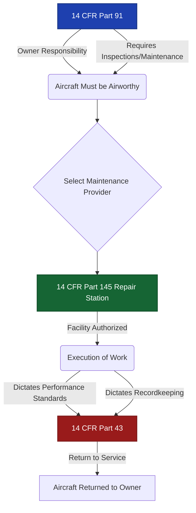
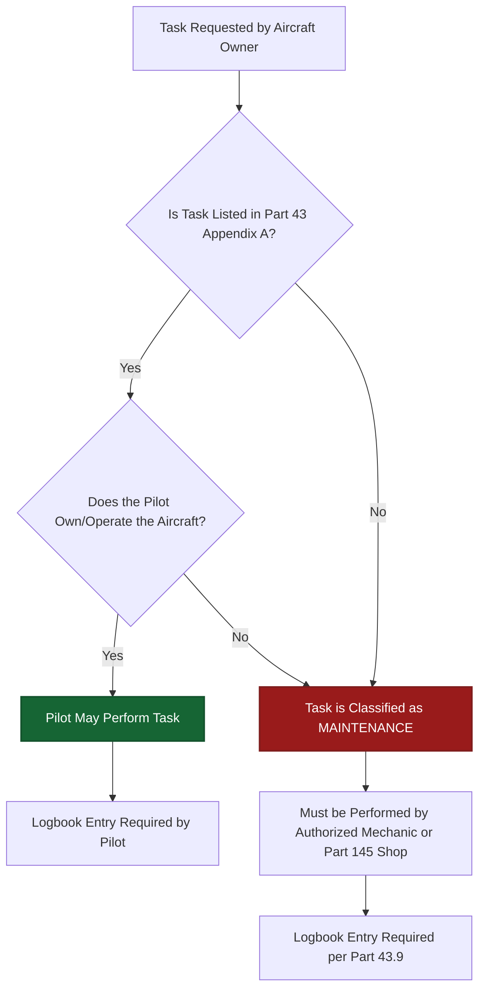
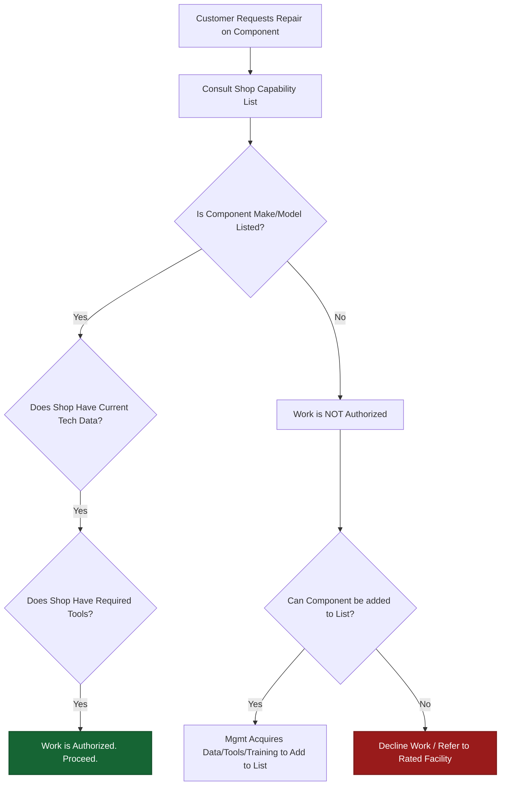
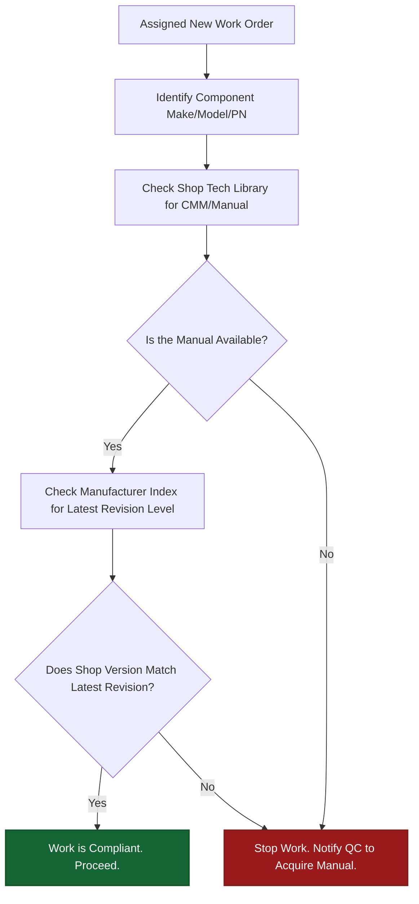
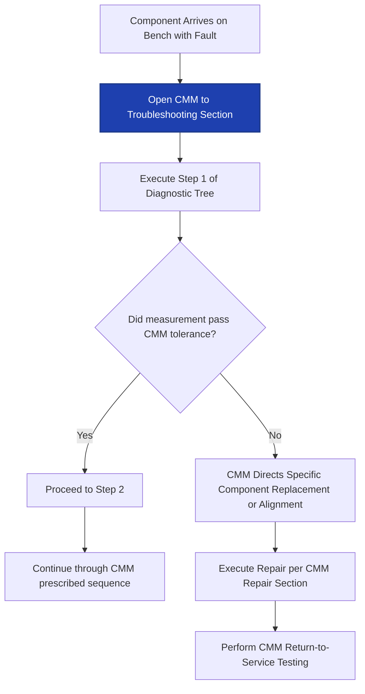
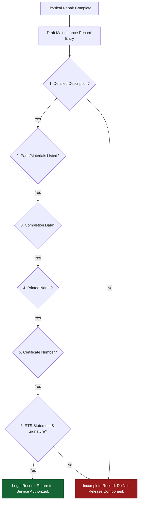
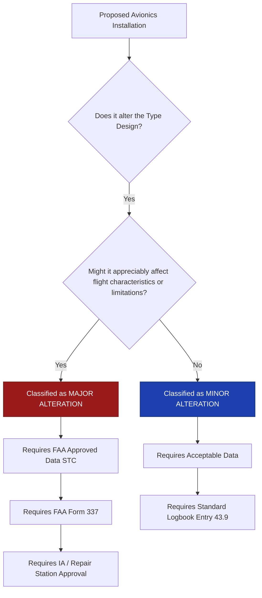
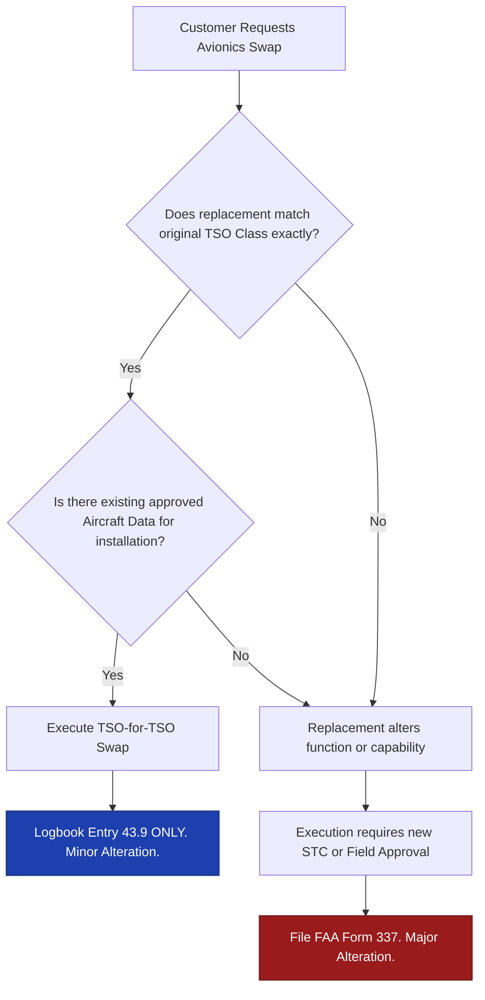
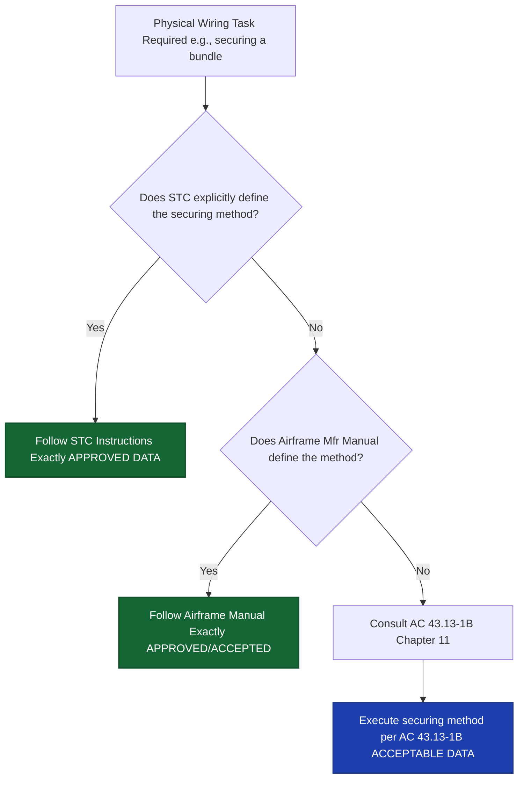
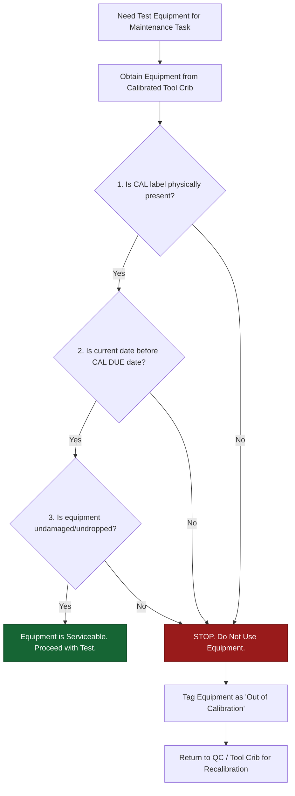

# World 2: Maintenance Regulations & Documentation — NEETS-Style Training Content
> **10 Nodes | 5 Zones | Estimated Read Time: 40–50 minutes total**

---
---

# Node: Parts 145/43/91 Basics (Recognition)
**Zone: Regulatory Framework**

## 📋 OBJECTIVES
- Differentiate between the scopes of 14 CFR Parts 145, 43, and 91.
- Identify which regulation governs the repair station's overall authority to operate.
- Explain how Part 43 dictates the performance standards for the maintenance itself.

## 🎯 WHY THIS MATTERS

On your first day in an FAA-certificated repair station, your lead tech tells you: "We operate under Part 145." Someone from the flight department walks in and says: "This aircraft is Part 91." The pilot asks about "Part 43 requirements." These are not random numbers — they are the three regulatory pillars that govern everything you will do in this shop. If you do not know which regulation governs what, you cannot understand why your work is performed the way it is.

## 📖 WHAT YOU NEED TO KNOW

The Federal Aviation Regulations (FARs) are organized into numbered "Parts" within Title 14 of the Code of Federal Regulations (14 CFR). As an avionics apprentice, you must instantly recognize the interaction between these three primary Parts:

### 14 CFR Part 145 — Repair Station Certification (The "Who/Where")
This is the regulation that **governs the shop you work in**. Part 145 establishes:
- Certification requirements for repair stations
- Housing, facility, and tool standards
- Personnel qualifications and rosters
- The requirement to have an accepted Repair Station Manual (RSM)
- Capability list requirements and quality control systems

Your shop holds a Part 145 certificate with specific ratings. This certificate is the fundamental authorization that allows the facility to exist and offer commercial maintenance services.

### 14 CFR Part 43 — Maintenance Performance Rules (The "How")
This is the regulation that **governs the work itself**. Part 43 applies to any authorized person performing maintenance, preventive maintenance, rebuilding, or alterations. It covers:
- Who is authorized to perform and approve maintenance at a personal level
- How maintenance must be documented and recorded (§43.9)
- What constitutes major vs. minor repairs and alterations
- Return-to-service requirements
- Performance standards (using methods acceptable to the Administrator)

**Key distinction**: Part 145 authorizes the shop as a corporate entity. Part 43 governs how the actual wrenches are turned and the paperwork is signed. Both apply simultaneously to your work.

### 14 CFR Part 91 — General Operating Rules (The "Owner")
This is the regulation that **governs how the aircraft is operated**. Part 91 covers:
- Airworthiness responsibilities of the owner/operator
- Required inspections and maintenance programs (e.g., Annual inspections, Altimeter/Transponder checks under §91.411 and §91.413)
- Operating rules and limitations

While you do not operate the aircraft, you must recognize Part 91 because the aircraft owner's Part 91 obligations (like a 24-month transponder certification) are what generate the work orders that arrive at your bench.

## 🖼️ SYSTEM DIAGRAM

## 🔧 ON THE JOB

When management references "Part 145," they are talking about shop audits, facility manuals, and the overarching quality system. When the lead references "Part 43," they are talking about how you actually perform the repair, torquing the bolts, and signing the logbook entry. When the customer references "Part 91," they are talking about their operational requirements. Keeping these distinct helps you ask the right questions.

## 🔑 KEY TERMS
- **14 CFR Part 145** — The regulation certifying repair stations and establishing their facility, personnel, and operating standards.
- **14 CFR Part 43** — The regulation governing maintenance performance rules, record-keeping, and return-to-service standards for all authorized mechanics.
- **14 CFR Part 91** — The regulation governing general aircraft operating and airworthiness rules, assigning primary responsibility to the owner/operator.

## ⚡ THE BOTTOM LINE

**Part 145 certifies the facility, Part 43 governs the physical work and documentation, and Part 91 governs the owner's operational responsibilities.**

---
---

# Node: Maintenance vs. Preventive Maintenance (Recognition)
**Zone: Regulatory Framework**

## 📋 OBJECTIVES
- Define the FAA's distinction between "Maintenance" and "Preventive Maintenance."
- Identify the explicit limitations on who may perform preventive maintenance.
- Determine if a given task falls under the preventive maintenance category using 14 CFR Part 43 Appendix A.

## 🎯 WHY THIS MATTERS

A Cessna owner mentions they replaced a navigation light bulb over the weekend. Is that legal? Later, the same owner asks if they can install their new stratus ADS-B transponder themselves to save money. Is that legal? The answer depends entirely on whether the task is classified as "maintenance" or "preventive maintenance" — a distinction that carries intense regulatory weight and determines who is legally authorized to touch the aircraft.

## 📖 WHAT YOU NEED TO KNOW

The FAA draws a sharp, unforgiving line between **maintenance** and **preventive maintenance**. This boundary exists to protect the safety of the aircraft while allowing private owners to perform simple upkeep.

### Maintenance (The Broad Definition)
Under FAA regulations (14 CFR §1.1), **maintenance** includes:
- Inspection
- Overhaul
- Repair
- Preservation
- Replacement of parts

Notice what is **explicitly excluded** from that list: preventive maintenance. The FAA carved it out as a completely separate legal category. As a technician in a Part 145 shop, you perform maintenance.

### Preventive Maintenance (The Narrow Exception)
**Preventive maintenance** is a strictly defined category of simple or minor preservation operations and the replacement of small standard parts not involving complex assembly operations. 
The critical rules for Preventive Maintenance are:
1. **The Authorized Person:** It may only be performed by the holder of at least a **private pilot certificate** issued under Part 61.
2. **The Aircraft Restriction:** It may only be performed on an aircraft **owned or operated by that pilot**. (A private pilot cannot change the oil on their friend's airplane).
3. **The Approved List:** The task MUST be explicitly listed in **14 CFR Part 43, Appendix A, Paragraph (c)**. If it is not on the list, it is not preventive maintenance.

**Examples from Appendix A:** 
- Replacing defective safety wire or cotter pins.
- Lubricating items not requiring disassembly.
- Replacing bulbs, reflectors, and lenses of position and landing lights.
- Replacing prefabricated fuel lines.
- Updating approved navigational software databases (if done from the front panel without tools).

### Why the Distinction Limits You
A pilot can replace a nav light bulb (preventive maintenance). They **cannot** install a GPS antenna, splice a broken sensor wire, or replace an altimeter — those are maintenance tasks requiring an authorized mechanic or repair station. If an owner performs unauthorized maintenance, the aircraft acts as unairworthy until inspected and signed off by authorized personnel.

## 🖼️ SYSTEM DIAGRAM

## 🔧 ON THE JOB

If a customer asks you if they can do a specific task themselves, your answer should never be an opinion. Your response should be: "Let's check Part 43 Appendix A." If the exact task is not explicitly written in that regulation, they cannot legally do it, no matter how simple they think it is.

## 🔑 KEY TERMS
- **Maintenance** — FAA-defined category covering inspection, overhaul, repair, preservation, and parts replacement. Excludes preventive maintenance.
- **Preventive Maintenance** — Simple/minor preservation tasks specifically listed in Part 43 Appendix A that a certificated pilot may perform on an aircraft they own or operate.
- **Part 43 Appendix A** — The regulatory document containing the exhaustive list of authorized preventive maintenance tasks.

## ⚡ THE BOTTOM LINE

**Maintenance and preventive maintenance are separate legal categories; preventive maintenance is strictly limited to simple tasks found in Appendix A, performed by pilots on their own aircraft.**

---
---

# Node: Ratings/Capability Limits (Stay in Your Lane)
**Zone: Scope & Technical Data**

## 📋 OBJECTIVES
- Define the function of a repair station's Operations Specifications (Ops Specs) and Capability List.
- Explain why individual technician certifications do not override shop rating limitations.
- Identify the correct course of action when asked to repair a component not listed on the capability list.

## 🎯 WHY THIS MATTERS

A customer brings in a hydraulic flight control actuator for overhaul. Your avionics shop has a couple of excellent A&P mechanics on staff with years of heavy hydraulic experience from military service. They know exactly how to fix it. But your Part 145 certificate only lists "Radio" and "Instrument" ratings. Can you take the job? No. It does not matter how qualified your personnel are — if the shop's ratings do not legally cover the component, the work is strictly unauthorized.

## 📖 WHAT YOU NEED TO KNOW

Every certificated Part 145 repair station operates under a legal document called **Operations Specifications (Ops Specs)** issued by the FAA. These Ops Specs dictate the absolute boundaries of what the business is legally allowed to do.

### Ratings and Classes
Ops Specs list the specific **ratings and classes** of work the shop is authorized to perform. Common broad rating categories include:
- Airframe
- Powerplant
- Propeller
- Radio (This covers Comm, Nav, and Radar avionics)
- Instrument
- Accessory

### The Capability List
Ratings are broad, but the **Capability List** is highly specific. Depending on how the repair station is structured (specifically if it holds limited ratings), it must maintain a living Capability List. This document explicitly identifies exactly which component makes, models, or part numbers the shop is authorized to maintain. 

If your shop has a Radio rating, but the specific BendixKing radar unit is not on the capability list, the shop cannot execute a repair on it until the Accountable Manager formally adds it to the list (which requires proving to the FAA that the shop has the tools, data, and trained personnel to do so).

### The Prime Directive: Stay in Your Lane
A Part 145 shop **may only perform work within its specific ratings and capability list**. Work outside those bounds is a severe regulatory violation, regardless of:
- The individual qualifications of the technician (an A&P certificate does not extend the shop's authority).
- Prior experience with similar equipment.
- Customer urgency or financial pressure.
- The perceived simplicity of the task.

**Individual certification vs. Facility certification:** You are working under the umbrella of the repair station certificate. If the repair station cannot legally do it, you cannot legally do it for the repair station.

## 🖼️ SYSTEM DIAGRAM

## 🔧 ON THE JOB

When a new, unfamiliar work order lands on your bench, your first instinct should be: "Is this on our capability list?" Most shops have the list available on their internal server. If you are unsure, you must check with your supervisor before removing a single screw. Never assume that because a senior tech says "I've done a million of these," the shop is legally rated for it.

## 🔑 KEY TERMS
- **Operations Specifications (Ops Specs)** — The FAA-issued document listing a repair station's authorized ratings, classes, and administrative limitations.
- **Capability List** — The specific document detailing exactly which components, systems, or aircraft a shop is authorized to maintain under its Part 145 certificate.
- **Ratings** — The broad FAA categories of authorized work (e.g., Airframe, Radio, Instrument, Accessory).

## ⚡ THE BOTTOM LINE

**A repair station may only perform work on items found on its capability list — individual technician experience never overrides the shop's legal authorization limits.**

---
---

# Node: Current Manuals / Technical Data Requirement
**Zone: Scope & Technical Data**

## 📋 OBJECTIVES
- Define what constitutes "current technical data" in a Part 145 environment.
- Explain the absolute necessity of accessing the correct revision before beginning work.
- Describe the technician's requirement to halt work if current data is unavailable.

## 🎯 WHY THIS MATTERS

A specific Garmin comm radio is on your shop's capability list. You have overhauled dozens of them. But when you log into the technical library to start this particular unit, you discover your shop only has Revision 3 of the Component Maintenance Manual (CMM), and the manufacturer released Revision 7 two months ago. Can you proceed using the older manual? No. It does not matter if you have the knowledge memorized. Being authorized to do the work is only half the equation. You must possess the **current** technical data before you begin.

## 📖 WHAT YOU NEED TO KNOW

Part 145 regulations dictate that before any maintenance can begin, two uncompromising conditions must be met:
1. **Authorization** — The component must be on the capability list.
2. **Current technical data** — The shop must possess or have immediate access to the **current revision** of the manufacturer's maintenance manual, service bulletins, and related instructions for continued airworthiness.

### What "Current" Transacts
"Current" means the absolute latest revision officially issued by the manufacturer. If the manufacturer published Revision 7, proceeding with Revision 3 is a direct regulatory violation. 
- You cannot make a subjective judgment call that "the older revision is close enough."
- You cannot assume that because revisions 4 through 7 didn't change the specific section you need, the old manual is valid. 
- The entire document must be the current revision.

### Who Is Responsible?
Under Part 145, the responsibility for ensuring current technical data is available is shared:
- The **Quality Control (QC) department** creates the systemic process for maintaining the shop's technical library and verifying currency against manufacturer indices.
- The **Accountable Manager** holds overall organizational liability for regulatory compliance.
- **You (The Technician)** hold the point-of-execution responsibility to personally verify the data you are looking at is marked current before you apply tools to the hardware.

### The Stop-Work Mandate
If you log in and realize the current revision is missing, expired, or unavailable:
- **Stop.** You may not begin the work.
- Do not attempt to work from memory.
- Notify your lead or QC department immediately so they can purchase or download the current revision.
- The work order is frozen until the current data is secured.

There is no workaround or waiver for this. An IA signature cannot substitute for missing technical data. The FAA does not tolerate maintenance performed from memory or obsolete manuals.

## 🖼️ SYSTEM DIAGRAM

## 🔧 ON THE JOB

Make verifying technical data a muscle-memory habit. Every time you start a new task, open the manual, verify the revision level, and check the date. Having an open manual on your bench (or a PFD pulled up on your screen) while you are actively working is the ultimate sign of a disciplined, professional Part 145 technician. Doing it from memory is the mark of an amateur.

## 🔑 KEY TERMS
- **Current Technical Data** — The absolute latest manufacturer-issued revision of the maintenance manual, service bulletins, and applicable documents for a specific component.
- **CMM (Component Maintenance Manual)** — The primary manufacturer document detailing the overhaul, repair, and test procedures for a specific "off-aircraft" component.
- **Accountable Manager** — The executive-level Part 145 position with overall organizational responsibility for regulatory compliance.

## ⚡ THE BOTTOM LINE

**Being on the capability list authorizes the work, but you must physically possess and utilize the current manufacturer's manual revision before you touch the component.**

---
---

# Node: Manual-First Troubleshooting Start Point
**Zone: Scope & Technical Data**

## 📋 OBJECTIVES
- Outline the mandatory sequence for troubleshooting avionics faults in a Part 145 repair station.
- Explain the risks of replacing internal components based solely on past experience.
- Document the diagnostic sequence exactly as prescribed by the Component Maintenance Manual (CMM).

## 🎯 WHY THIS MATTERS

A VHF communication transceiver arrives at your bench squawking an intermittent transmit fault. You have seen this exact symptom on this exact model a dozen times before — last time it was a failed power amplifier module. Your first instinct is to grab a solder extractor, pull the PA, and swap it. But jumping ahead to a component swap — no matter how historically confident you are — is a regulatory violation. Experience informs your work, but the **manual sets the procedure**.

## 📖 WHAT YOU NEED TO KNOW

In a Part 145 repair station, the **first step** in troubleshooting any fault is never a physical action; it is to **consult the manufacturer's approved technical data**. This is not a suggestion for new technicians. It is a strict operational requirement for all technicians.

### Why Manual-First?
Approved technical data must guide all maintenance. The manufacturer's designated troubleshooting tree exists to:
- Define the correct diagnostic sequence.
- Identify specific test points, required voltages, and tolerances.
- Prevent unnecessary component replacement (the "parts cannon" approach).
- Ensure all potential root causes (like a failing linear regulator upstream of the PA module) are evaluated systematically.

### What Manual-First Means in Practice
When a squawk or discrepancy arrives at your bench:
1. **Pull the manual** — Open the Fault Isolation or Troubleshooting section of the CMM.
2. **Follow the decision tree** — The manual may direct you to verify bench power supply voltage first, then run a BITE (Built-In Test Equipment) self-test, then measure specific test points on the board.
3. **Execute in order** — If the manual says "check power supply ripple first," you check it first — even if you are 99% sure the problem is the final output transistor.
4. **Document the path** — Record what the manual directed and what values you physically measured at each step.

### Experience vs. Procedure
"Manual-First" does not mean you ignore your hard-earned experience. Your experience tells you *how* to take the measurement accurately, *how* to interpret the ripple on the oscilloscope, and *when* a reading looks suspicious. But the **manual dictates what parameter gets measured and in what order.**

Skipping the manual and jumping straight to a hardware swap is non-compliant. Even if the swap successfully fixes the problem, the process itself was an illegal maintenance action under Part 145.

## 🖼️ SYSTEM DIAGRAM

## 🔧 ON THE JOB

When a fault comes to your bench, physically open the manual before you turn on your soldering iron or grab a screwdriver. Follow the steps in order. If an FAA inspector walks up to your bench during an audit and asks "Why are you probing that capacitor?", your answer must never be "Because I think it's bad." It must be "Because CMM Section 100, Figure 102, Step 4 directs me to verify 5VDC at this node."

## 🔑 KEY TERMS
- **CMM (Component Maintenance Manual)** — The manufacturer's document detailing maintenance, inspection, and troubleshooting procedures for a specific off-aircraft component.
- **Manual-First** — The foundational principle that approved technical data must be consulted and followed before any diagnostic or repair action is taken.
- **Fault Isolation** — The systematic, manual-driven process of tracing a system failure down to a specific defective component.

## ⚡ THE BOTTOM LINE

**The manual dictates the troubleshooting sequence — follow it first, every time, regardless of how confident you are in your own diagnosis.**

---
---

# Node: Maintenance Record Elements (Part 43.9 Level)
**Zone: Documentation Basics**

## 📋 OBJECTIVES
- Identify the six mandatory elements required in a general maintenance record entry under 14 CFR §43.9.
- Differentiate between a compliant work description and an unacceptably vague one.
- Draft a compliant Part 43.9 maintenance record entry for a simulated avionics repair.

## 🎯 WHY THIS MATTERS

You just completed a transponder repair — the internal power supply was rebuilt, the unit tested perfectly on the bench, and it is ready to ship back. But if your paperwork is incomplete, the work is legally non-existent. In aviation maintenance, **the work is not complete until the record is complete.** An aircraft is grounded if its maintenance records are incomplete, no matter how flawlessly the physical repair was executed.

## 📖 WHAT YOU NEED TO KNOW

**14 CFR §43.9** is the regulation that specifies exactly what must be included in every general maintenance record entry. There is no flexibility here — all elements are unconditionally required.

### The Six Required Elements (§43.9)
Every single maintenance record entry must include:

1. **Description of work performed** — A clear, specific account of what was done. 
   - *Bad:* "Repaired transponder."
   - *Good:* "Replaced internal power supply module PN 123-45 per CMM Rev 7 Section 4. Unit passed full functional test."
2. **Parts used** — Part numbers and quantities of any components installed.
3. **Date completed** — The date the maintenance was finished and signed off, NOT the date work started.
4. **Technician name** — The printed full name of the person who holds the authorization.
5. **Certificate number** — The technician's FAA airman certificate number (or the repair station certificate number if signing under the shop's authority).
6. **Return-to-Service Statement / Signature** — A declarative statement that the work was performed satisfactorily, followed by the physical signature of the authorized person.

### Common Documentation Failures
Most FAA paperwork violations stem from lazy documentation:
- Omitting the specific part numbers of installed hardware.
- Recording the work order creation date instead of the completion date.
- Using a work order number in place of the required individual elements.
- Writing vague, useless descriptions ("checked and OK'd", "fixed wire").
- Forgetting the actual physical signature.

### What Is NOT Required by §43.9
The following are often included by company policy, but are NOT mandated by the FARs:
- Aircraft serial number or tail number (unless signing an actual aircraft logbook instead of a yellow tag/8130-3).
- Work order number (this is an internal administrative tool).
- IA (Inspection Authorization) countersignature (this is only required for major repairs and major alterations, not general maintenance).

## 🖼️ SYSTEM DIAGRAM

## 🔧 ON THE JOB

When you complete a repair and sit down to write the record, mentally check off all six elements: description, parts, date, name, certificate number, return-to-service signature. Be verbose. Assume the person reading the logbook entry in 5 years needs to know exactly what book you used and what you replaced. If any one element is missing, the record is incomplete and the work cannot be released.

## 🔑 KEY TERMS
- **14 CFR §43.9** — The specific FAR section governing the content requirements for general maintenance records.
- **Return-to-Service Signature** — The final signature by an authorized person declaring the maintenance was completed satisfactorily per approved data.
- **Description of Work Performed** — A specific, detailed, traceable account of the maintenance actions taken.

## ⚡ THE BOTTOM LINE

**Every maintenance record must include six specific elements: description of work, parts used, date completed, printed name, certificate number, and signature — if one is missing, the aircraft is grounded.**

---
---

# Node: Major Alteration Basics
**Zone: Approved Data / Changes**

## 📋 OBJECTIVES
- Define a "Major Alteration" according to 14 CFR Part 43 Appendix A.
- Recognize the correlation between an STC Flight Manual Supplement and a major alteration.
- Identify the specific FAA form required to document a major alteration.

## 🎯 WHY THIS MATTERS

Your shop installs a new modern glass touchscreen GPS navigator under a Supplemental Type Certificate (STC). The STC package includes a thick Flight Manual Supplement that changes the aircraft's approved operating limitations from VFR-only to IFR-approved. Is this a minor alteration or a major alteration? Getting this classification wrong is a severe regulatory violation, because a "Major Alteration" instantly triggers the requirement for specialized FAA paperwork (Form 337) and an Inspection Authorization (IA) sign-off.

## 📖 WHAT YOU NEED TO KNOW

### What Is a Major Alteration?
Per **14 CFR Part 43, Appendix A**, a major alteration is defined as:

> A change to the type design that might **appreciably affect** structural strength, performance, powerplant operation, flight characteristics, or other qualities affecting airworthiness — and is **not listed** in the aircraft specifications or type certificate data sheet.

The critical phrase here is "might appreciably affect." The alteration does not have to definitely, negatively impact the aircraft; the mere potential to alter the baseline airworthiness qualities is sufficient to classify it as major.

### What Makes It "Major" — Not Minor?
The classification is based strictly on the **effect on airworthiness**, not on:
- The financial cost of the avionics package.
- The labor hours required for the installation.
- The physical size or weight of the component.
- The fact that the equipment holds a TSO (Technical Standard Order).

A relatively simple avionics harness integration can be a major alteration if it heavily integrates with the autopilot or changes the aircraft's operating limitations. Conversely, swapping a large, heavy passenger seat for an identical approved part number is minor maintenance.

### The Ultimate Tell: Flight Manual Supplements
A common example in avionics: an **STC installation that requires adding a Flight Manual Supplement** to the pilot's handbook is virtually always a **major alteration**. 
- The flight manual supplement exists because the modification fundamentally changes the aircraft's approved operating procedures, capabilities, or limitations. 
- Any change to limitations directly meets the "appreciably affect airworthiness qualities" threshold.

*Note: The fact that the installed part has a TSO approval does not change the classification. A TSO certifies the 'box' meets a standard. It does NOT certify the installation into an airframe.*

### The Documentation Burden
Minor alterations are documented with standard logbook entries (§43.9). Major alterations require significant regulatory overhead:
1. **FAA Form 337 (Major Repair and Alteration)** — Filed with the FAA and kept in the aircraft records.
2. **Approved Data** — Must be performed using data explicitly approved by the FAA (like an STC or Field Approval), not just acceptable data.
3. **IA Signature** — Must be approved for return to service by a mechanic holding an Inspection Authorization (IA), or an authorized Part 145 repair station.

## 🖼️ SYSTEM DIAGRAM

## 🔧 ON THE JOB

When you are assigned an installation project, ask the lead: "Is this a major or minor alteration?" If the STC installation manual includes a Flight Manual Supplement, you are certainly working on a major alteration, and FAA Form 337 will be required. Understand this classification before you start wiring so you can ensure you are precisely following the approved STC data.

## 🔑 KEY TERMS
- **Major Alteration** — A type design change that might appreciably affect airworthiness qualities, requiring approved data and Form 337.
- **FAA Form 337** — The official, mandatory documentation form used to record major repairs and major alterations.
- **Flight Manual Supplement** — An addition to the pilot's operating handbook detailing new procedures or limitations resulting from an installed modification (STC).

## ⚡ THE BOTTOM LINE

**A major alteration is any change that might appreciably affect airworthiness — an STC requiring a flight manual supplement is a flashing neon sign that you are executing a major alteration.**

---
---

# Node: STC and TSO Replacement Basics
**Zone: Approved Data / Changes**

## 📋 OBJECTIVES
- Define a Technical Standard Order (TSO) and explain its relationship to component approval.
- Differentiate between a TSO component approval and an STC installation approval.
- Determine when a TSO-for-TSO replacement qualifies as a minor alteration versus a major alteration.

## 🎯 WHY THIS MATTERS

A customer's legacy transponder fails. Your shop has a brand new, modern transponder from a different manufacturer in stock. The customer asks: "Can you just swap it in this afternoon?" The answer depends on two acronyms: TSO and STC. If it is a direct TSO-for-TSO swap per approved data, you might be done by lunch. If the new unit requires a new Supplemental Type Certificate (STC) installation, the aircraft might be in the shop for a week awaiting FAA Form 337 paperwork and an IA sign-off. Understanding this distinction prevents you from inadvertently performing a major alteration on a minor alteration budget.

## 📖 WHAT YOU NEED TO KNOW

### What Is a TSO?
A **Technical Standard Order (TSO)** is an FAA minimum performance standard for a specific category of aviation article (e.g., radios, seats, software, transponders). When a manufacturer produces a part that meets a specific TSO, they are granted a TSO Authorization (TSOA). This means the FAA agrees the part fundamentally works as intended.

Examples of common Avionics TSOs:
- TSO-C151 — Terrain Awareness and Warning System (TAWS)
- TSO-C146 — Airborne Navigation Sensors (WAAS GPS)
- TSO-C112 — Air Traffic Control Transponder

### TSO-for-TSO Replacement (Usually Minor)
When you replace a TSO-approved part with another TSO-approved part **of the exact same functional class**, AND you do it **per approved data** (like an Aircraft Maintenance Manual or previously approved field design), it is generally considered a **minor alteration**.
- It does not change the aircraft's type design in a way that appreciably affects airworthiness.
- Standard documentation (Part 43.9 maintenance record) applies.

*Both qualifiers must be met: Same TSO class, AND executed per approved data.*

### What Is an STC?
A **Supplemental Type Certificate (STC)** is an FAA approval that authorizes a major modification to a type-certificated aircraft in a manner **not covered by the original factory type certificate**. 
- STCs are aircraft-specific — an STC to install a Garmin GTN 750 on a Cessna 172 legally does not apply to a Beechcraft King Air.
- An STC installation that changes the aircraft's capabilities or limitations (e.g., adds WAAS LPV approach capability) is universally a **major alteration**.

### The Critical Distinction: The Part vs. The Airframe
Do not confuse the two. This is the most common misunderstanding among junior techs:
- **TSO** = The FAA approves the **part itself** sitting on a shelf.
- **STC** = The FAA approves the **modification to the aircraft** to accept that part.

A TSO data plate on a part does NOT automatically authorize its installation into an airframe. The installation itself must be approved either by the aircraft manufacturer, an STC, or a Field Approval.

## 🖼️ SYSTEM DIAGRAM

## 🔧 ON THE JOB

When removing a failed radio to upgrade to a newer model, compare the data plates physically. If the old unit says TSO-C112 and the new unit says TSO-C112, you are in basic swap territory (provided the wiring data matches). If the new unit has additional TSOs (like adding ADS-B Out capability), you are stepping into a major alteration requiring an STC. Always verify the classification with your lead before quoting the job time.

## 🔑 KEY TERMS
- **TSO (Technical Standard Order)** — An FAA minimum performance standard for a specified category of aviation article. It approves the part, not the installation.
- **TSO-for-TSO Replacement** — Replacing a TSO part with another of the identical TSO class, per approved data, typically classifying as a minor alteration.
- **STC (Supplemental Type Certificate)** — An FAA approval authorizing a specific, major modification to a specific make and model of type-certificated aircraft.

## ⚡ THE BOTTOM LINE

**A TSO approves the 'box' while an STC approves the modification to the airplane — swapping identical TSO classes is usually minor, but changing capabilities via STC is always major.**

---
---

# Node: Installation Standards Awareness (AC 43.13-1B)
**Zone: Standards & Calibration Awareness**

## 📋 OBJECTIVES
- Identify AC 43.13-1B as the FAA's primary baseline standard for maintenance practices.
- Determine the correct hierarchy of technical data when routing or terminating aircraft wiring.
- Explain the regulatory limitation of acceptable data versus approved data.

## 🎯 WHY THIS MATTERS

You are routing a new wire harness for a transponder installation. The manufacturer's manual tells you what pins to connect, but it doesn't say how tight the bend radius of the coaxial cable should be as it leaves the tray. It doesn't specify the minimum separation distance between your new wire bundle and the aircraft's hydraulic lines. It doesn't define the crimp pull-test strength. The answers to all of these physical installation questions exist in one overarching document that governs wiring practice across the entire aviation industry. If you violate its standards, your installation is inherently unairworthy.

## 📖 WHAT YOU NEED TO KNOW

### AC 43.13-1B — The Aviation Bible
**Advisory Circular (AC) 43.13-1B** is the FAA's primary document outlining **"Acceptable Methods, Techniques, and Practices"** for aircraft inspection and repair. For an avionics technician, Chapter 11 (Aircraft Electrical Systems) is the definitive guide to physical craftsmanship.

In a Part 145 avionics shop, AC 43.13-1B Chapter 11 governs:
- Minimum allowable wire bend radii (preventing internal conductor breaks).
- Maximum distances between wire bundle clamping/support points.
- Connector installation, pin crimping methods, and splice staggering.
- Mandatory physical separation distances from fluid, fuel, hydraulic, and oxygen lines.
- Grounding and bonding resistance limits.
- Wire identification and laser marking standards.

### The Hierarchy of Technical Data
AC 43.13-1B is the **baseline standard**. However, it is not the ultimate authority. When the **aircraft manufacturer's specific wiring data** exists for a procedure, the manufacturer's data ALWAYS takes precedence. The hierarchy is:

1. **Approved Data** (STCs, ADs) — Absolute Primary Authority.
2. **Aircraft Manufacturer's Maintenance Manual (AMM/SRM)** — Secondary Authority.
3. **AC 43.13-1B** — **Default Standard** used only when specific manufacturer data is unavailable or silent on a generic practice.

You must always check whether manufacturer-specific data applies to your installation before defaulting to the general practices of AC 43.13-1B.

### Acceptable vs. Approved Data
AC 43.13-1B provides **acceptable data**. This means it is recognized by the FAA as a compliant way to perform a minor repair or minor alteration. However, it is generally NOT **approved data** (which is required for major alterations) unless specifically referenced as such by an FAA inspector in a Field Approval.

## 🖼️ SYSTEM DIAGRAM

## 🔧 ON THE JOB

When you are wiring an avionics installation and you are unsure about a routing decision, a bend radius, or a separation requirement, your answer is never "just make it look good." Your answer is "check the airframe manual, and if it's silent, check AC 43.13-1B." Excellent craftsmanship in avionics is not subjective; it is explicitly defined by Chapter 11 of that advisory circular. Form the habit of looking it up rather than guessing.

## 🔑 KEY TERMS
- **AC 43.13-1B** — The FAA Advisory Circular establishing acceptable baseline methods, techniques, and practices for aircraft maintenance and electrical installation.
- **Acceptable Data** — Industry-standard procedures recognized as compliant for maintenance (like AC 43.13), but insufficient on their own to approve major alterations.
- **Approved Data** — Data explicitly approved by the FAA Administrator (such as STCs, ADs, or Type Certificate Data) required to execute major alterations.

## ⚡ THE BOTTOM LINE

**AC 43.13-1B is the universal governing standard for avionics wiring craftsmanship — use it as your definitive guide whenever manufacturer-specific data is silent.**

---
---

# Node: Calibration Label Check
**Zone: Standards & Calibration Awareness**

## 📋 OBJECTIVES
- Explain the critical importance of metrological traceability in a Part 145 repair station.
- Outline the three required elements of a valid test equipment calibration label.
- Execute the mandatory pre-use verification check on any piece of shop test equipment.

## 🎯 WHY THIS MATTERS

You reach for the shop's pitot-static test set to perform an integrated altimeter and transponder correlation check. You hook it up, pressurize the system to 20,000 feet, verify the encoding accuracy, and sign off the §91.411 and §91.413 Federal certifications. A week later, Quality Control audits the work order and notices the test set's calibration had actually expired two months prior to your test. Every altitude measurement you took was legally invalid. The aircraft you tested is now grounded until it can be re-tested. The entire, expensive task must be re-performed — all because you did not look at a small green sticker for three seconds before turning the machine on.

## 📖 WHAT YOU NEED TO KNOW

In a Part 145 shop, all **specialized test equipment** used for maintenance, testing, or return-to-service validation must possess a **current, traceable calibration**. A multimeter from a hardware store without a calibration certificate cannot be used to declare an aircraft component serviceable.

### The Traceability Requirement
When a shop calibrates a tool (like a torque wrench or an oscilloscope), it must be verified against a master standard that is traceable back to the National Institute of Standards and Technology (NIST). This chain of custody ensures that when your meter says "28.0 Volts," it is an undeniable, legally defensible, universally recognized 28.0 Volts. 

### What "Current Calibration" Means
The equipment verification must have occurred within the tool's prescribed **calibration interval** (typically 6 or 12 months, dictated by the tool's manufacturer or the shop's QC manual). 

A valid calibration label MUST be affixed directly to the equipment, plainly showing:
1. **The date the last calibration was performed.**
2. **The date the next calibration is due.**
3. **The identity of the calibrating technician/facility.**

### Your Absolute Responsibility
You are the final barrier. Before using ANY measurement equipment in a Part 145 shop, you must perform a mandatory pre-use check:
1. Is there a calibration label affixed to the equipment?
2. Is today's date BEFORE the "next calibration due" (CAL DUE) date?
3. Is the equipment free from physical damage that might render the calibration invalid (e.g., dropped on the floor)?

If any answer is NO — **do not use the equipment under any circumstance.**

## 🖼️ SYSTEM DIAGRAM

## 🔧 ON THE JOB

Before you pick up a multimeter, torque wrench, crimper, ramp tester, or oscilloscope — stop and look at the sticker. It must become automatic. If the due date is tomorrow, you can use it today. If the due date was yesterday, the tool is a brick. If you drop a calibrated tool on the concrete floor, do not just pick it up and keep working; physical shock voids the calibration assumption. Take it to QC and admit you dropped it so it can be re-verified. 

## 🔑 KEY TERMS
- **Calibration** — The process of verifying a test instrument's accuracy against a known, NIST-traceable reference standard and adjusting it if necessary.
- **Calibration Interval** — The maximum legally allowable time period between required calibrations (typically 6–12 months).
- **CAL DUE Label** — The mandatory sticker affixed to precision test equipment identifying the last calibration date, next due date, and the calibrating authority.

## ⚡ THE BOTTOM LINE

**Look at the sticker: If the calibration is expired, missing, or compromised by damage, the equipment must not be used, and all data generated by it is legally invalid.**
