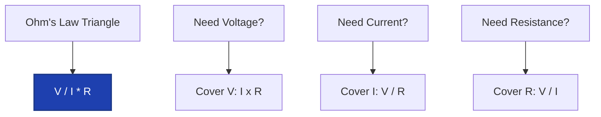
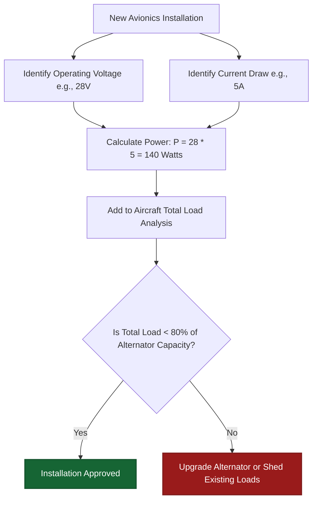
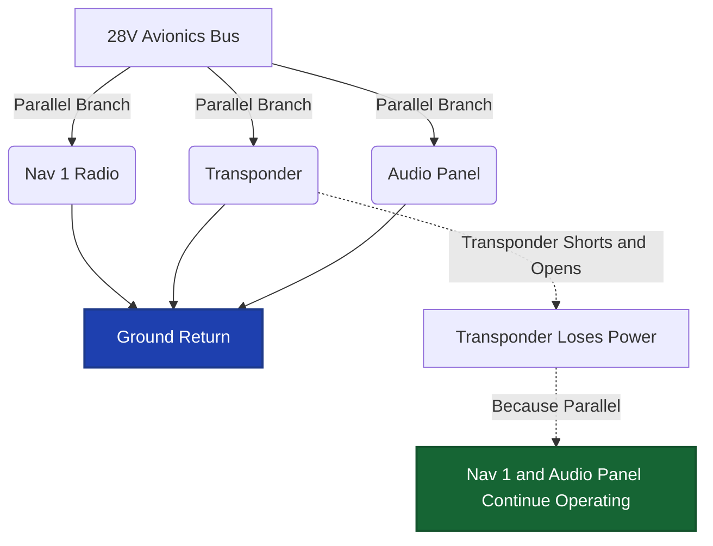
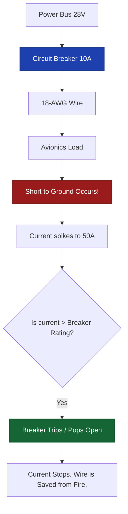
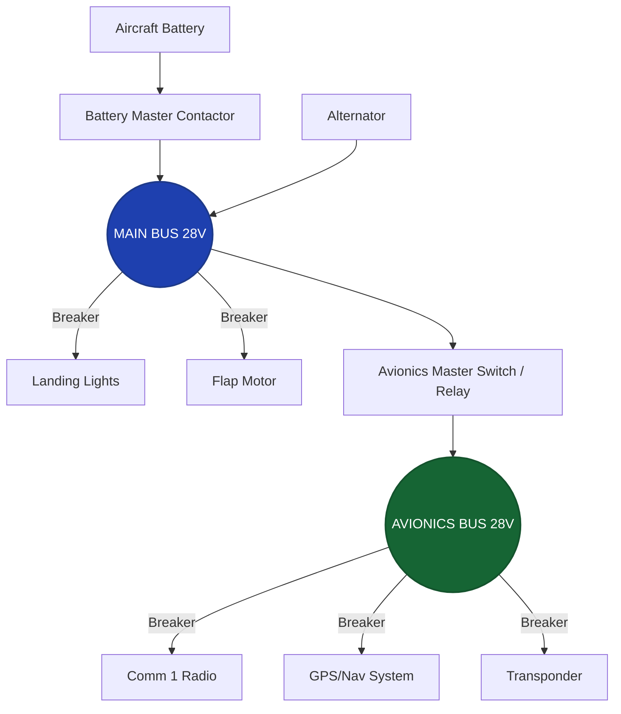
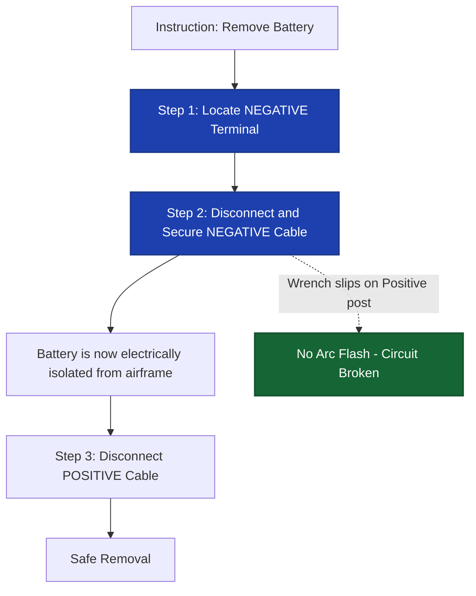
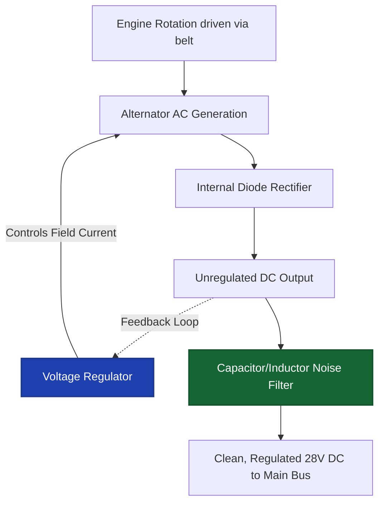
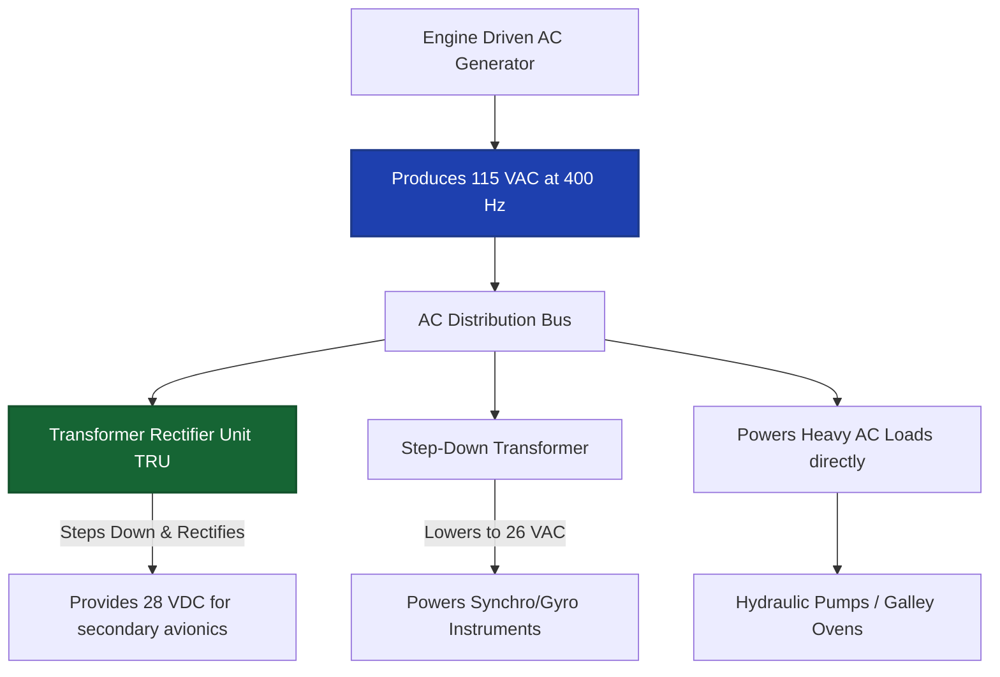

# World 3: Electrical Fundamentals & Aircraft Electrical Systems — NEETS-Style Training Content
> **8 Nodes | 4 Zones | Estimated Read Time: 45–55 minutes total**

---
---

# Node: Ohm's Law Basics
**Zone: DC Fundamentals**

## 📋 OBJECTIVES
- Define the relationship between voltage, current, and resistance.
- Calculate an unknown electrical quantity using the three variations of Ohm's Law.
- Predict circuit behavior when voltage or resistance is proportionally changed.

## 🎯 WHY THIS MATTERS

A technician measures 14 volts across a Nav radio power connector and 7 amps through its supply wire. Is that normal? The only way to answer is Ohm's Law — the single most important mathematical relationship you will ever use in avionics troubleshooting. Every voltage reading, every current measurement, and every "is this right?" diagnostic question on the bench or in the aircraft starts and ends with V = I × R.

## 📖 WHAT YOU NEED TO KNOW

**Ohm's Law** defines the absolute physical relationship between three fundamental electrical quantities: voltage (V), current (I), and resistance (R). It has three algebraic forms, each solving for one unknown:

### The Three Forms
1. **I = V / R** — Current equals voltage divided by resistance. 
   - *Use case:* You know the supply voltage and the load resistance, and you need to find out how many amps the circuit will draw to size a wire/breaker.
2. **V = I × R** — Voltage equals current multiplied by resistance. 
   - *Use case:* You are measuring 2 amps of current flowing through a corroded ground terminal that has 3 ohms of resistance. 2A × 3Ω = a 6-volt drop across that bad connection.
3. **R = V / I** — Resistance equals voltage divided by current. 
   - *Use case:* You measure 28V across a landing light and measure 10 amps flowing through it. The resistance of the bulb must be 2.8 ohms.

### Proportionality Rules (The Intuitive Check)
You should understand how the three quantities relate when one is held constant, without having to calculate the math every time:

- **Voltage increases, resistance constant** → Current increases proportionally. Doubling voltage doubles current. *(Direct proportionality)*
- **Resistance increases, voltage constant** → Current decreases proportionally. Doubling resistance halves current. *(Inverse proportionality)*
- **Current increases, resistance constant** → Voltage drop across the resistor increases proportionally. Doubling current doubles voltage drop. *(Direct proportionality)*

These proportionality rules are how you instantly predict what happens in a circuit when conditions change during troubleshooting.

## 🖼️ SYSTEM DIAGRAM

## 🔧 ON THE JOB

When you measure a voltage and a current on the bench, divide the voltage by the current and you instantly know the resistance. When a wire shows higher-than-expected resistance (corroded connector, damaged splice), Ohm's Law tells you exactly how much voltage is being lost and how much current is being reduced. This is the foundation of every troubleshooting technique you will employ.

## 🔑 KEY TERMS
- **Voltage (V)** — Electrical "pressure" or electromotive force that pushes current through a circuit. Measured in volts.
- **Current (I)** — The actual flow rate of electrons through a conductor. Measured in amperes (amps).
- **Resistance (R)** — The physical opposition to current flow. Measured in ohms (Ω).
- **Ohm's Law** — The fundamental relationship: V = I × R.

## ⚡ THE BOTTOM LINE

**I = V / R, V = I × R, R = V / I — memorize all three forms and intuitively understand that doubling voltage doubles current, while doubling resistance halves current.**

---
---

# Node: Power Basics
**Zone: DC Fundamentals**

## 📋 OBJECTIVES
- Define electrical power and state its unit of measurement.
- Calculate total power dissipation using the Power formula (P = V × I).
- Explain the concept of load analysis in an aircraft electrical installation.

## 🎯 WHY THIS MATTERS

Your shop is installing a massive new glass avionics suite, an electric air conditioning unit, and high-intensity LED landing lights in a 40-year-old Cessna 182. The customer asks: "Can the factory alternator handle all this?" To answer, you must calculate the total power draw. If the equipment exceeds the alternator's capacity, the battery will slowly drain in flight — leading to a total electrical failure in IMC. The power formula is the heart of every installation load analysis.

## 📖 WHAT YOU NEED TO KNOW

**Electrical power** is the rate at which electrical energy is consumed, converted (into heat, light, or motion), or delivered. It is measured in **watts (W)**.

### The Power Formula
**P = V × I**

Power equals voltage multiplied by current. This is the second fundamental mathematical relationship you must memorize.

### Applying the Power Formula
- **12V bus, 2A draw**: P = 12V × 2A = **24 watts**
- **28VDC bus, 25A total draw**: P = 28V × 25A = **700 watts**

That 700W figure is critical — it tells you whether the aircraft's 28V alternator (typically rated around 60A, which equals 1,680W of capacity) can handle the total continuous load with a safe margin to spare.

### The Quadrupling Effect (Thermal Danger)
If a fault causes **both** voltage and current to double simultaneously across a component, power does not just double — it **quadruples**:
- Original state: P = 6V × 2A = 12W
- Doubled state: P = 12V × 4A = 48W (4 × 12W)

This nonlinear relationship is why overcurrent faults are so incredibly dangerous. A component carrying twice its rated current generates four times the heat. This is why electrical shorts rapidly cause insulation to melt and fires to start.

### Load Analysis
In aircraft modifications, **load analysis** is the required regulatory process of adding up the power consumption of all connected equipment to ensure the alternator/generator can supply the total demand with an adequate safety margin (typically keeping total continuous load under 80% of alternator capacity).

## 🖼️ SYSTEM DIAGRAM

## 🔧 ON THE JOB

When installing a new package, tabulate the current draw of every single device. Compare the total to the alternator's rated output. Always maintain a margin. If the total load pushes the limit, you may be required to install a higher-output alternator or implement a load-shedding strategy (where secondary loads are disabled during critical phases of flight).

## 🔑 KEY TERMS
- **Power (P)** — The rate of electrical energy consumption or dissipation, measured in watts.
- **Watt (W)** — The unit of electrical power. 1 watt = 1 volt × 1 amp.
- **Load Analysis** — The engineering process of calculating the total electrical demand to verify alternator and battery capacity limits.

## ⚡ THE BOTTOM LINE

**P = V × I — you must master this formula to perform load analyses, and remember that doubling both voltage and current yields quadruple the thermal power dissipation.**

---
---

# Node: Series/Parallel Circuit Behavior
**Zone: Circuit Behavior**

## 📋 OBJECTIVES
- Contrast the behavior of current and voltage in a series circuit versus a parallel circuit.
- Calculate total resistance for simple series and parallel branches.
- Explain why aircraft electrical distribution systems heavily utilize parallel wiring architecture.

## 🎯 WHY THIS MATTERS

A Piper's three navigation lights are all wired across the same 28VDC lighting bus. During pre-flight, the left wingtip bulb burns out. Do the right wingtip and tail lights go dark too? No — because they are wired in parallel, each light enjoys its own independent path to ground. Understanding series versus parallel behavior is the secret to reading schematics and isolating faults quickly.

## 📖 WHAT YOU NEED TO KNOW

### Series Circuits (The Single Path)
In a **series circuit**, components are connected end-to-end like links in a chain. There is only one path for the electrons to take.

**Rules for series circuits:**
- **Current** is exactly the same through every component.
- **Total resistance** is the simple sum of all resistances: Rt = R1 + R2 + R3.
- **Voltage divides** across each component in proportion to its resistance.
- **The Failure Rule:** If one component opens (fails, breaks, or blows), the entire circuit stops functioning instantly — no current flows anywhere.

### Parallel Circuits (The Independent Paths)
In a **parallel circuit**, components are connected across the same two common points (a supply bus and a ground), providing multiple independent paths for current.

**Rules for parallel circuits:**
- **Voltage** is exactly the same across every parallel branch.
- **Total current** is the sum of all individual branch currents: It = I1 + I2 + I3.
- **Total resistance** is calculated by the reciprocal formula: 1/Rt = 1/R1 + 1/R2 + 1/R3.
- **The Resistance Rule:** Total resistance is ALWAYS less than the smallest individual branch resistor. Adding more parallel branches decreases total resistance and increases total current demand from the source.
- **The Failure Rule:** If one branch opens, the remaining branches continue to operate at full voltage completely unaffected.

### Aircraft Architecture (Why it matters)
Aircraft distribution systems are almost entirely **parallel**. The Nav radio, the GPS, and the transponder all connect to the Avionics Bus in parallel. They all receive 28V. If the transponder shorts out and trips its breaker (opening its branch), the Nav radio and GPS are unaffected. This fault-isolation property is why parallel wiring is critical to flight safety.

## 🖼️ SYSTEM DIAGRAM

## 🔧 ON THE JOB

When troubleshooting, ask yourself: "Are these components in series or parallel?" If one instrument is dead but the cluster next to it is fine, they are wired in parallel, and the fault is isolated to that specific branch. If an entire cluster of instruments is dead, trace back to a common series element — like a shared ground block, a master breaker, or a bus relay.

## 🔑 KEY TERMS
- **Series Circuit** — Components wired sequentially; current is identical everywhere; one physical break disables the entire system.
- **Parallel Circuit** — Components wired across a shared supply; voltage is identical everywhere; one break does not affect other branches.
- **Reciprocal Formula** — (1/Rt = 1/R1 + 1/R2...) The mathematical method for calculating total parallel resistance.

## ⚡ THE BOTTOM LINE

**Aircraft use parallel wiring because branches are independent and fault-isolated; adding loads in parallel increases current but keeps voltage identical across all devices.**

---
---

# Node: Circuit Protection (Fuses/Breakers)
**Zone: Circuit Behavior**

## 📋 OBJECTIVES
- State the primary purpose of an aircraft circuit breaker or fuse.
- Differentiate the operational characteristics of fuses and circuit breakers.
- Identify the hazard of repeatedly resetting a tripped circuit breaker.

## 🎯 WHY THIS MATTERS

An aging wire behind the instrument panel chafes against a sharp metal rib until the insulation wears through. The conductor touches the bare metal, creating a dead short to ground. Instantly, 50 amps of current surges through a wire rated for only 10 amps. The wire begins to rapidly heat, softening the insulation and preparing to ignite. The circuit breaker (or fuse) is the only component preventing an uncontrollable in-flight electrical fire. 

## 📖 WHAT YOU NEED TO KNOW

### The Primary Purpose
**Fuses and circuit breakers** exist strictly to protect **the aircraft wiring** from overcurrent conditions. 

This is a critical distinction: they are installed to protect the wire, not the expensive avionics equipment at the end of the wire. Circuit protection devices are sized strictly to the **current-carrying capacity of the wire gauge**. If an 18-AWG wire can safely carry 10 amps, the breaker is rated at 10 amps — regardless of whether the connected radio draws 1 amp or 8 amps. 

### Fuses: One and Done
A **fuse** contains a calibrated metal element (link) designed to **melt** when current exceeds its specific rating.
- The melted element permanently opens the circuit, halting current flow.
- A fuse **cannot be reset** — it is destroyed by design and must be replaced.
- Fuses are simple, highly reliable, and have no moving mechanical parts.

### Circuit Breakers: Mechanical Tripping
A **circuit breaker (CB)** is a mechanical thermal/magnetic switch that **trips** (springs open) when current exceeds its rating.
- Breakers can be **reset** by pushing the button back in after the overcurrent condition is resolved and the thermal element cools.
- Most aircraft circuit breakers are **trip-free**, meaning the internal mechanism will trip and stay open even if a desperate pilot forcibly holds the button pushed in.
- In a Part 145 shop, a breaker that trips repeatedly on the bench is indicating a persistent hard fault (like a shorted diode or pinched wire). Do not keep resetting it. 

### What Circuit Protection Does NOT Do
It is vital to understand their limitations. Fuses and breakers:
- Do NOT regulate or step-down voltage.
- Do NOT filter out electrical noise or transients.
- Do NOT protect equipment against voltage spikes (over-voltage).
- Usually cannot trip fast enough to save a sensitive microchip from an internal short.

## 🖼️ SYSTEM DIAGRAM

## 🔧 ON THE JOB

When a breaker trips during testing, completely resist the urge to immediately reset it to "see what happens." If it tripped, the circuit drew too much current. Stop. Ask: why did it trip? Check for short circuits, crushed harnesses, or incorrectly pinned connectors. A tripped breaker did its job — now you have to do yours to find the short.

## 🔑 KEY TERMS
- **Overcurrent** — An abnormal condition where current flow exceeds the safe thermal rating of the wire insulation.
- **Circuit Breaker** — A resettable, mechanical protective device that opens when heated by excessive current.
- **Trip-Free** — A vital breaker design ensuring the circuit will open during a fault, even if the external actuator is forcibly held closed.

## ⚡ THE BOTTOM LINE

**Circuit protection exists solely to protect wiring from catching fire — fuses melt permanently, breakers trip mechanically, and neither should be ignored when activated.**

---
---

# Node: Buses and Distribution
**Zone: Aircraft DC Systems**

## 📋 OBJECTIVES
- Define the function of an electrical bus in an aircraft power distribution system.
- Contrast the purpose of a Main Bus with an Avionics Bus.
- Explain how bus architecture isolates operational faults.

## 🎯 WHY THIS MATTERS

You flip the single Avionics Master switch on the panel, and instantly power flows to the GPS, both Comm radios, the transponder, and the audio panel simultaneously. How does one simple switch feed five different high-draw components? They are all physically connected to the same **bus** — the central distribution artery of the aircraft. When troubleshooting a "dead radio" versus a "dead panel," understanding bus architecture is what tells you exactly where to put your multimeter first.

## 📖 WHAT YOU NEED TO KNOW

### What Is an Electrical Bus?
An **electrical bus** (or bus bar) is a common, highly conductive distribution point (typically a solid copper or aluminum bar, or a heavy-duty terminal strip) configured to:
- Intake high-amperage power from one or more **sources** (battery, alternator/generator).
- Distribute that power to multiple individual **loads** (radios, lights, motors).
- Operate purely as a **parallel** distribution system — meaning all connected loads share the exact same system voltage.

### Common Bus Architecture
Modern General Aviation aircraft utilize multiple buses to manage power safely:
1. **Main Bus (or Primary Bus):** Connected directly to the alternator and battery master relay. It powers essential airframe systems (lights, flaps, fuel pumps).
2. **Avionics Bus:** A separate bus dedicated exclusively to sensitive electronics. It is connected to the Main Bus via the Avionics Master switch (often a relay). Its primary purpose is to keep avionics isolated and powered off during engine start, protecting delicate microprocessors from massive voltage spikes caused by the starter motor engaging.
3. **Essential/Emergency Bus:** A highly protected bus that remains powered even if the main bus fails or shorts. It is wired directly to the battery or a backup battery, powering only critical flight instruments (AHRS, primary comm) needed to land safely.

### Why Architecture Dictates Troubleshooting
Separating loads into different buses provides **fault isolation** and load-shedding capabilities. 
If a massive short circuit occurs in the landing light wiring, it might pop the massive 50-amp Main Bus feed breaker. If all the avionics were on the Main Bus, you'd lose your radios in the dark. But because the Avionics Bus is often isolated or on a separate feed from the battery tie, you retain communications.

## 🖼️ SYSTEM DIAGRAM

## 🔧 ON THE JOB

When troubleshooting a "no power" discrepancy, establish whether the failure is localized (one radio) or systemic (all radios). Start at the bus. Is the avionics bus actually energized to 28V? Check the heavy bus feed terminal with a voltmeter. If the bus is hot but the component is dead, the problem is downstream (breaker, wiring, connector). If the bus is dead, the problem is upstream (Avionics Master relay, contactor, or tie breaker).

## 🔑 KEY TERMS
- **Bus (Bus Bar)** — A central, high-capacity distribution point connecting power sources to multiple parallel loads.
- **Avionics Master** — A switch/relay that isolates the avionics bus from the main bus to protect sensitive electronics during engine start transients.
- **Fault Isolation** — Designing a system so that a failure in one section (like a short on the main bus) does not cascade and disable critical secondary systems.

## ⚡ THE BOTTOM LINE

**A bus distributes power in parallel — the main bus powers the airframe, while the avionics bus isolates sensitive electronics from engine-start voltage spikes.**

---
---

# Node: Batteries and Grounding/Bonding
**Zone: Aircraft DC Systems**

## 📋 OBJECTIVES
- Identify the correct mandatory sequence for disconnecting and reconnecting an aircraft battery.
- Explain the physical rationale behind the "negative first" disconnect rule.
- Define the three primary purposes of airframe bonding jumpers.

## 🎯 WHY THIS MATTERS

A new technician is assigned to remove a 24-volt battery from a tightly packed nose bay. They reach their steel wrench in and attach it to the positive terminal first to loosen the nut. While turning, the end of the wrench taps the aluminum airframe mounting bracket. Instantly, a blinding arc flash vaporizes the tip of the wrench, throwing molten metal into the technician's face and starting a small fire. This violent, highly dangerous situation is completely preventable by following one absolute procedural rule.

## 📖 WHAT YOU NEED TO KNOW

### Battery Role in the DC System
The aircraft **battery** is the foundation of the DC system. It provides:
1. **Initial power** to spin the high-draw starter motor and excite the alternator field.
2. **Emergency backup power** if the alternator fails in flight (often limited to 30-45 minutes).
3. **Voltage buffering** to absorb electrical transients and spikes from the alternator, acting like a massive capacitor.

### The Disconnect Sequence Rule
Virtually all general aviation aircraft use a **negative ground system**, meaning the entire metal aluminum airframe is the negative return conductor for the circuit. 

When disconnecting an aircraft battery, you MUST follow this order:
1. **Remove the NEGATIVE (ground) cable FIRST.**
2. **Then remove the POSITIVE cable.**

**The Physics behind the rule:** If you leave the negative attached, the entire airframe is alive. If your wrench touches the positive terminal and the airframe simultaneously, you create a dead short with zero resistance, unleashing hundreds of amps instantly. 
If you disconnect the negative terminal *first*, the battery is isolated from the airframe. Now, even if your wrench slips off the positive terminal and hits the airframe, absolutely nothing happens, because the circuit path to the battery's negative post has already been severed.

When **reconnecting**, reverse the order: **Positive first, Negative last.**

### Bonding and Grounding
A **bonding jumper** is a short, braided metal strap or conductor that creates a low-resistance electrical path between an avionics component (or flight control surface) and the main aircraft structure. 

In avionics, strict bonding serves three crucial purposes:
1. **Current Return Path** — In a single-wire system, bonding ensures current has a low-resistance path back to the battery/alternator.
2. **EMI / Static Eradication** — Equalizes the electrical potential between all components, preventing static buildup, ground loops, and radio frequency interference (audio whine).
3. **Lightning Protection** — Provides a controlled, massive-capacity dissipation path for lightning energy to flow harmlessly through the skin rather than cooking the avionics.

## 🖼️ SYSTEM DIAGRAM

## 🔧 ON THE JOB

When dealing with batteries, recite the mantra: **"Negative Off First, Negative On Last."** Never deviate from this. When troubleshooting audio interference (like a whine in the headsets when transmitting or when the strobes fire), the very first physical check should be the bonding straps on the radio trays, the engine mount, and the airframe ground block. A loose or corroded bonding jumper is the culprit 80% of the time.

## 🔑 KEY TERMS
- **Negative Ground System** — An electrical architecture where the metal airframe serves as the common return path to the battery's negative terminal.
- **Bonding Jumper** — A braided conductor ensuring a low-resistance connection between isolated components and the airframe structure.
- **Arc Flash** — A violent, explosive release of heat and light caused by an unintended low-resistance short circuit across high-amperage terminals.

## ⚡ THE BOTTOM LINE

**Disconnect the negative terminal first to physically prevent catastrophic short circuits, and ensure all avionics are heavily bonded to the airframe to eliminate EMI.**

---
---

# Node: Power Generation and Regulation
**Zone: Aircraft DC Systems**

## 📋 OBJECTIVES
- Contrast the operational characteristics of alternators versus older generators.
- Explain how a voltage regulator controls alternator output.
- Identify the purpose of capacitors and inductors in alternator noise filtering.

## 🎯 WHY THIS MATTERS

You are performing an engine run-up on a Cessna 172 to verify the charging system. At idle (800 RPM), the bus voltmeter reads 28.2V. At 2,000 RPM, it still reads exactly 28.2V. You turn on the landing lights, pitot heat, and all avionics (adding 30 amps of load). The voltage briefly dips, then instantly snaps right back to 28.2V. How is the system maintaining such aggressive stability across wild changes in engine speed and electrical load? The answer is the **Voltage Regulator**, and understanding it is how you diagnose flickering lights, dying batteries, and over-voltage trips.

## 📖 WHAT YOU NEED TO KNOW

### Alternators vs. Generators
Older aircraft used DC generators; nearly all modern aircraft use **alternators**. 
- **Low-RPM output:** Alternators produce usable charging power even at engine idle. Older generators required high cruise RPMs to charge the battery, leading to dead batteries during long taxi operations.
- **Lighter weight:** Alternators are significantly lighter than generators of equivalent output power.
- **Operation:** Alternators technically produce AC power internally. This internal AC is passed through a **rectifier** (a bridge of six diodes) built into the back of the alternator, which converts the AC into the smooth DC required by the aircraft bus.

### The Voltage Regulator
An alternator cannot regulate itself. Without control, its output voltage would spike to 80+ volts at high RPM and drop to 10 volts at idle.
The **Voltage Regulator (VR)** is the "brain" of the charging system. It maintains a consistent, stable output voltage (typically 28V or 14V) regardless of RPM or load.

**How it works:**
The regulator monitors the bus voltage. If the voltage drops (because you turned on a heavy load), the regulator increases the **field current** flowing into the alternator's spinning rotor. More field current creates a stronger magnetic field, which forces the alternator to produce more power, bringing the bus voltage back up. If the bus voltage gets too high (RPM increases), the regulator chokes back the field current.

If the VR fails:
- **Fails Open (No field current):** Alternator output drops to zero. The aircraft runs entirely on battery power until it dies.
- **Fails Closed (Full field current):** Alternator output spikes out of control (Over-voltage condition), which can boil the battery acid and destroy avionics. (Luckily, modern systems employ Over-Voltage Relays to automatically trip the alternator offline if this happens).

### Alternator Noise (The Avionics Killer)
Because alternators rectify AC into DC, the resulting DC isn't perfectly flat — it has a slight, high-frequency ripple known as **alternator whine**. This noise easily infiltrates avionics audio systems.
To silence this, the alternator's output is passed through a **Low-Pass Filter**:
- **Capacitors** are utilized to shunt high-frequency AC ripple directly to ground.
- **Inductors (Chokes)** are wired in series to actively block high-frequency noise from passing down the wire.

## 🖼️ SYSTEM DIAGRAM

## 🔧 ON THE JOB

If a pilot complains that the panel lights flicker or pulse with engine RPM, the voltage regulator is likely failing to smoothly modulate the field current. If a pilot complains of a high-pitched whine in their headset that changes pitch exactly as they advance the throttle, the alternator diodes or the noise filter capacitor has failed, allowing AC ripple onto the avionics bus.

## 🔑 KEY TERMS
- **Alternator** — An engine-driven generator that produces AC internally and rectifies it to DC using diodes; effective even at low engine idle RPM.
- **Voltage Regulator** — Solid-state module that monitors bus voltage and modulates alternator field current to maintain a stable, constant output voltage.
- **Field Current** — The control current fed into the alternator rotor that determines the ultimate output power of the alternator.
- **Rectifier (Diodes)** — Internal alternator components that convert alternating current (AC) into direct current (DC).

## ⚡ THE BOTTOM LINE

**Alternators produce the power via engine rotation, but the voltage regulator is what controls the field current to keep that power stable for sensitive avionics across all flight conditions.**

---
---

# Node: AC Fundamentals (Frequency, Waveform, Reactance, Transformer)
**Zone: AC Fundamentals**

## 📋 OBJECTIVES
- Define AC frequency and explain why aviation utilizes the 400 Hz standard instead of 60 Hz.
- Identify the components of a sinusoidal AC waveform.
- Explain the basic operation and advantage of an electrical transformer.

## 🎯 WHY THIS MATTERS

A technician is repairing a heavy transport AC generator control unit on the bench. They verify the output is a perfect 115 VAC, sign off the unit, and install it. But when the aircraft powers up, the AC-powered gyro motors run erratically and the avionics displays glitch constantly. The problem? The generator is outputting 115 VAC, but at 350 Hz instead of the required 400 Hz. In AC systems, voltage alone does not define power — **frequency** matters equally. If you do not understand AC characteristics, you cannot maintain large transport or business aircraft.

## 📖 WHAT YOU NEED TO KNOW

While light aircraft run entirely on 28V DC, large business jets and commercial airliners generate and distribute primary power as **Alternating Current (AC)** (typically 115 VAC, 3-phase). 

### The Waveform and Frequency
Unlike DC which stays flat, a single-phase AC voltage follows a **sinusoidal (sine wave)** pattern:
- It rises from zero to a positive peak, drops back through zero, falls to a negative peak, and returns to zero — completing one full **cycle**.

**Frequency** describes how many of these complete AC cycles occur per second. It is measured in **Hertz (Hz)**.
- US household power = **60 Hz** (60 cycles every second).
- Commercial Aircraft AC systems = **400 Hz**.

### Why 400 Hz? The Weight Advantage
Why did aviation engineers choose 400 Hz instead of standard 60 Hz? **Weight.**
In electromagnetic devices like motors, generators, and transformers, higher frequencies allow the magnetic cores and copper windings to be physically smaller while transferring the same amount of power. A 400 Hz transformer is a fraction of the size and weight of a 60 Hz transformer. In aviation, shedding pounds is paramount.
*The downside?* 400 Hz power experiences much higher line losses over long wire runs, but an aircraft fuselage is short enough that this trade-off is worth it.

### The Transformer Advantage
The primary reason heavy aircraft use AC instead of DC is the **Transformer**:
- Transformers use electromagnetic induction to step AC voltage UP or DOWN. (They physically cannot work with DC).
- Why step up voltage? Because **P = V × I**. If you step up the distribution voltage (say, to 115V or 230V), you drastically reduce the current required to deliver a specific wattage to the load.
- Lower current means you can use **thinner, lighter wiring** to route power across the 150-foot wingspan of an airliner, saving hundreds of pounds of copper weight.

### Reactance (When Frequency Matters)
In AC circuits, inductors and capacitors behave uniquely compared to DC:
- **Inductive Reactance (XL)** is the opposition an inductor presents to AC current. Crucially, as the AC frequency *increases*, the inductor's opposition *increases*.
- **Capacitive Reactance (XC)** is the opposition a capacitor presents. As AC frequency *increases*, the capacitor's opposition *decreases*.
This frequency-dependent behavior is exactly how avionics engineers build the filters that separate high-frequency radio signals from low-frequency audio signals.

## 🖼️ SYSTEM DIAGRAM

## 🔧 ON THE JOB

When bench-testing or troubleshooting an AC generator, inverter, or ground power cart, verifying voltage with a standard multimeter is only half the job. You MUST verify the frequency using a frequency counter or oscilloscope. 115V at 300Hz is unairworthy power and will destroy expensive 400Hz avionics cooling fans and gyro motors.

## 🔑 KEY TERMS
- **Hertz (Hz)** — The standard unit of frequency; equating to one complete AC cycle per second.
- **400 Hz** — The mandated aviation AC frequency standard, chosen to minimize the physical size and weight of magnetic components.
- **Transformer** — An AC-only device featuring primary and secondary windings that transfers power magnetically to step voltage levels up or down.
- **Sinusoidal Waveform** — The smooth, continuously alternating wave shape produced by rotating AC generators.

## ⚡ THE BOTTOM LINE

**AC power relies on both voltage and frequency — aviation uses the 400 Hz standard because it allows transformers and motors to be significantly lighter than 60 Hz components.**
