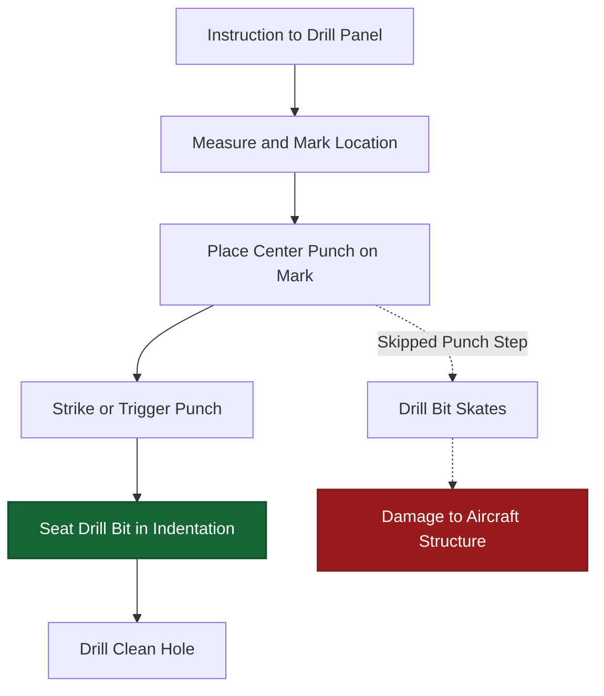
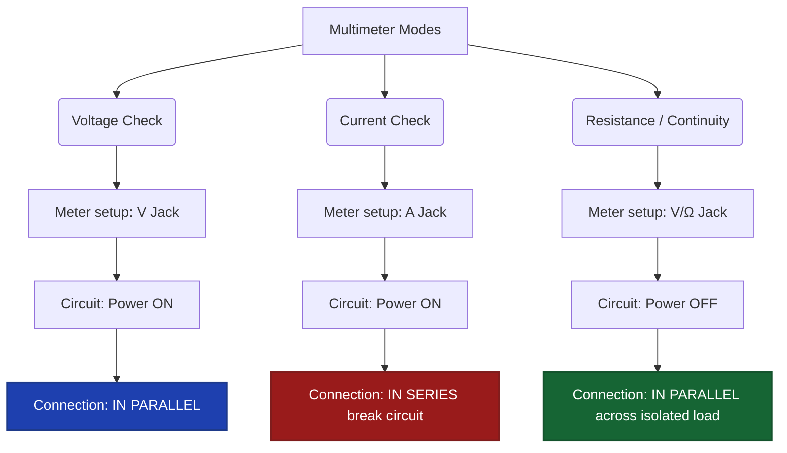
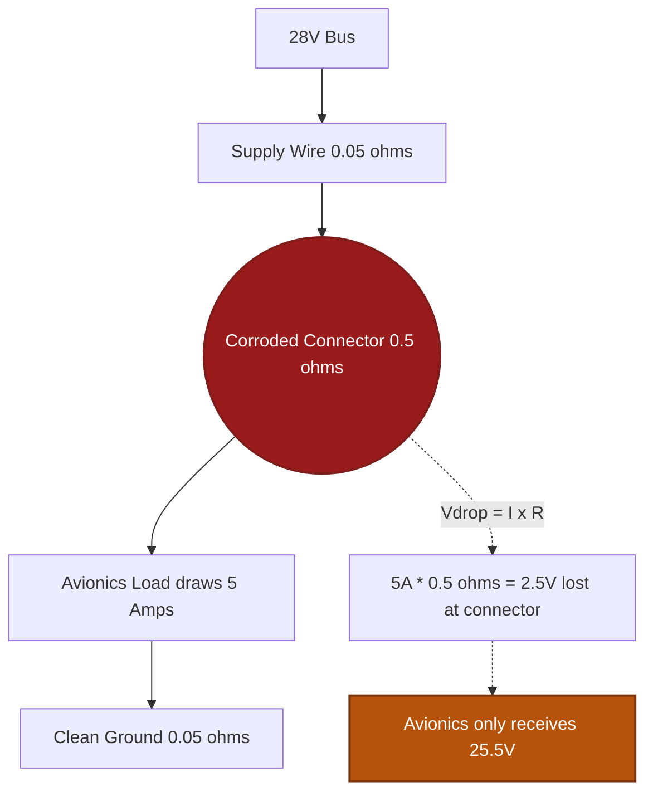
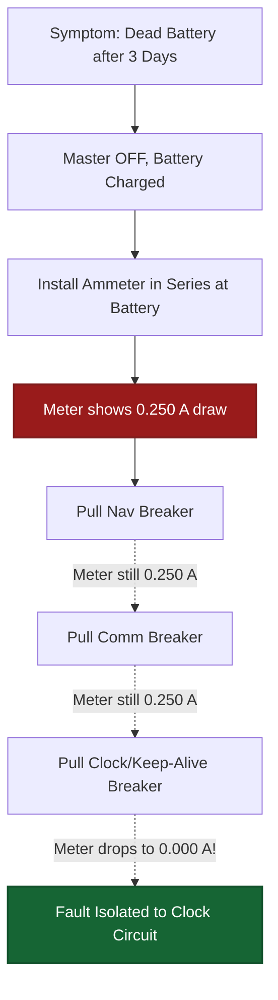
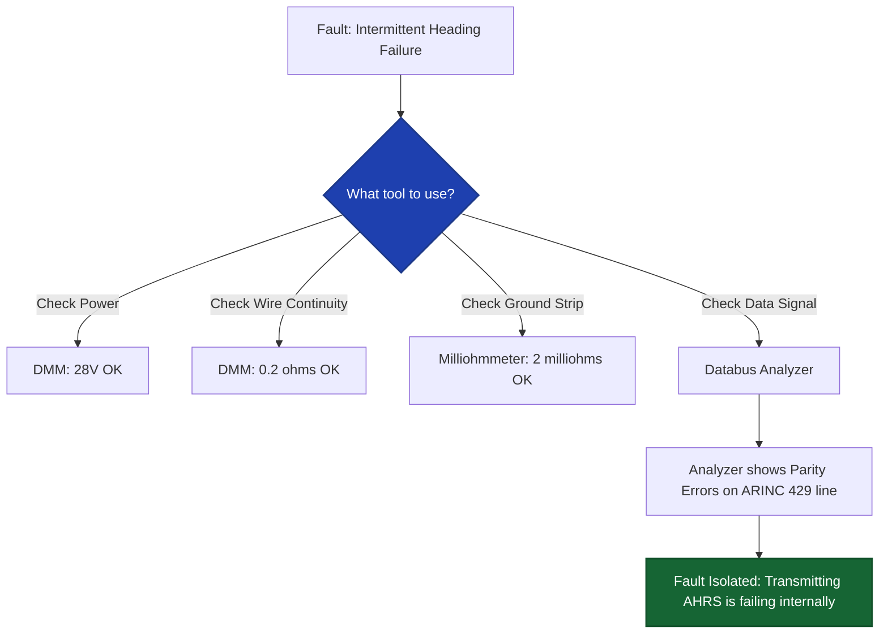
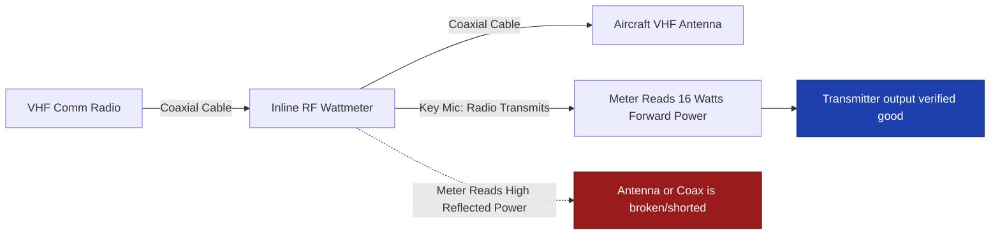

# World 4: Tools & Test Equipment — NEETS-Style Training Content
> **6 Nodes | 5 Zones | Estimated Read Time: 40–50 minutes total**

---
---

# Node: Hand Tools & Precision Basics
**Zone: Hand Tools**

## 📋 OBJECTIVES
- Describe the purpose and correct use of a center punch.
- Identify the cause and preventative measures for screwdriver cam-out.
- Outline the three-step procedure for accurate micrometer measurements.

## 🎯 WHY THIS MATTERS

A technician is drilling a mounting hole for a new antenna doubler plate on the pressurized belly of a King Air. They position the drill and pull the trigger — but the bit skates across the slick aluminum and gouges a 3-inch slot instead of a clean hole. The skin is ruined. The fix was simple: using a center punch before drilling. Proper hand tool use is not about "natural skill" — it is about following the correct, disciplined procedure the first time, every time.

## 📖 WHAT YOU NEED TO KNOW

### Center Punch
A **center punch** is a hardened steel tool struck with a hammer to create a small conical indentation in metal. 
Its absolute purpose is to provide a **starting seat for the drill bit**, preventing the bit from skating (walking) across the surface when it first begins to rotate. 
- You must use a center punch before *every* drilled hole in sheet metal.
- Spring-loaded automatic center punches are common in avionics because they require only one hand and no hammer.

### Screwdriver Selection and Cam-Out
**Cam-out** occurs when a screwdriver slips out of the screw head recess under torque, damaging the screw head (stripping it) and potentially sending the tool sliding across surrounding surfaces. Prevention is simple but strictly enforced: **use a properly sized driver** that fully fills and engages the screw head recess.
- An undersized blade has less contact area and cams out more easily.
- A worn or damaged driver tip significantly increases cam-out risk.
- In avionics, a cam-out event can gouge an anodized radio faceplate, strip soft-metal instrument panel fasteners, or send a Phillips driver sliding directly into a $10,000 circuit board.

### Micrometer Measurement Procedure
When measuring wire gauges, connector pin diameters, or hardware thickness, accurate micrometer readings require three disciplined steps:
1. **Clean** both measuring surfaces (spindle and anvil) to remove dust or oil bridging the gap.
2. **Zero Check** the micrometer — close it on nothing using the ratchet and verify the reading is exactly zero. (If not, it must be calibrated).
3. **Apply gentle, consistent pressure** exclusively using the thimble ratchet — never grab the thimble and torque it down. Excessive force deforms the workpiece and produces false, undersized readings.

## 🖼️ SYSTEM DIAGRAM

## 🔧 ON THE JOB

Before drilling: center punch. Before turning a screw: verify the driver tip fully and tightly seats in the recess with no slop. Before measuring with a micrometer: wipe the anvil and verify the zero. These are three-second mechanical habits that protect you from hours of rework and thousands of dollars in damaged aircraft hardware.

## 🔑 KEY TERMS
- **Center Punch** — A pointed steel tool that creates a starting indentation to guide a drill bit, preventing wandering.
- **Cam-Out** — The forceful slipping of a screwdriver from the screw recess under torque, caused by undersized or worn driver tips.
- **Micrometer Zero Check** — Verifying the micrometer reads zero with nothing between the measuring surfaces before taking critical measurements.

## ⚡ THE BOTTOM LINE

**Center punch before drilling, use the exact correct size screwdriver to prevent cam-out, and always wipe and zero a micrometer before measuring.**

---
---

# Node: DMM Basics (Modes & Connections)
**Zone: Multimeters**

## 📋 OBJECTIVES
- Identify the correct circuit connection methodology (series vs. parallel) for measuring voltage, current, and resistance.
- State the necessary power state (ON or OFF) for each measurement type.
- Interpret an "OL" reading during a continuity test.

## 🎯 WHY THIS MATTERS

A technician connects a multimeter directly across a landing light bulb to measure how much current it draws. The meter's internal fuse blows instantly with an audible pop. Why? The technician connected an ammeter in *parallel*. An ammeter has near-zero internal resistance. By placing it in parallel, the technician created a dead short circuit directly through the meter. Getting the connection wrong destroys fuses, damages multimeters, and can result in severe arc flashes.

## 📖 WHAT YOU NEED TO KNOW

A **Digital Multimeter (DMM)** measures three primary electrical quantities: **voltage (V), current (A), and resistance (Ω)**. Because the meter behaves differently in each mode, the physical connection to the circuit must change.

### Voltage Measurement (V)
- **Connection:** Connect the meter **in parallel** (across the component). You do not need to disconnect any wires.
- **Power State:** Circuit must be **powered ON**.
- **Probe setup:** Red probe to the V/Ω jack, black to COM.
- *Physics:* In Voltage mode, the meter has extremely HIGH internal resistance (megohms) so that it sips almost zero current, preventing the meter from "loading" or affecting the circuit being measured.

### Current Measurement (A)
- **Connection:** Connect the meter **in series**. You MUST break the circuit and insert the meter so that all current flows *through* the meter.
- **Power State:** Circuit must be **powered ON** to flow current.
- **Probe setup:** Red probe MUST move to the dedicated 'A' or 'mA' jack, black to COM.
- *Physics:* In Current mode, the meter has extremely LOW internal resistance so it does not restrict the circuit current. **NEVER connect an ammeter in parallel.**

### Resistance Measurement (Ω)
- **Connection:** Connect the meter in parallel across the isolated component.
- **Power State:** Circuit power MUST be **OFF**.
- *Physics:* The meter provides its own small, internal battery voltage to push a tiny test current through the component. If applied to a live circuit, the external voltage will fight the meter and damage the ohmmeter circuitry.

### Continuity Test and "OL"
A continuity test uses the resistance mode (often with an audible beep) to verify whether a solid conductive path exists.
- **Near-zero resistance (Beep):** Path is complete (good wire, closed switch).
- **OL (Over Limit):** Path is broken (cut wire, open fuse, disconnected connector).
"OL" literally means the measured resistance exceeds the meter's maximum screen range. For avionics wiring, OL almost always proves an **open circuit**.

## 🖼️ SYSTEM DIAGRAM

## 🔧 ON THE JOB

Before touching probes to a circuit, adhere to this absolute three-second mental checklist: "What am I measuring? Are my leads in the right jacks for that? Is the power state correct for that?" If you are checking resistance, verify the master switch is off. If you are checking current, verify you have broken the circuit to insert the meter.

## 🔑 KEY TERMS
- **In Parallel** — Connecting a meter *across* a component without breaking the circuit. Required for voltage.
- **In Series** — Connecting a meter *inline* by breaking the circuit. Required for current.
- **OL (Over Limit)** — Meter screen indication that resistance exceeds the selected range; effectively means an open circuit.
- **Continuity Test** — A resistance measurement utilizing an audible tone used to verify a complete end-to-end conductive path.

## ⚡ THE BOTTOM LINE

**Voltage is measured in parallel (power ON), current is measured in series (power ON), resistance is measured with power OFF — and an ammeter connected in parallel creates a short circuit.**

---
---

# Node: Voltage Drop & Resistance Clues
**Zone: Fault Finding**

## 📋 OBJECTIVES
- Define voltage drop and explain its relationship to resistance in a wiring path.
- Identify common physical causes of excessive voltage drop in aircraft wiring.
- Explain why the ground return path must be tested during voltage drop troubleshooting.

## 🎯 WHY THIS MATTERS

A newly installed transponder works intermittently. You measure the aircraft bus — it is perfectly healthy at 28.0V. You pull the radio tray out and measure the power pin at the back of the tray — it reads 25.5V. You have a 2.5-volt drop. Where did the voltage go? It was consumed by **excessive resistance** in the wiring path (likely a bad crimp or a corroded ground). Mastering voltage drop is the single most powerful diagnostic skill an avionics technician can possess. 

## 📖 WHAT YOU NEED TO KNOW

### What Is Voltage Drop?
Voltage drop is the exact reduction in voltage between the power source and the load end. It is caused by unintended electrical resistance somewhere in the physical wiring path. Using Ohm's Law:

**V_drop = I × R_path**

Even tiny amounts of unexpected physical resistance create significant, measurable voltage drops because aircraft systems draw high current. A 0.5Ω resistance (a slightly loose screw) in a wire carrying 6 amps creates a 3-volt drop before the power ever reaches the component.

### Common Physical Causes of Voltage Drop
- **Corroded connector pins** — Oxidation acts as an insulator, drastically increasing contact resistance.
- **Loose ring terminals** — Incomplete surface contact reduces the path diameter, increasing resistance.
- **Bad splices** — Poorly crimped barrels or cold-soldered joints add parasitic resistance.
- **Undersized wire** — Wire that is too thin for the required current load has higher natural resistance per foot.

### The Ground Return Trap
The most commonly missed diagnostic step in aviation: Voltage drop can occur in **any part of the total circuit loop**, including the ground path. 
In a single-wire system, the airframe is the negative wire. A corroded aluminum ground point causes the exact same voltage drop symptoms as a corroded positive supply wire. You must check the **entire path** from source out to load, and from load back to the battery negative.

### Recognizing Voltage Drop Symptoms
- **Dim lighting** — The bulb illuminates, but at less than full intensity because it is receiving 22V instead of 28V.
- **Slow motors** — Flap or trim motors run sluggishly.
- **Intermittent avionics resets** — Radios reboot automatically when transmitting, because transmitting draws heavy current, which spikes the voltage drop, dipping the radio input voltage below its operational minimum threshold.

## 🖼️ SYSTEM DIAGRAM

## 🔧 ON THE JOB

When a component works, but poorly (dim, slow, erratic) — immediately measure voltage at the bus, then measure voltage at the component connector. If there is a measurable difference greater than 0.5V, you absolutely have a voltage drop fault. Trace the harness path visually. Inspect every bulkhead connector, terminal strip, and ground lug between those two measurement points.

## 🔑 KEY TERMS
- **Voltage Drop** — The loss of voltage along a wiring path due to unintended resistance, calculated by V_drop = I × R.
- **Contact Resistance** — The localized resistance at a mechanical connection point (pin, terminal, or lug) caused by corrosion, contamination, or insufficient torque.
- **Ground Return** — The negative side of the circuit path (often the aluminum airframe); it is equally susceptible to voltage drop issues as the positive supply line.

## ⚡ THE BOTTOM LINE

**Voltage drop is the result of physical resistance in the wiring path stealing voltage from your load — when diagnosing dim lights or rebooting radios, always check splices, connectors, AND the ground return.**

---
---

# Node: Basic Fault Isolation (Opens, Shorts, Parasitic Draw)
**Zone: Fault Finding**

## 📋 OBJECTIVES
- Differentiate between the symptoms of an open circuit, a short circuit, and a parasitic draw.
- Identify the correct immediate action when a circuit breaker trips upon reset.
- Outline the ammeter-based isolation procedure for finding a parasitic battery drain.

## 🎯 WHY THIS MATTERS

A flight school owner complains that the battery in their Piper Arrow is dead every single Monday morning. Over the weekend, with the master switch fully off and the keys out, something is silently draining power. This is a **parasitic draw** — and alongside hard shorts and open wires, it represents one of the three foundational faults in all electrical troubleshooting. Finding it requires methodical, logic-based fault isolation, not random component swapping.

## 📖 WHAT YOU NEED TO KNOW

Every electrical failure in an aircraft essentially boils down to three fundamental fault types.

### 1. Open Circuit (The Break)
An open circuit is a physical severing of the conductive path — no current can flow.
- **Symptoms:** 0V measured across the load. The component is completely dead. Breakers do not trip.
- **Common causes:** A cut wire, a blown fuse, an accidentally tripped breaker, an open switch, or a loose connector pin that backed out of its shell.
- **Diagnostic Logic:** If you measure 0V across a component in a powered circuit, the fault is almost always **upstream** — a switch or wire between the power source and the component is open.

### 2. Short Circuit (The Shortcut)
A short circuit is an unintended, low-resistance path that routes current directly to ground, completely bypassing the normal load.
- **Symptoms:** The circuit breaker trips forcefully. If reset, it trips again instantly. Severe overcurrent flow.
- **Common causes:** Chafed wire insulation rubbing against an aluminum rib, a pinched wire trapped under a radio tray, or a failed internal semiconductor creating a dead short to ground.
- **Diagnostic Logic:** A breaker that trips the **instant** you reset it indicates a hard short. **Do not repeatedly reset it "just to see."** Every reset pushes massive current through the fault, creating heat and worsening the physical wire damage. Stop, isolate the wire run, and visually inspect for chafing.

### 3. Parasitic Draw (The Silent Drain)
A parasitic draw is current consumed by a component when the master electrical switch is supposed to be OFF.
- **Symptoms:** A completely dead battery after the aircraft sits idle for a few days. Even tiny draws (like 100 milliamps) will kill an aviation battery over a quiet weekend.
- **Common causes:** Faulty master relays that remain welded closed, stuck hobbs meter switches, or modern avionics (like GPS keep-alive memory) wired directly to the hot battery bus incorrectly.

### Diagnosing Parasitic Draw (The Breaker Pull)
To isolate a parasitic draw silently killing a battery:
1. Ensure the Master Switch is OFF.
2. Place a highly accurate DMM ammeter in **series** with the battery negative cable. (You will see the tiny current draw on the screen).
3. Go to the cockpit and **pull circuit breakers out one at a time.**
4. Watch the ammeter. When you pull a specific breaker and the current instantly drops to zero, you have successfully isolated the circuit causing the draw. 

## 🖼️ SYSTEM DIAGRAM

## 🔧 ON THE JOB

When a breaker trips immediately upon engagement: stop, pull the equipment out, and inspect the harness for chafing. When a battery is mysteriously dead after sitting: use the series ammeter and breaker-pulling method. When a newly installed radio won't power up at all: check that the breaker is pushed in, the power pin is in the right slot, and the ground wire is actually bolted to bare metal. Methodical isolation beats random guesswork every time.

## 🔑 KEY TERMS
- **Open Circuit** — A physical break in the conductive path; zero current flows; results in 0V at the load.
- **Short Circuit** — An unintended, extremely low-resistance path bypassing the normal load; causes massive overcurrent and immediate breaker trips.
- **Parasitic Draw** — Unintended steady current consumed with the master electrical switch turned off, resulting in drained batteries over time.

## ⚡ THE BOTTOM LINE

**Opens give you zero volts and dead loads, shorts trip circuit breakers violently, and parasitic draws kill batteries slowly — use methodical isolation like the breaker-pull test to find the exact fault.**

---
---

# Node: Oscilloscope & Specialty Instruments Awareness
**Zone: Scope & Specialty Instruments**

## 📋 OBJECTIVES
- Describe the primary diagnostic advantage of an oscilloscope over a digital multimeter.
- Identify the specific fault conditions that require the use of a milliohmmeter or a megohmmeter.
- Explain the role of a databus analyzer in diagnosing digital communication failures.

## 🎯 WHY THIS MATTERS

An EFIS display loses its heading data intermittently. It drops out for two seconds, recovers, and works fine for an hour before doing it again. Your multimeter reads a rock-solid 28V at the display's power pin. Your continuity checks on the wiring pass perfectly. The fault is not in the power or the copper wire — it is in the **digital data**. The only way to see what is happening on an ARINC 429 databus is with a **databus analyzer**. Knowing exactly which specialty instrument to reach for is the hallmark of a master technician.

## 📖 WHAT YOU NEED TO KNOW

A standard Digital Multimeter (DMM) is a blunt instrument. It shows steady-state voltage and simple resistance. Advanced avionics require advanced insight.

### Oscilloscope (Visualizing Time)
An **oscilloscope (O-scope)** displays voltage as a visual function of time on a calibrated screen. Unlike a DMM which averages a reading into a single number, an oscilloscope shows you:
- **Waveform shape** — Is it a clean sine wave, a square wave, or corrupted digital pulses?
- **Amplitude** — The absolute peak-to-peak transient voltage limits.
- **Frequency** — How rapidly the signal cycles (Hz).
- **Interference** — Visually seeing high-frequency alternator noise riding on top of a DC power line.

**Use case:** When you need to see exactly *how a signal behaves over time* or identify split-second electrical noise glitches that a DMM cannot catch.

### Milliohmmeter (Micro-Resistance)
A standard multimeter cannot accurately measure resistance below 1 ohm because the resistance of the meter's own test leads skews the reading. A **milliohmmeter** uses a 4-wire technique to measure extremely low resistance values (milliohms) with extreme precision.
- **Use case:** Verifying lightning protection bonding straps. If the manual requires a bonding strap connection to measure less than 3 milliohms (0.003Ω) to the airframe, only a milliohmmeter can prove it.

### Megohmmeter (Megger / Insulation Testing)
A **megohmmeter** is designed specifically to test the integrity of wire insulation. It applies a very high test voltage (typically 500V or 1000V DC) across the insulation to see if it "leaks" current. 
- **Use case:** Testing heavy gauge starter cables, generator windings, or aging wire bundles for microscopic cracks, chafing, or moisture intrusion. A standard DMM's 3-volt battery cannot stress insulation enough to find a high-voltage leak. Readings are measured in Megohms (Millions of ohms).

### Digital Databus Analyzer
Modern avionics (Garmin, Collins, Honeywell) talk to each other using high-speed digital protocols like ARINC 429, RS-232, or Ethernet. A **databus analyzer** connects non-intrusively to the data wires and:
- Captures the lightning-fast 1s and 0s in real time.
- Decodes the raw binary into human-readable engineering data (e.g., "Heading: 275 degrees").
- Flags corrupted data words, parity errors, or incorrect timing.
- **Use case:** Essential for diagnosing "red X" display failures when the power and wiring are perfect, but the transmitting computer is broadcasting garbage data.

## 🖼️ SYSTEM DIAGRAM

## 🔧 ON THE JOB

Match the specific instrument to the question you are asking:
- "What does this audio signal look like?" → **Oscilloscope**
- "Is this static wick bonded tightly enough to the aluminum?" → **Milliohmmeter**
- "Is the insulation on this old generator cable breaking down?" → **Megohmmeter**
- "Why is the GPS not talking to the Autopilot?" → **Databus analyzer**
Reaching for a DMM out of habit when you need an analyzer wastes hours. 

## 🔑 KEY TERMS
- **Oscilloscope** — A visual test instrument that displays voltage amplitude against time, revealing waveform physical shape and high-frequency noise.
- **Milliohmmeter** — A precision instrument for measuring microscopic resistance (bonding, ground paths).
- **Megohmmeter (Megger)** — A high-voltage tester used exclusively to verify the integrity of wire insulation and motor windings.
- **Databus Analyzer** — A protocol reader that captures, decodes, and translates digital bus traffic (like ARINC 429) to diagnose communication faults.

## ⚡ THE BOTTOM LINE

**Oscilloscopes show high-speed waveforms over time, milliohmmeters prove bonding integrity, megohmmeters stress-test wire insulation, and databus analyzers translate digital communication.**

---
---

# Node: Wattmeter Basics
**Zone: Tool Governance**

## 📋 OBJECTIVES
- Define the function of a wattmeter.
- Explain how a wattmeter connects to a circuit compared to a voltmeter or ammeter.
- Identify common avionics scenarios where an inline RF wattmeter is mandatory.

## 🎯 WHY THIS MATTERS

A pilot complains their VHF communication radio sounds weak and has very short range. The radio receives fine, and it powers on. To determine if the transmitter amplifier is actually pushing energy out to the antenna, you cannot use a standard multimeter. You need to measure the actual Radio Frequency (RF) power output. Inserting an **inline RF wattmeter** between the radio and the antenna gives you the definitive answer instantly.

## 📖 WHAT YOU NEED TO KNOW

### What a Wattmeter Measures
A **wattmeter** is an instrument designed to directly measure **electrical power (the rate of energy transfer) in watts (W)**. 

While you can mathematically calculate DC power using Ohm's Law (P = V × I) by taking separate voltage and current measurements, a wattmeter performs this multiplication internally and displays the true power instantly on a single dial or screen.

### How a Wattmeter Connects (Internal Architecture)
Because power requires both voltage and current, a legacy electro-mechanical wattmeter requires two simultaneous connections to the circuit:
1. **Voltage sensing coil** — Wired in **parallel** across the load (exactly like a standard voltmeter).
2. **Current sensing coil** — Wired in **series** with the load (exactly like a standard ammeter).
The magnetic interaction between these two internal coils physically drives the needle to display total Watts. (Modern digital wattmeters use solid-state sensors to do the same thing).

### Avionics Application: The RF Wattmeter
In avionics, the most common daily use of wattmeter technology is the **Inline RF Wattmeter** (often colloquially referred to as a "Bird meter," after the famous manufacturer). 
- It is physically inserted inline (in series) into the coaxial cable connecting a transmitting radio to its antenna.
- When the pilot keys the microphone (transmits), the meter reads the exact RF wattage the amplifier is producing (e.g., 16 Watts for a VHF Comm radio).
- It also measures **Reflected Power** — energy that bounces back from a broken or untuned antenna, helping the technician instantly diagnose a bad antenna installation.

### AC Power: True Power vs. Apparent Power
In heavy AC alternating current circuits (inverters, large motors), a wattmeter reads **True Power** (actual usable watts consumed). This is vital, because due to phase shifts in AC motors (reactance), simply multiplying Volt-Amps with a DMM gives you "Apparent Power", which is artificially higher. A true RMS wattmeter does the complex math to show you what the system is *actually* consuming.

## 🖼️ SYSTEM DIAGRAM

## 🔧 ON THE JOB

When diagnosing a weak transmitter, do not guess. Disconnect the antenna coaxial cable at the radio rack, insert an inline RF wattmeter into a dummy load, and key the transmitter. If the meter reads the manufacturer's specified output (usually 10-16 watts for VHF), the radio is fully functional and your problem is definitively out in the aircraft wiring or the antenna structure itself. 

## 🔑 KEY TERMS
- **Wattmeter** — A test instrument that directly measures the electrical power output or consumption in watts.
- **Inline RF Wattmeter** — A specialized meter inserted into coaxial cables to measure the forward output power and reflected power of radio transmitters.
- **Reflected Power** — RF energy that fails to radiate out of the antenna and bounces back down the cable, indicating an antenna or cable fault.
- **True Power** — The actual usable power consumed in an AC circuit, accounting for phase shifts, read definitively by a wattmeter.

## ⚡ THE BOTTOM LINE

**A wattmeter reads true power by simultaneously sensing voltage and current; in avionics, inline RF wattmeters are the absolute standard for verifying radio transmitter health and antenna integrity.**
