# World 5: Aircraft Wiring & Harness — NEETS-Style Training Content
> **12 Nodes | 5 Zones | Estimated Read Time: 55–65 minutes total**

---
---

# World 5: Aircraft Wiring & Harness — NEETS-Style Training Content
> **12 Nodes | 5 Zones | Estimated Read Time: 55–65 minutes total**

---
---

# World 5: Aircraft Wiring & Harness — NEETS-Style Training Content
> **12 Nodes | 5 Zones | Estimated Read Time: 55–65 minutes total**

---
---

# Node: Wire Types & Insulation
**Zone: Wire/Cable Fundamentals**

## 📋 OBJECTIVES
- Identify the standard military specification (MIL-Spec) for modern avionics wire insulation.
- List the three environmental criteria used to select wire insulation for a specific aircraft zone.
- Explain the critical consequence of incorrect blade depth when stripping PTFE wire.

## 🎯 WHY THIS MATTERS

You are routing power wire for a new ELT installation. Part of the intended route passes near a heating duct boundary. You reach for the exact same 20 AWG wire you used in a cabin audio system install — but that wire was PVC-insulated, rated to only 80°C. The boundary temperature comfortably exceeds 120°C. Within months, the PVC insulation melts away, the conductor shorts to the adjacent metal rib, and the ELT either fires inadvertently or fails to fire in a crash. The wire type must perfectly match the environment.

## 📖 WHAT YOU NEED TO KNOW

### PTFE (Teflon) Wire — MIL-W-22759
**PTFE-insulated wire** (specifically the MIL-W-22759 series) is the absolute standard wire insulation used in modern General and Business Aviation aircraft. 
Key properties that make it mandatory:
- **Temperature range:** Rated from -65°C to +200°C.
- **Lightweight:** The insulation layer is extremely thin compared to automotive wire.
- **Chemical resistance:** It is impervious to aviation fuels, oil, hydraulic fluid (Skydrol), and de-icing fluids.
- **Abrasion resistance:** It withstands vibration-induced friction against other wires in a bundle.

### High-Temperature Applications
When wiring near engines, exhaust systems, or high-heat zones:
- You must use **MIL-W-22759/16** (PTFE, rated ~200°C) or **fiberglass-insulated** wire (rated 400°C+).
- Attempting to use standard PVC, nylon, or automotive-grade wire will result in catastrophic insulation failure. Automotive wire has no place in an aircraft.

### Insulation Selection Criteria
When selecting wire for an installation, match the insulation to the physical environment using three strict criteria:
1. **Temperature rating** — The insulation's rated max temperature must significantly exceed the maximum local ambient temperature of the aircraft zone.
2. **Chemical resistance** — The insulation must resist any fluids uniquely present in that zone.
3. **Abrasion resistance** — The insulation must withstand the specific routing conditions (e.g., tight conduit wear vs. open tray routing).

### Stripping PTFE Insulation (The Danger Zone)
PTFE insulation is incredibly tough, thin, and tightly bonded to the copper conductor. When using automatic mechanical strippers:
- **The cutting blade depth must be precisely calibrated** for the exact wire gauge.
- **Too deep:** The blade nicks the outer copper strands. This creates a stress riser. Under flight vibration, that nicked strand will rapidly fatigue and break, reducing the current capacity of the wire and creating a hot spot.
- **Too shallow:** The blade fails to fully sever the tough PTFE, stretching it and leaving microscopic insulation residue on the conductor, guaranteeing a high-resistance crimp.

## 🖼️ SYSTEM DIAGRAM
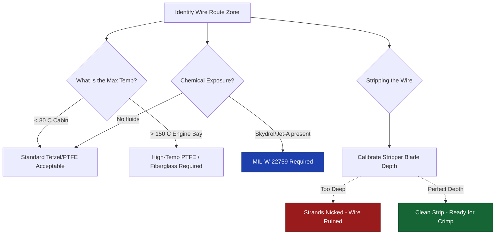

## 🔧 ON THE JOB

Before running any new wire, check the physical installation location: Is it near the engine? Near hydraulic lines? In an unpressurized wheel well? Match the insulation to the environment. When stripping PTFE, never guess the calibration. Strip a 1-inch piece of scrap wire from the exact same spool, inspect the copper strands under a magnifying glass for nicks, and only proceed to the aircraft once the tool is perfectly dialed in.

## 🔑 KEY TERMS
- **PTFE (MIL-W-22759)** — The standard aircraft wire insulation: lightweight, highly temperature-resistant, and chemically impervious.
- **Blade Depth** — The critical setting on automatic wire strippers that must perfectly match the wire gauge to avoid conductor nicks or insulation residue.
- **Stress Riser** — A physical nick or scratch in a metal strand that concentrates vibration forces, initiating rapid fatigue cracking.

## ⚡ THE BOTTOM LINE

**PTFE/MIL-W-22759 is the structural standard — you must match the insulation to the specific aircraft zone environment and perfectly calibrate stripper blade depth to protect the copper strands.**

---
---

# Node: Wire Gauge Sizing
**Zone: Wire/Cable Fundamentals**

## 📋 OBJECTIVES
- Interpret the AWG numbering system regarding physical conductor size.
- List the three primary factors used to strictly determine the correct wire gauge for a circuit.
- Explain the physical rationale for temperature de-rating.

## 🎯 WHY THIS MATTERS

A technician grabs a spool of 22 AWG wire to install a new high-intensity LED landing light circuit that draws 10 amps. The wire is rated for only 5 amps continuous. During a night flight, the wire begins to rapidly overheat, the insulation softens and smokes, and an electrical fire initiates behind the panel. Conversely, using massive 10 AWG wire for a circuit that draws 1 amp adds completely unnecessary weight, degrading aircraft performance. Wire gauge selection is a strict engineering decision — never a visual guess.

## 📖 WHAT YOU NEED TO KNOW

### American Wire Gauge (AWG)
The AWG system designates the physical size of the metallic conductor. **The numbering is inverted** — higher AWG numbers mean physically smaller wire:
- **22 AWG & 24 AWG** — Small conductors, exclusively used for extremely low-current digital signal wiring and databuses.
- **20 AWG & 18 AWG** — Medium conductors, the most common sizing for standard avionics equipment power feeds.
- **14 AWG & 12 AWG** — Larger conductors, used for high-current loads like landing lights or pitot heat.
- **10 AWG & 8 AWG** — Massive conductors, used for primary high-current bus feeders linking alternators to the main bus.

### Selecting the Correct Gauge (The Three Factors)
Correct wire gauge is determined by consulting the **aircraft wire load analysis** and calculating against the **manufacturer's ampacity tables** (found in AC 43.13-1B). You must synthesize three factors:
1. **Circuit Current Draw (Amps)** — The wire must be physically large enough to carry the required load continuously without overheating.
2. **Wire Run Length** — Every foot of wire adds resistance. Longer runs create more voltage drop. A 20-foot run might require jumping up to 18 AWG to deliver 28V to the tail, even if 20 AWG could handle the current safely.
3. **Installation Temperature (De-rating)** — As ambient air temperature increases (like near the engine), the wire's ability to safely dissipate its own heat decreases. Therefore, its allowable current capacity must be mathematically reduced (de-rated).

### The Consequences
- **Undersized wire (too high AWG number)** → Restricts current → Creates intense resistive heating → Damages insulation → Electrical fire risk.
- **Oversized wire (too low AWG number)** → Carries the current effortlessly → Adds massive unnecessary weight across a 50-foot run → Reduces aircraft useful load.
- Correct sizing is an engineering balancing act between absolute thermal safety and weight efficiency.

## 🖼️ SYSTEM DIAGRAM
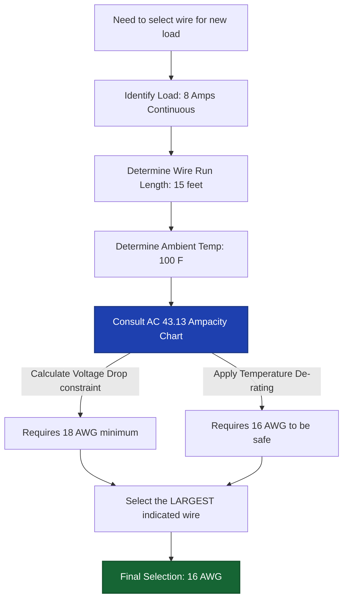

## 🔧 ON THE JOB

Never assume a wire gauge is correct just because it "looks thick enough." Check the installation manual for the specific equipment's current draw. Consult the AC 43.13 ampacity table for the specific wire formulation, factor in the total run length to ensure voltage drop stays below 0.5V, and de-rate the capacity if routing the bundle through warm structural areas. The engineering load analysis document proves this for each circuit before sign-off.

## 🔑 KEY TERMS
- **AWG (American Wire Gauge)** — The standard wire physical sizing system; higher numbers equal smaller wire diameters.
- **Ampacity** — The absolute maximum current a specific wire can safely carry continuously without thermally degrading its insulation.
- **De-rating** — The required mathematical reduction of a wire's allowable current capacity based on elevated ambient temperatures or bundling multiple hot wires together.

## ⚡ THE BOTTOM LINE

**Higher AWG numbers mean smaller wires; you must select gauge using strict ampacity tables that account for continuous current draw, total run length, and thermal de-rating.**

---
---

# Node: Crimping Fundamentals
**Zone: Terminations/Connectors**

## 📋 OBJECTIVES
- Define the physical characteristics of a gas-tight crimp.
- Explain why non-ratcheting crimp tools are prohibited in aviation.
- Identify the consequences of using an incorrectly sized crimp die.

## 🎯 WHY THIS MATTERS

A critical navigation connector pin fails intermittently in flight — causing loss of autopilot tracking for 2 seconds, followed by immediate recovery. On the bench, static continuity tests pass perfectly. The technician pulls the suspect contact out of the housing and finds a loose crimp — the wire effortlessly pulls out of the metal barrel with light finger pressure. The original crimp was made with an uncalibrated, hardware-store, pliers-type tool that the installer released before full compression. An approved, calibrated ratcheting tool physically prevents this failure.

## 📖 WHAT YOU NEED TO KNOW

### The Physics of the Crimp Connection
A proper avionics crimp creates a **gas-tight, low-resistance, mechanically permanent** connection through cold-forming physics:
1. The complex die geometry of the crimp tool **mechanically crushes and deforms** the terminal barrel perfectly around the stripped wire strands.
2. The immense, controlled force creates pure **metal-to-metal cold bonding** between every individual strand and the terminal wall.
3. This deformation perfectly seals the interface — **no oxygen (gas-tight)** can penetrate the connection.
4. Because oxygen is excluded, **oxidation and corrosion cannot form** at the wire-to-terminal interface over the multi-decade lifespan of the aircraft.

### Calibrated Ratcheting Crimp Tools
Aircraft wire termination strictly requires a **calibrated ratcheting crimp tool** (like the ubiquitous blue DMC tools):
- The **ratcheting mechanism** physically locks the handles. The tool cannot be opened or released until the crimp cycle handles are squeezed to absolute full compression.
- This mechanical interlock guarantees the exact same massive crimp force on every single termination, regardless of hand strength or fatigue.
- Non-ratcheting (pliers-type) tools allow technicians to make partial crimps that look visually complete but lack the internal deformation required. They will inevitably pull loose under flight vibration.

### Crimp Tool Die Selection (The Matrix)
The correct die (or turret head) must exactly match **two specific physical parameters**:
1. **Terminal/Contact Type** — Determines the die geometry (the shape of the crush, whether indent or wrapped barrel).
2. **Wire Gauge (AWG) Selector** — Determines the absolute depth of the crimp indentation.

Using the wrong die completely ruins the termination:
- **Over-crimped (Die too small/Gauge selector too high)** → Crushes and fractures the barrel, heavily scoring and breaking the delicate copper strands inside.
- **Under-crimped (Die too large/Gauge selector too low)** → Leaves a loose connection that is not gas-tight, guaranteeing high contact resistance and future pull-out failure.

## 🖼️ SYSTEM DIAGRAM
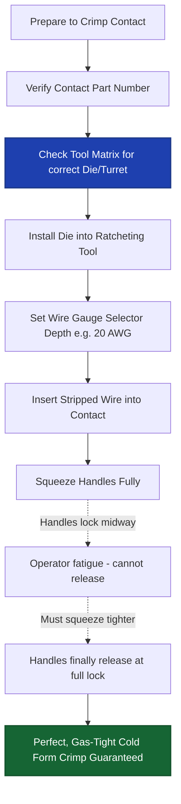

## 🔧 ON THE JOB

Before squeezing the handles, visually verify: Do I have the correct terminal? Do I have the correct color turret installed? Is the gauge selector dial matched to the wire I am holding? After crimping, perform a swift tug-test on the connection — it should not pull free under firm force. If it moves at all, the crimp is defective, the wire must be cut back, and the process restarted with a newly verified tool setting.

## 🔑 KEY TERMS
- **Gas-Tight Crimp** — A physical deformation crimp that seals the wire-to-terminal interface from environmental oxygen, permanently preventing internal oxidation and maintaining ultra-low resistance.
- **Ratcheting Crimp Tool** — A specialized, calibrated hand tool that mechanically cannot release its jaws until the full programmed crimp force cycle is completed.
- **Turret Head / Die** — The interchangeable mechanical component of a crimp tool that dictates the physical shape and depth of the crush applied to the terminal.

## ⚡ THE BOTTOM LINE

**You must exclusively use a calibrated ratcheting crimp tool fitted with the exact correct die for the terminal and wire gauge — partial crimps from cheap tools cause catastrophic intermittent system failures.**

---
---

# Node: Connectors & Backshells
**Zone: Terminations/Connectors**

## 📋 OBJECTIVES
- Define the primary purpose of multi-pin circular and D-sub connectors in avionics architectures.
- List the three protective functions provided by a connector backshell.
- Explain the purpose and methodology of the dynamic "wiggle test."

## 🎯 WHY THIS MATTERS

A VHF comm radio works flawlessly on the quiet test bench but repeatedly drops offline when the aircraft hits light turbulence. The technician pulls the radio tray out to inspect the large D-subminiature connector at the rear. They find the metal backshell is missing its clamping screws, leaving the massive bundle of fifty wires dangling freely. Without the backshell's strain relief, every vibration bump pulls directly on the tiny crimped pins inside the housing, causing them to lose contact micro-seconds at a time. A $5 backshell clamp would have prevented a massive diagnostic headache.

## 📖 WHAT YOU NEED TO KNOW

### The Function of Connectors
Aircraft **connectors** (like D-Subs or Circular Mil-Specs) provide a reliable, modular, removable electrical junction between the massive aircraft wire harnesses and the delicate avionics equipment. 
Their primary engineering purpose is modularity: **LRUs (Line Replaceable Units) can be swiftly removed and replaced** for repair without having to cut wires or destructively disturb the airframe harness.

### The Criticality of Backshells
A **backshell** is the metallic or composite rear housing of a connector that firmly clamps the exiting wire bundle. A connector without a properly installed backshell is unairworthy. It provides three mandatory functions:
1. **Strain Relief:** It securely anchors the heavy wire bundle to the connector shell, absorbing massive mechanical tension so pulling forces do not transfer to the fragile, millimeter-thin connector pins.
2. **Vibration Protection:** It acts as a rigid splint, shielding the delicate pin terminations from dynamic flight loads and engine harmonics.
3. **Environmental Sealing & Shielding:** In advanced connectors, it excludes moisture and provides absolute 360-degree continuity for the cable's EMI shielding braid to ground out against the chassis.

### Environmentally Sealed Splices
When making permanent connections in moisture-prone areas (wheel wells, engine bays, unpressurized tail cones, bilge areas), standard butt splices are inadequate. Connections must be **environmentally sealed** using:
- **Solder-Sleeves:** A precise, heat-shrinkable sleeve containing a pre-tinned solder ring that flows when heated with a heat gun, simultaneously fusing the conductors and sealing the joint from moisture.
- **Adhesive-Lined Heat-Shrink:** Placed over a standard crimp splice, the inner polymer melts during shrinking, oozing out the ends to form a permanent waterproof barrier.
Open nylon crimp splices or wrapping joints in electrical tape are **strictly prohibited** in aviation.

### The Wiggle Test (Dynamic Diagnostics)
A single static continuity check with a multimeter on the ground is useless against vibration-induced faults. You must perform a **wiggle test**:
- With the system powered and operating, gently but firmly flex, push, and bend the wire harness immediately behind the connector backshell.
- Monitor the avionics display or audio output for any dropouts, static, or resets.
- This dynamic test exclusively detects marginal crimps that maintain delicate touching contact at rest but structurally break apart under flex.

## 🖼️ SYSTEM DIAGRAM
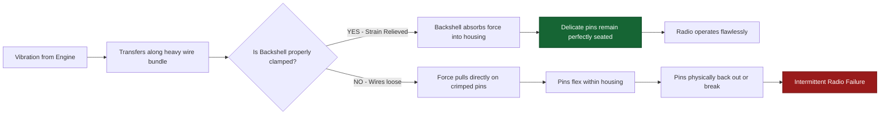

## 🔧 ON THE JOB

After meticulously pinning out a 37-pin connector, never rush the final step. Verify the backshell saddle clamp is tightened evenly—snug enough to grip the bundle tightly so it cannot be pushed or pulled, but not so tight that it crushes the Teflon wire insulation. Before signing off any new digital installation, perform a vigorous wiggle test at every single connector interface to guarantee you haven't left a ticking time-bomb in the harness.

## 🔑 KEY TERMS
- **Backshell** — The structural rear housing geometry of a connector that clamps the wire bundle to provide strain relief, vibration damping, and shielding continuity.
- **Strain Relief** — A mechanical anchoring method that isolates delicate electrical terminations from physical tension and bundle weight.
- **Solder-Sleeve** — A specialized pre-tinned, heat-activated splice tube that provides simultaneous electrical connection and absolute environmental sealing.
- **Wiggle Test** — A dynamic manual flexing of wiring harnesses near connectors during operation to expose hidden intermittent faults.

## ⚡ THE BOTTOM LINE

**Backshells are structurally mandatory to prevent vibration damage, wet-area splices must be environmentally sealed, and rigorous wiggle tests catch the intermittent faults that simple static testing completely misses.**

---
---

# Node: Harness Fabrication Basics
**Zone: Harness Fab/Routing**

## 📋 OBJECTIVES
- Explain the critical importance of comprehensively studying a wiring diagram before fabrication begins.
- List three approved methods for securing and grouping aviation wire harnesses.
- Identify securing methods that are strictly prohibited in aircraft structures.

## 🎯 WHY THIS MATTERS

A junior technician spends three hours cutting 45 wires to exact lengths, stripping the ends, crimping high-density contacts onto every wire, and painstakingly inserting them into a military-spec circular connector. Just as they click the final pin into place, the lead technician reviews the engineering print and points out that the RS-232 transmit and receive lines (Wires 14 and 15) were swapped in the schematic interpretation. Because the specialized connector contacts are non-reusable, both wires must be cut off, stripped, and re-crimped with new expensive pins — wasting hours of labor. This devastating error would have been prevented by a five-minute structured diagram review.

## 📖 WHAT YOU NEED TO KNOW

### First Step: Master the Diagram
Aviation wiring diagrams are dense, complex engineering blueprints. Before picking up wire cutters, you must thoroughly trace and comprehend the diagram to verify:
- All logical wire runs and physical routing lengths.
- Precise connector locations and exact pin assignments (distinguishing between male pins and female sockets).
- Required wire gauges and shielding prerequisites for each individual circuit.
- Breakout points where the main trunk splits into smaller branches.

Errors caught with a highlighter on paper cost zero dollars. Errors discovered after wire is physically cut, stripped, and pinned waste immense time, ruin expensive consumables, and destroy production schedules.

### Harness Securing and Binding Methods
Unlike automotive wiring which runs wildly through chassis channels, aircraft harnesses must be rigidly structured into tightly bound bundles. There are three primary approved methods for binding and securing harnesses:
1. **MS/AN Lacing Cord:** The traditional, ultra-reliable aerospace method. It utilizes approved waxed nylon or Kevlar flat cord tied in highly specific, interlocking structural knots (like the clove hitch secured by a square knot). It is prized because it adds virtually zero weight and cannot chafe adjacent bundles.
2. **Nylon Tie Wraps (Zip Ties):** Highly restricted in aviation. If used, they must be aerospace-grade (Tefzel) for high-temp environments and **must** have their tails cut absolutely flush using a specialized tensioning tool. A protruding, sharply cut zip-tie tail acts like a razor blade against adjacent technicians' wrists and neighboring wire bundles under vibration.
3. **Cushioned Clamps (Adel Clamps):** Rigid metal loop clamps lined with extruded synthetic rubber. These are bolted directly to the aircraft structure at rigidly specified intervals (typically every 12 to 24 inches) to support the weight of the bundle and prevent any sagging.

### Prohibited Methods
In aerospace, the following are completely unauthorized for securing harnesses:
- **Rubber bands** (they rapidly degrade, dry-rot, and snap).
- **Adhesive electrical tape** (the adhesive turns to sludge under heat, leaving the bundle loose and sticky).
- **Automotive split-loom tubing** (vibrates rapidly, chafes insulation, and traps flammable fluids).

## 🖼️ SYSTEM DIAGRAM
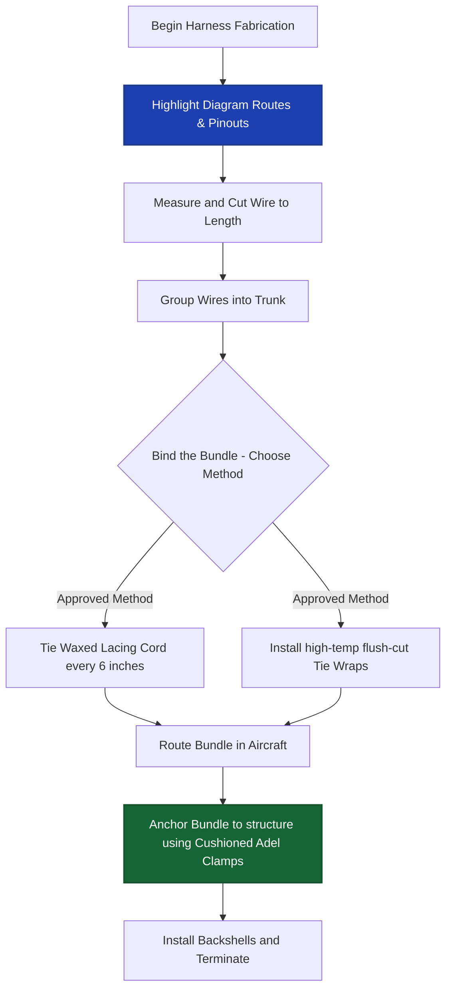

## 🔧 ON THE JOB

Before you cut a single foot of wire, trace every single run on the master schematic with a brightly colored highlighter. Verbally verify the pin assignments. Check the gauge callouts on the drawing. When lacing the harness, ensure the knots are tight but not strangling the wires. When anchoring the bundle to the airframe, ensure the rubber cushion on the Adel clamp sits squarely against the bundle — metal-to-wire contact is a strict structural failure.

## 🔑 KEY TERMS
- **Wiring Diagram** — The authoritative engineering blueprint documenting all circuit wire runs, exact pin assignments, required gauges, and physical routing.
- **Lacing Cord** — Specially formulated, flat waxed cord (MS/AN spec) used to tightly bind wire bundles via structural knots without adding chafing hazards or weight.
- **Cushioned Clamp (Adel)** — A metal loop clamp lined with synthetic rubber used to rigidly secure heavy wire bundles to the airframe geometry without damaging insulation.

## ⚡ THE BOTTOM LINE

**Spend ten minutes mastering the wiring diagram before cutting any material — and structurally secure the finished harness using solely approved lacing cord, flush tie wraps, and rubber-cushioned Adel clamps.**

---
---

# Node: Routing & Protection
**Zone: Harness Fab/Routing**

## 📋 OBJECTIVES
- Identify the primary environmental and structural hazards that dictate wire routing paths.
- Explain the physical requirement of installing strain relief near connector bulkheads.
- Describe the mandatory protection procedures for wire bundles routed near moving flight controls.

## 🎯 WHY THIS MATTERS

During an extensive 100-hour inspection, a sharp-eyed technician spots a sleek new wire bundle resting gently against an elevator control cable sector bracket in the aft tailcone. Looking closely, the constant motion of the control surface has sawed cleanly through the wire's outer Teflon jacket, and the raw copper conductor is visibly exposed, mere millimeters from shorting out against the steel bracket. One more aggressive flight could have resulted in a dead short circuit immediately adjacent to a primary moving flight control. Meticulous wire routing is not a cosmetic exercise — it is a life-saving structural discipline.

## 📖 WHAT YOU NEED TO KNOW

### Routing Priority — Separation from Hazards
The absolute highest priority when laying out a wire routing path is physically maintaining maximum separation from four primary hazards:
1. **Heat Sources:** Exhaust stacks, environmental heating ducts, and high-temp engine blocks. (Radiant heat destroys insulation integrity).
2. **Moving Parts:** Aileron, elevator, and rudder control cables, spinning actuator screws, and rotating propeller shafts.
3. **Sharp Edges:** Exposed structural ribs, lightning-hole raw edges, bracket corners, and protruding bolt threads.
4. **Fluid Lines:** Fuel lines, high-pressure hydraulic manifolds, oxygen lines, and oil returns. (Wiring must always be routed physically *above* fluid lines to prevent dripping flammable fluids from tracking down the wire harness).

### The Necessity of Strain Relief
**Strain relief** is the practice of solidly anchoring the wire bundle immediately before it enters a physical connector or a delicate component. 
- It absorbs the massive mechanical tension generated by airframe flex and G-forces.
- It prevents the total weight of the heavy bundle from pulling directly on the fragile soldered joints or micro-crimped pins inside the connector.
- Without it, vibration will rapidly fatigue the terminations, causing intermittent system dropouts.

### Routing Near Flight Controls (Critical Danger)
If engineering dictates a wire bundle must be routed near moving flight control cables or mechanical linkages, absolute restrictions apply:
- The bundle must be encased in **approved protective conduit** or heavy-duty spiral wrap.
- The bundle must possess **sufficient mechanical slack** ensuring that at absolute zero point during the control's maximum deflection geometry can the cable pull tight, bind the mechanism, or restrict movement.
- Wires must **never** be zip-tied or clamped directly to moving flight control cables under any circumstance.

### Chafed Wire Bundle — Mandatory Procedure
When inspecting a routing path and discovering a chafed bundle:
1. **Immediate Action:** Remove all power from the affected circuits. Tag out the breakers.
2. **Investigation:** Assess the full, 360-degree extent of the damage. Disassemble the bundle if necessary to inspect internal wires.
3. **Rectification:** Follow uncompromising repair procedures dictated by the manufacturer's maintenance manual or AC 43.13-1B. (If the copper conductor is nicked, the wire **must** be cut and repaired; tape over exposed copper is illegal).
4. **Root Cause:** Address the routing flaw that caused the chafe before signing off the repair. Add an Adel clamp or reroute.

### Routing Conflicts
If a dense wire bundle simply does not fit through the designated engineering routing path hole:
- **Do NOT force or yank it.** Heavy pulling aggressively stretches the conductors and shears the insulation.
- **Do NOT trim out structural material** to make the hole bigger without engineering approval.
- **Consult the installation engineering manual** to request an approved alternate deviation route.

## 🖼️ SYSTEM DIAGRAM
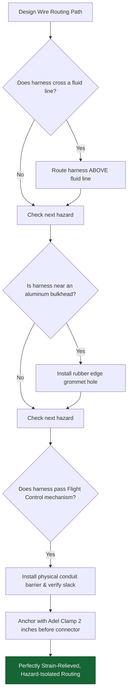

## 🔧 ON THE JOB

During every single installation, inspection, or panel closure, physically run your bare hand gently along the wire harness. You will feel for proximity to sharp structural edges, engine heat sources, or moving mechanical parts far better than you can see them deep in the airframe. Verify that every Adel clamp is torqued and that the routing path is completely clear of the flight control sweep envelope. A five-minute physical routing verification prevents catastrophic in-flight electrical fires.

## 🔑 KEY TERMS
- **Strain Relief** — A rigid anchoring methodology near a connector that structurally absorbs bundle tension, protecting the microscopic pins and internal terminations from failure.
- **Chafing** — The aggressive, friction-based destruction of wire insulation caused by vibration-induced contact with a sharp edge or rough structural surface.
- **Bulkhead Grommet** — A rubber or nylon protective ring inserted into a hole cut in sheet metal, preventing the knife-like edge from slicing through wires routed through it.

## ⚡ THE BOTTOM LINE

**Route harnesses completely clear of heat, moving parts, sharp edges, and highly flammable fluid lines — protect bundles intensely near flight controls with conduit, and immediately anchor bundles preceding all connectors to provide absolute strain relief.**

---
---

# Node: Service Loops & Routing Discipline
**Zone: Harness Fab/Routing**

## 📋 OBJECTIVES
- Define the structural purpose and standard length of an avionics service loop.
- Explain the physical criteria for assessing damaged wire jacket covering.
- Identify the standard minimum bend radius allowed for aircraft data cables.

## 🎯 WHY THIS MATTERS

Five years after an expensive dual-GPS installation, a technician discovers a single connector pin is badly corroded and must be replaced. They carefully extract the pin, cut the wire back a quarter-inch, strip it, and crimp on a new gold contact. But when they attempt to re-insert the pin into the heavy connector housing, the wire is now pulled bow-string tight—it is a half-inch too short to reach the socket. Because the original installer failed to leave a service loop, the only FAA-approved fix is to install an inline splice. With a proper service loop, the extra coiled wire provides enough slack material for future re-terminations without adding multiple failure points.

## 📖 WHAT YOU NEED TO KNOW

### The Necessity of Service Loops
A **service loop** is a deliberately fabricated coil of extra wire length intentionally stored immediately behind a connector or terminal block. 
- **The Purpose:** Over a commercial aircraft's 30–50 year service life, avionics LRUs and connectors are removed, rebuilt, and modified dozens of times. Each re-termination (cutting, stripping, and re-crimping a pin) permanently shortens the wire by roughly 0.5 inches.
- **The Payoff:** The service loop provides the **raw material for future repairs** without the catastrophic necessity of splicing.
- **The Standard:** A typical avionics connector service loop provides 4 to 6 inches of coiled extra wire, rigidly secured just before the backshell.

### Harness Support Requirements
A completed, properly routed harness must be structurally secured to the airframe geometry:
- **Support Intervals:** Harnesses must be secured at regular intervals — typically every 12 to 24 inches, or closer if specified by the maintenance manual.
- **Minimum Bend Radius:** Wires cannot be sharply folded. The standard minimum bend radius is typically **10 times the outside diameter of the wire bundle**. If bent tighter, the internal copper strands stretch and fracture, and the Teflon insulation cold-flows thin, risking a short circuit.

### Damaged Harness Jacket Assessment
A wire bundle is often encased in an outer protective jacket (like fiberglass braiding or extruded Teflon). When this outer jacket is found chafed or damaged during inspection:
- **Superficial damage (Jacket only):** May be repaired in place with approved heat-shrink tubing, silicone tape, or split conduit, per the structural repair manual (SRM).
- **Deep damage (Individual wire insulation compromised):** Requires meticulous assessment. If only one wire's primary insulation is scratched but the conductor is intact, it might be repaired. If multiple primary insulations are cut or copper is exposed, the harness section must be cut out and completely replaced.

## 🖼️ SYSTEM DIAGRAM
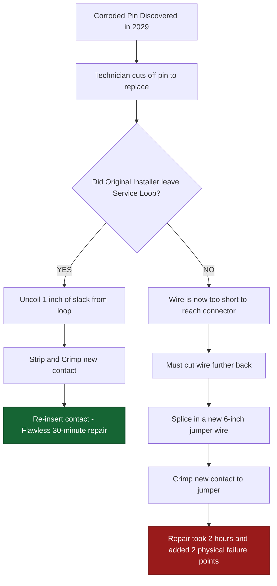

## 🔧 ON THE JOB

When fabricating a new harness, always factor in an additional footprint of length for a service loop at every single connector interface. Tie it neatly. It costs practically nothing in weight or material during the initial build phase, but it saves thousands of dollars in labor and aircraft downtime when the system inevitably requires repair years in the future.

## 🔑 KEY TERMS
- **Service Loop** — Extra wire specifically stored in coils near connectors to guarantee sufficient material for future re-terminations without splicing.
- **Minimum Bend Radius** — The tightest engineered arc a wire or bundle can be bent around without causing structural damage to conductors or insulation (typically 10x diameter).
- **Jacket Damage Assessment** — The critical inspection evaluating outer harness covering damage to determine whether an in-place repair or full harness replacement is legally required.

## ⚡ THE BOTTOM LINE

**Service loops provide essential wire for future LRU re-terminations, harnesses must be supported every 12–24 inches, and wire bundles can never be bent tighter than 10 times their diameter.**

---
---

# Node: Shielding & EMI Basics
**Zone: Shielding & Repairs**

## 📋 OBJECTIVES
- Define EMI and trace its common sources inside an aircraft.
- Demonstrate the three primary layout techniques used to eliminate EMI coupling.
- Explain why a shielded cable's drain wire must only be grounded at one end.

## 🎯 WHY THIS MATTERS

A newly installed digital audio panel operates flawlessly on battery power. However, the exact moment the pilot turns on the aircraft alternator, a loud, piercing whine that changes pitch precisely with engine RPM floods the pilot's headset. The technician inspects the wiring: the sensitive mic audio signal wire was zip-tied directly alongside the high-current alternator output wire, and to make matters worse, the audio cable's outer shield was left entirely disconnected (floating). The system suffered massive **Electromagnetic Interference (EMI)**. This lesson teaches you how to design harnesses that are completely immune to this invisible threat.

## 📖 WHAT YOU NEED TO KNOW

### EMI (Electromagnetic Interference)
**EMI** is destructive, unwanted electrical energy that magnetically couples from a 'noisy' emitting circuit into an adjacent 'quiet' receiving circuit, vastly degrading analog signal quality and corrupting digital databuses. 
Common high-emission EMI sources include:
- Alternator output lines (AC ripple noise)
- Strobe light power supplies (high-voltage capacitive switching spikes)
- Ignition harnesses (massive high-voltage pulses)
- Transmitting radio coaxial cables (RF radiation)

### Three Mandatory EMI Reduction Techniques
1. **Physical Separation:** The most effective defense. Route sensitive signal wires and noisy power wires in completely distinct bundles, maintaining an absolute minimum of 3 inches of physical separation throughout the airframe.
2. **Twisted-Pair Wiring:** Signals (like databus lines) are transmitted down two identical conductors twisted tightly together (e.g., 6 twists per foot). Any magnetic noise wave passing through the bundle induces an equal but completely opposite voltage in each overlapping twist, perfectly canceling the noise out to zero.
3. **Shielded Cables:** A dense, conductive metal braid woven entirely around the internal signal wires. It physically intercepts and captures incoming electromagnetic fields before they can reach the sensitive copper core.

### Shield Termination (The Single-Point Ground Rule)
The absolute most critical rule of avionics shielding: **Ground the braided shield drain wire at ONE end only** (typically at the receiver or the avionics chassis end).

**Why?** Grounding a shield at *both* ends physically connects two different airframe locations. Due to airframe resistance, those two points often sit at fractionally different voltage potentials. This difference drives a massive current straight through the shield braid from one end to the other. This phenomenon is called a **Ground Loop**. A ground loop physically transforms your protective shield into a massive, noise-radiating antenna — creating the exact interference you were paid to eliminate.

### Floating Shields Provide Zero Protection
A shielded cable where the drain wire is **not connected to ground at either end** provides absolute **zero EMI protection**. The metallic shield intercepts the magnetic waves, but without a ground path to dump that energy into the airframe, the energy simply bleeds straight through the insulation and directly onto the signal conductor.

## 🖼️ SYSTEM DIAGRAM
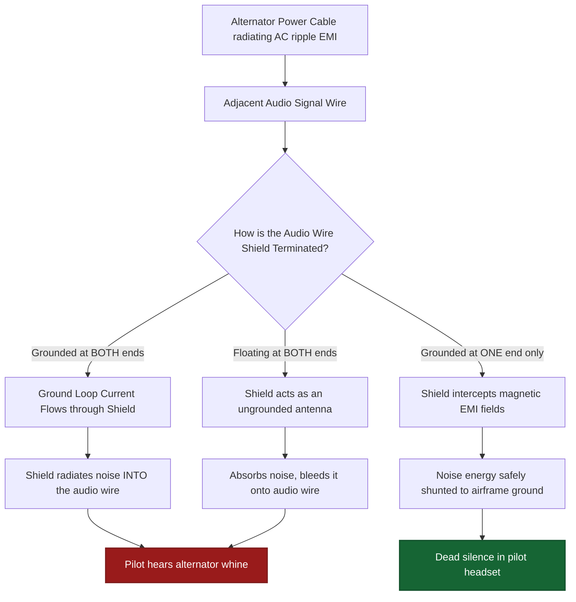

## 🔧 ON THE JOB

When terminating shielded cables, meticulously unbraid the shield, form the drain wire pigtail, and apply a solder sleeve to extend the ground lead. **Verify on the schematic which end gets grounded.** If you ground both, you will spend three days chasing a mystery audio whine. If you ground neither, the shield is dead weight. Finally, physically separate the audio, databus, and power bundles as early as possible behind the instrument panel.

## 🔑 KEY TERMS
- **EMI (Electromagnetic Interference)** — Unwanted external electrical energy magnetically coupling into a circuit and heavily degrading or corrupting its signal.
- **Ground Loop** — A destructive conductive loop formed by mistakenly grounding a cable shield at both ends, allowing circulating currents that radiate immense interference.
- **Drain Wire** — The uninsulated pigtail conductor formed from the shielding braid, specifically used to terminate the shield to an airframe ground point.
- **Twisted-Pair** — Two signal conductors uniformly twisted together specifically to magnetically cancel induced external noise.

## ⚡ THE BOTTOM LINE

**Physically separate power from signal routing, exclusively ground shields at one end only to prevent ground loops, and leverage twisted-pair wiring for differential databus lines.**

---
---

# Node: Soldering Awareness
**Zone: Shielding & Repairs**

## 📋 OBJECTIVES
- Execute the fundamental thermodynamic rule of successful soldering.
- Differentiate the chemical composition and application of rosin-core vs. acid-core solder.
- Identify the visual and physical characteristics of a defective "cold joint."

## 🎯 WHY THIS MATTERS

A technician, lacking supplies, uses a thick roll of plumbing-grade acid-core solder found in a hangar drawer to terminate a delicate shield drain wire onto a D-sub connector ground pin. The finished joint looks perfect—bright, smooth, and well-flowed. Six months later, the avionics fail. The inspector finds the solder joint turned powdery green and crumbled apart at the slightest touch. The highly corrosive acid flux literally ate the microscopic copper conductor from the inside out. Using the correct aviation-grade rosin-core solder would have guaranteed a 40-year lifespan.

## 📖 WHAT YOU NEED TO KNOW

### The Universal Technique
The absolute, unbreakable fundamental rule of soldering is: **Heat the work, never the solder.**

1. Place the tinned, heavy iron tip firmly against the **joint** (touching both the copper wire and the brass terminal pad simultaneously).
2. Allow the mass of the joint to reach full soldering temperature (typically takes 2–4 seconds).
3. Apply the raw solder wire directly to the **heated copper wire/pad** — on the side completely opposite the iron tip.
4. Because solder instinctively flows toward heat, it will aggressively flow *through* the joint by capillary action, instantly filling all microscopic gaps.
5. Remove the solder reel first, allow it a second to stabilize, then remove the iron tip. Do not disturb the joint while it cools.

### The Cold Joint (Failure Mode)
Applying raw solder directly onto the hot iron tip and attempting to "paint" it onto a cold wire creates a **cold joint**. 
- Because the copper wire was not hot enough to achieve atomic wetting, the solder merely sits on the surface like cold wax on glass.
- Cold joints appear distinctly dull, frosty, grainy, and physically bulbous.
- They possess immense electrical resistance and are mechanically shattered instantly by standard flight vibration.

### Approved Solder Chemical Type
**60/40 Rosin-Core Solder** (60% Tin / 40% Lead) or equivalent Mil-Spec alloy is the legacy aviation standard:
- **Alloy Ratio:** Provides an incredibly low melting point and flows beautifully into complex stranded geometries. (Modern lead-free SAC305 is becoming common but requires much higher temperatures and specific techniques).
- **Rosin-Core Flux:** The center of the solder wire contains benign rosin flux. When heated, it aggressively cleans oxidation off the copper mating surfaces. When cooled, the leftover residue is completely inert (non-corrosive) and harmless if left uncleaned.

### Prohibited: Acid-Core Solder
**Acid-core solder is universally prohibited** in all avionics, aerospace, and electrical work.
- It is designed exclusively for heavy copper plumbing pipe sweating.
- The acid flux is violently corrosive.
- Even if wiped clean, microscopic acid traces remain trapped between the wire strands, relentlessly attacking the copper conductors and connector contacts over time until the circuit physically breaks apart in mid-air.

## 🖼️ SYSTEM DIAGRAM
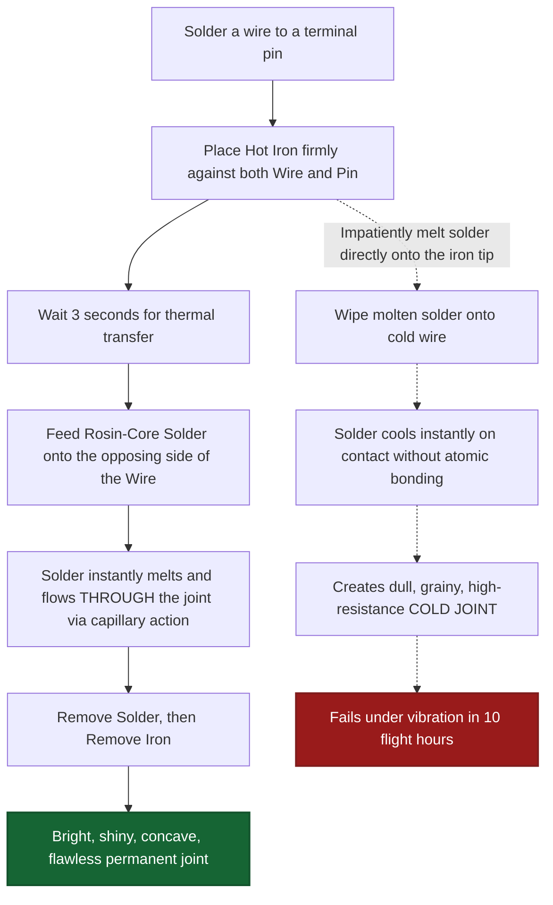

## 🔧 ON THE JOB

When soldering in the avionics shop, physically inspect the solder roll label to verify it explicitly says "rosin-core" or "no-clean flux" before applying it to an aircraft component. If you find unlabeled, thick solder sitting on a workbench, throw it in the trash—it is likely acid-core. Heat the work for a full 3 seconds before applying solder. If the solder beads up and rolls off the wire instead of sucking into the strands, the work is simply not hot enough yet.

## 🔑 KEY TERMS
- **Rosin-Core Solder** — An approved aviation solder alloy featuring a benign, non-corrosive flux center that safely cleans oxidation from copper pads.
- **Acid-Core Solder** — A plumbing solder containing immensely corrosive acid flux; structurally prohibited in all aircraft electrical work as it eats wiring over time.
- **Cold Joint** — A defective, brittle solder joint caused by profoundly insufficient base metal heat; visually appears excessively dull, lumpy, and grainy, and possesses massive electrical resistance.
- **Capillary Action** — The fluid dynamic process where molten solder is aggressively pulled into the microscopic gaps between heated copper strands.

## ⚡ THE BOTTOM LINE

**Aggressively heat the work first (never just the solder), exclusively utilize 60/40 rosin-core flux solder, and completely eradicate any acid-core solder from the hangar — it will destroy copper joints over time.**

---
---

# Node: Heat Shrink & Solder Sleeves
**Zone: Shielding & Repairs**

## 📋 OBJECTIVES
- Distinguish between the environmental applications of standard heat-shrink versus adhesive-lined heat-shrink.
- Explain the three simultaneous functions performed by a military-spec solder sleeve.
- Detail the correct application methodology using a calibrated heat gun.

## 🎯 WHY THIS MATTERS

You have just crimped a crucial butt splice joining wires routing directly through the aircraft's unpressurized, fully exposed wheel well. If you leave it as a standard bare nylon crimp, splashing runway moisture, de-icing fluid, and grime will corrode the connection within a single winter season, causing a landing gear warning failure. By encasing the joint in the correct adhesive-lined heat-shrink tubing or replacing it with an integrated Mil-Spec solder sleeve, you completely seal the joint from the hostile environment, extending its uncompromised service life to match the airframe itself.

## 📖 WHAT YOU NEED TO KNOW

### Heat-Shrink Tubing Fundamentals
**Heat-shrink tubing** is an engineered polymer sleeve that structurally shrinks to a tight, conforming fit around wiring when subjected to extreme localized heat from a calibrated hot air gun. Aviation utilizes two distinct classifications:

1. **Standard Heat-Shrink (Non-Lined):** Shrinks tightly to physically conform to the joint, providing excellent mechanical abrasion protection and electrical insulation. However, it *does not* seal against moisture (water can wick up under the ends). Used exclusively in protected, dry cabin environments.
2. **Adhesive-Lined Heat-Shrink (Dual-Wall):** Features a thick inner ring of specialized thermomelt adhesive. As the outer jacket shrinks, the inner adhesive viciously melts and flows into every crevice of the wire bundle. Required in **harsh, environmentally exposed zones** (wheel wells, engine bays, bilge areas, leading-edge exterior runs).

### Solder Sleeves (The Triple Threat)
A **solder sleeve** (often called environmental splices or Thermofit devices) is a remarkably advanced component that executes three critical functions simultaneously in a single application:
1. Contained within the transparent sleeve is a **pre-formed solder ring** with integrated flux — When heated to exactly 140°C, it melts and aggressively flows to create a flawless, permanent electrical connection between stripped wires.
2. The outer **heat-shrinkable insulation sleeve** recovers tightly, covering the exposed bare conductors.
3. Thermoplastic **sealing rings** placed at both extreme ends melt to create an absolute environmental barrier, preventing any moisture ingress.

### Application Rules and Discipline
- You must exclusively use a **calibrated industrial heat gun** tipped with a specialized reflector nozzle.
- Use of an open flame (lighters, butane torches) is strictly prohibited as it instantly scorches, chars, and ruins the structural integrity of the polymer insulation.
- Apply the heat evenly — starting rigorously from the center of the sleeve and sweeping outward to the edges to drive out trapped air bubbles.
- To verify a perfect solder sleeve installation: The solder ring must have completely vanished (flowed flat into the stranded wire), the sleeve must have fully recovered with zero wrinkles, and a visible tiny bead of sealing adhesive must have uniformly oozed out from both ends indicating a perfect seal.

## 🖼️ SYSTEM DIAGRAM
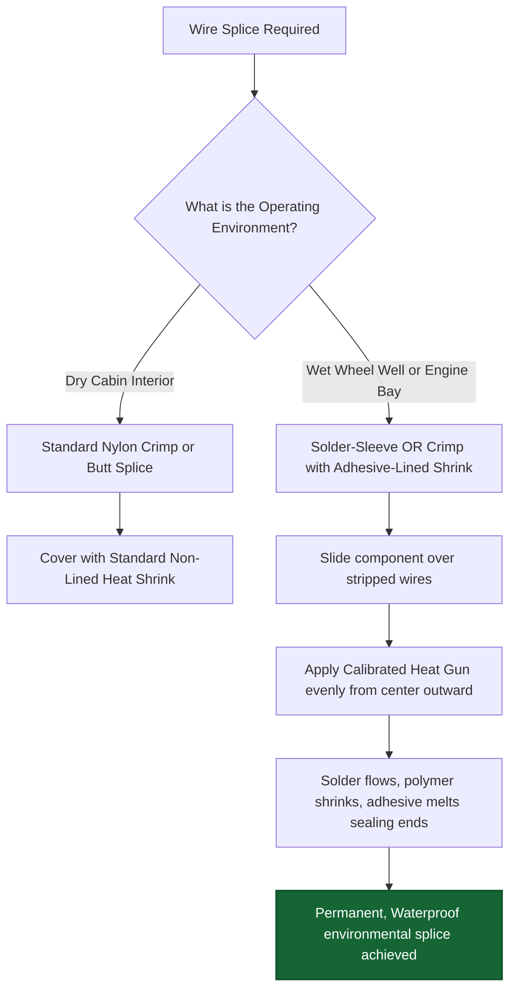

## 🔧 ON THE JOB

For standard dry cabin connections, utilizing generic heat-shrink directly over a traditional crimp splice is perfectly acceptable. For any airframe area violently exposed to ambient moisture, condensation, hydraulic fluids, or severe temperature extremes, you must escalate to adhesive-lined heat-shrink or integrated solder sleeves. Always deploy a dedicated electric heat gun with a curved reflector nozzle — never take a shortcut with a cigarette lighter.

## 🔑 KEY TERMS
- **Adhesive-Lined Heat-Shrink** — A premium heat-shrink structural tubing featuring a meltable inner adhesive core, absolutely required to establish a moisture-proof environmental seal in exposed aircraft zones.
- **Solder Sleeve** — A highly specialized, single-step transparent sleeve component that simultaneously solders, insulates, and environmentally seals a wire joint when precisely heated.
- **Reflector Nozzle** — A curved metallic attachment fitted to an industrial heat gun that efficiently wraps the hot air a full 360 degrees around the wire, ensuring even shrinkage and preventing localized scorching.

## ⚡ THE BOTTOM LINE

**Deploy standard thin-wall heat-shrink for dry cabin areas; mandate heavy adhesive-lined heat-shrink or robust solder sleeves for wet areas — apply heat evenly with a calibrated gun, never an open flame, and verify uniform adhesive oozing.**

---
---

# Node: Prohibited Practices
**Zone: Inspection & Prohibited**

## 📋 OBJECTIVES
- Explain the catastrophic structural mechanics that occur when solder is applied to a crimped contact.
- Identify three reasons why cheap automotive-grade connectors are strictly prohibited in aviation environments.
- Articulate the severe electrical hazards posed by leaving unused, unterminated wire ends exposed in a harness.

## 🎯 WHY THIS MATTERS

A well-meaning owner-assisted mechanic upgrades a Cessna 172's instrument panel and splices in a bulky, plastic automotive-style blade-fuse holder from an auto parts store alongside standard AutoZone nylon crimp connectors. It powers up perfectly on the ramp on a sunny day. However, during the first cold soak climb to 10,000 feet, the cheap unrated plastic violently contracts, the loosely stamped brass pins lose gripping contact, and the primary GPS display fatally drops out mid-flight. Automotive components are engineered for smooth asphalt, not altitude physics. Deploying them is not just amateurish—it is an outright violation of the Code of Federal Regulations.

## 📖 WHAT YOU NEED TO KNOW

### Three Strictly Prohibited Aircraft Wiring Practices

**1. Soldering Onto Crimp-Only Contacts**
When a technician nervously distrusts their own crimp tool, they often flow raw solder heavily into the crimped barrel "just for extra safety." In reality, they have ruined the joint.
- **The Physics of Solder Wicking:** The molten solder aggressively wicks deep up the fine wire strands by capillary action, stopping abruptly just under the wire insulation.
- This creates a massive transitioning **stress-concentration point (a 'hard spot')** where the rigid silver solder meets the highly flexible raw copper wire.
- Under natural flight vibration, the wire rapidly flexes exactly against this rigid ledge, snaps the brittle strands, and causes complete electrical failure. Crimp contacts are designed to be cold-crushed only; adding solder defeats the engineering.

**2. Utilizing Automotive-Grade Components and Connectors**
Aircraft components must meet excruciating FAA/military durability specifications (MIL-SPEC). Automotive components fail miserably in aerospace for several reasons:
- **Temperature Limits:** Auto parts are typically rated vaguely from 0°C to 80°C. Aircraft environments routinely fluctuate violently from -65°C to +200°C.
- **Vibration Harmonics:** Auto connectors lack rigid secondary locking mechanisms (like backshells or safety wire holes) and violently shake apart under aircraft harmonic frequencies.
- **Pressure & Altitude:** Unrated plastic housings outgas toxic fumes, become incredibly brittle, and shatter under high-altitude low pressures.
- Using uncertified hardware profoundly violates 14 CFR Part 43 maintenance standards.

**3. Leaving Unterminated Wire Ends Floating**
During a massive avionics upgrade, technicians often leave old, abandoned wiring coiled up under the panel intending to use it "later." If the stripped copper end is left raw and exposed:
- It creates massive **arc flash and electrical fire hazard** if it accidentally shifts and touches the grounded aluminum airframe while energized.
- Bare copper universally acts as a catalyst for rapid, cancerous corrosion drawing deep into the harness bundle.
- **Mandatory Procedure:** All unused, abandoned wire ends must be aggressively clipped, capped safely with an approved insulated splice cap or blank pin, permanently tied back securely, or completely extracted from the aircraft harness.

## 🖼️ SYSTEM DIAGRAM
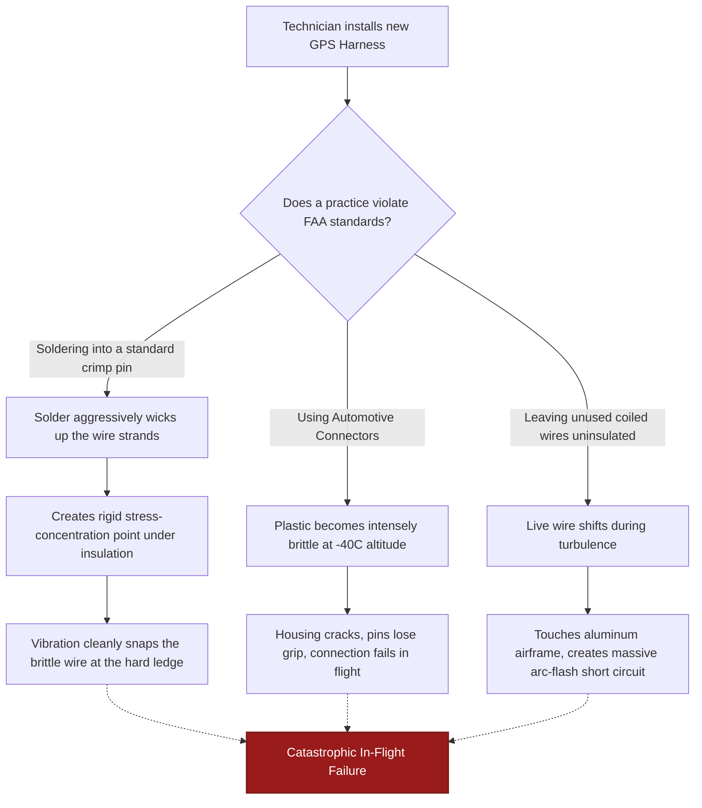

## 🔧 ON THE JOB

If you are inspecting an aircraft and encounter a cheap plastic automotive connector, a thick glob of solder hastily dripped onto a standard D-sub crimp pin, or a raw, stripped wire end flapping around unrestricted under the instrument panel, immediately document it as a hard discrepancy. You must report it to your lead technician or Quality Control inspector. These are not minor cosmetic gripes; they are lethal hazards that must be structurally corrected and signed off before returning the aircraft to service.

## 🔑 KEY TERMS
- **Solder Wicking** — The destructive fluid action where molten solder is aggressively drawn up delicate wire strands beyond the terminal barrel, causing a harsh transition zone that guarantees rapid fatigue failure.
- **Automotive-Grade** — Non-aviation civilian components engineered exclusively for low-stress surface environments; entirely uncertified for altitude, severe temperature shocks, and the intense vibration envelopes of flight.
- **Unterminated Wire** — Any exposed, bare conductor end that is not safely secured to a verified terminal, fully enclosed contact, or insulated end-cap—creating an immediate short circuit hazard.

## ⚡ THE BOTTOM LINE

**Never aggressively solder onto engineered crimp contacts, never utilize uncertified automotive connectors under any circumstance, and never leave raw wire ends unprotected under a panel — all three are severely prohibited in aircraft structural wiring.**

---
---

# Node: Safety Wire Twist Rate
**Zone: Inspection & Prohibited**

## 📋 OBJECTIVES
- Define the absolute purpose of applying safety wire to aviation hardware.
- State the rigid numerical standard twist-rate range required for the double-twist method.
- Explain the precise alignment required for the tension pull direction.

## 🎯 WHY THIS MATTERS

You are tasked with safety-wiring a heavy set of critical avionics rack fasteners following a major equipment installation behind the bulkhead. If you carelessly apply too few twists, the safety wire sits loose and sloppy—it provides exactly zero positive locking resistance against the bolt backing out. If you become overzealous and apply far too many twists, the stainless steel wire becomes highly brittle, work-hardened, and will inevitably fracture and fail long before the next scheduled inspection. Hitting the exact, rigidly specified twist rate ensures the lockwire performs its life-critical job indefinitely.

## 📖 WHAT YOU NEED TO KNOW

### The Core Purpose of Safety Wire
**Safety wire (Lockwire)** is an uncompromising positive locking methodology designed specifically to prevent fasteners (bolts, turnbuckles, cannon plugs) from violently backing out and failing due to intense aircraft vibration. It operates by physically locking the fastener geometry by structurally linking it with highly tensioned braided wire to a secure anchor point or another adjacent fastener.

### The Correct Structural Twist Rate
The absolute gold-standard twist rate for the ubiquitous **double-twist safety wire method** (as defined by FAA AC 43.13-1B) is strictly:
> **6 to 8 twists per linear inch.**

- **Fewer than 6 twists per inch:** The wire braid is entirely too loose. It cannot maintain the required tensile force, allowing the bolt tiny increments of play to vibrate loose. It will fail inspection.
- **More than 8 twists per inch:** The steel wire becomes aggressively work-hardened, over-stressed, and vastly prone to kinking. It will snap prematurely under minimal strain.
- **The 6–8 range:** The mathematical sweet spot providing maximum sustained tension layered with critical metallurgical fatigue resistance.

### Crucial Application Geometry
- Choose the correct gauge wire designed for the specific hardware size (typically robust **.032" stainless steel** for standard structural bolts).
- **The Pull Direction:** The wire routing MUST exert a constant, positive pulling tension in the fastener’s **tightening direction** (clockwise for standard threads). If the wire pulls in the loosening direction, it is actively helping the bolt fail.
- **The Pigtail Termination:** After achieving the final twist, the wire is snipped to leave 4-5 twists. This sharp pigtail end must be structurally bent profoundly back and tucked flush against the hardware. An untucked pigtail acts as an unseen razor blade, shredding technicians' wrists and severing adjacent delicate wire bundles.

## 🖼️ SYSTEM DIAGRAM
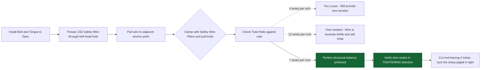

## 🔧 ON THE JOB

When actively safety-wiring on the ramp, hold a ruler up to your finished work and aggressively count the twists in a one-inch span — always aim for dead center at 7. Utilize professional, calibrated safety wire pliers for remarkably consistent, flawlessly even twisting. After securing the wire, critically verify the geometric pull direction (ensure it aggressively fights loosening) and run your gloved finger over the pigtail. If it snags your glove, it is not tucked tightly enough.

## 🔑 KEY TERMS
- **Safety Wire (Lockwire)** — A robust, physical positive locking technique utilizing braided stainless steel wire connecting hardware to violently prevent vibration-induced loosening.
- **Double-Twist Method** — The absolute aerospace standard methodology utilizing two parallel strands twisted rigidly together at an exact specification of 6–8 twists per inch.
- **Positive Locking** — A mechanical restraint system (like wire or cotter pins) that absolutely physically blocks a fastener from backing out, operating entirely independently of unreliable thread friction or chemical thread locker.

## ⚡ THE BOTTOM LINE

**Execute exactly 6 to 8 twists per inch for the standard double-twist safety wire method — fewer is uselessly loose, more is dangerously brittle, and always verify it positively pulls in the tightening direction.**
