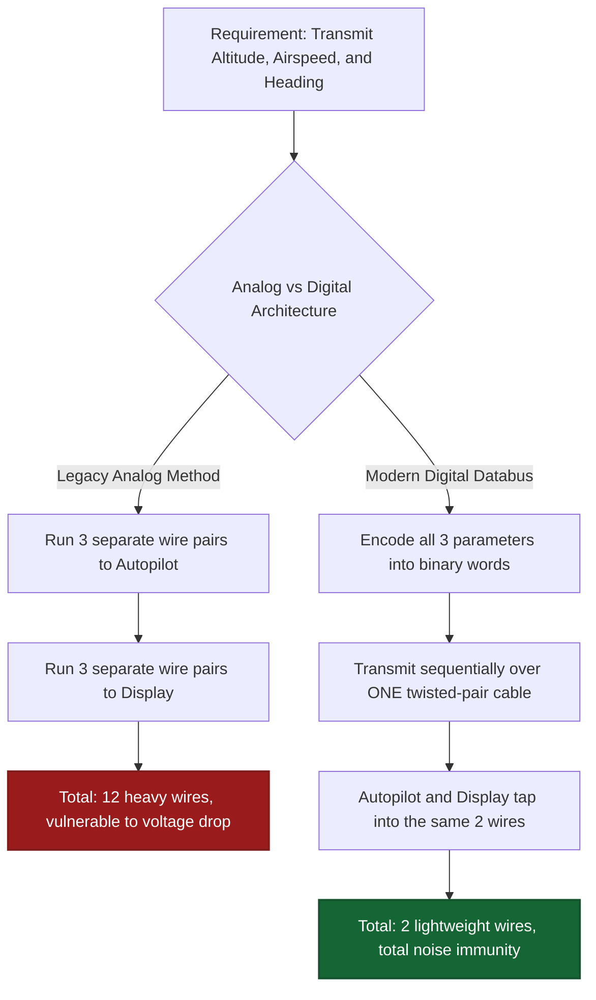
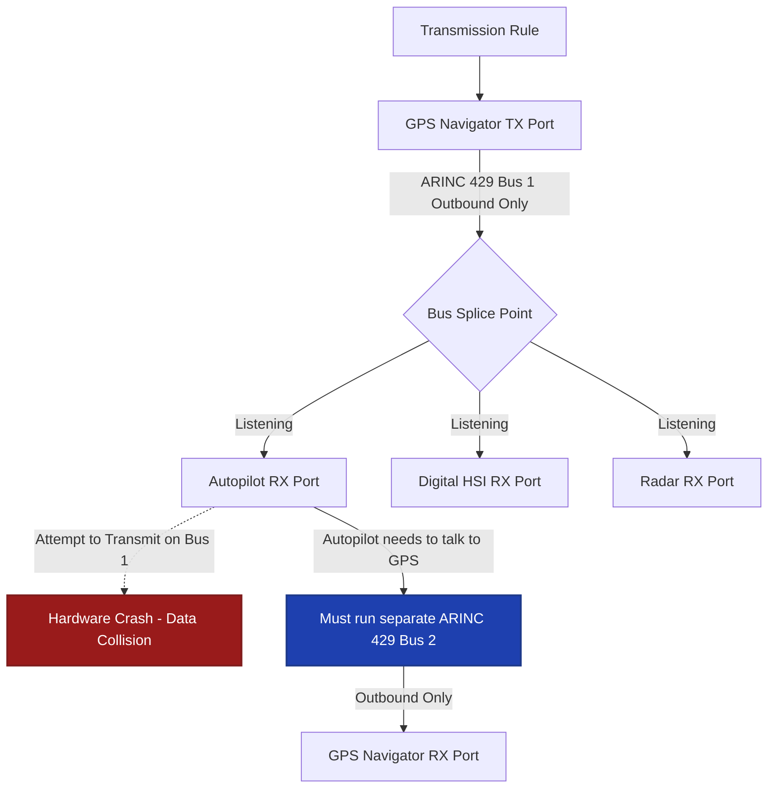
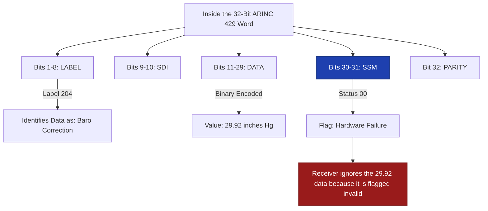
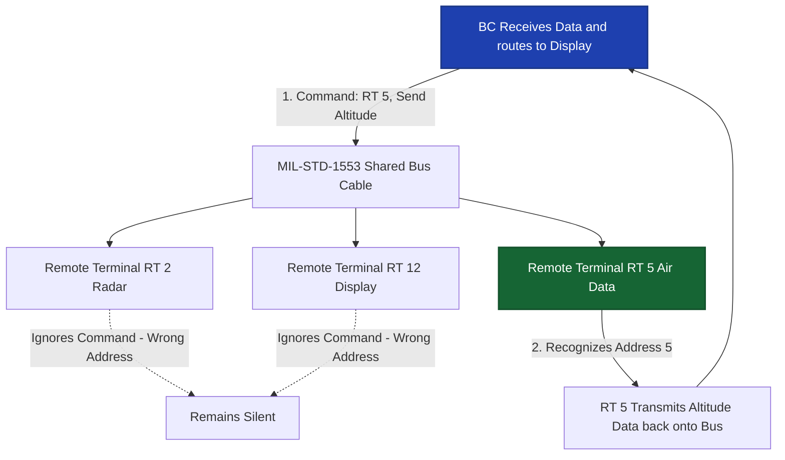
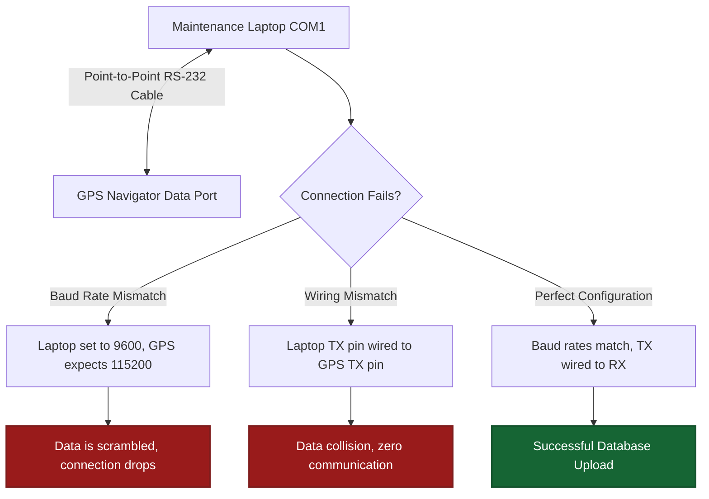
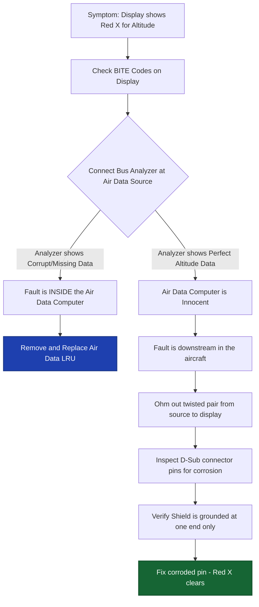

# World 6: Digital Databus Systems — NEETS-Style Training Content
> **5 Nodes | 4 Zones | Estimated Read Time: 35–45 minutes total**

---
---

# Node: Why Digital Databuses Exist
**Zone: Why Digital Buses**

## 📋 OBJECTIVES
- Contrast the wiring requirements of legacy analog architectures versus modern digital architectures.
- Identify the physical properties of Shielded Twisted Pair (STP) cable that provide noise immunity.
- Explain the utility of BITE (Built-In Test Equipment) in modern avionics line maintenance.

## 🎯 WHY THIS MATTERS

A 1970s commercial aircraft panel required upwards of 50 individual analog wires running from the air data computer to the autopilot, HSI, and flight director. Each physical parameter — altitude, airspeed, heading, vertical speed — required its own dedicated analog wire pair. In a modern glass-cockpit aircraft, all of that exact same data travels simultaneously on a single twisted-pair cable. Understanding fundamentally why digital buses replaced analog point-to-point wiring helps you comprehend the architecture of every modern avionics suite you will touch.

## 📖 WHAT YOU NEED TO KNOW

### What Is a Digital Databus?
A **digital databus** is a shared, standardized communication medium (the wires and the language) that allows multiple avionics LRUs (Line Replaceable Units) to seamlessly exchange thousands of data parameters using a standardized digital protocol, completely replacing individual point-to-point analog voltage wiring.

### Why Digital Buses Replaced Analog (The Three Pillars)
1. **Massive Wiring Reduction (Weight Savings):** A single shared bus replaces dozens of dedicated analog cables. Connecting 10 LRUs point-to-point in a mesh could require up to 45 individual bulky cable runs. A shared digital bus connects all 10 with a single, lightweight daisy-chained cable. This saves hundreds of pounds of copper per aircraft.
2. **Absolute Noise Immunity:** Analog signals (like a 0-5V pressure sensor) degrade proportionally with any induced electrical noise. Digital signals transmit data as discrete, rigid logic states (0 or 1). Small amounts of electrical interference simply do not corrupt the data — the noise spike must be massive enough to flip a 0 to a 1 (exceeding the noise margin) to cause an error.
3. **Industry Standardization:** A standardized bus protocol (like ARINC 429) defines exactly how the binary data is mathematically formatted, allowing a Garmin GPS to natively communicate with a Collins autopilot and a Honeywell display without requiring heavy, custom analog converter boxes.

### The Physical Medium: Shielded Twisted Pair (STP)
Nearly all avionics databuses utilize **shielded twisted-pair (STP)** wire to physically guarantee noise immunity:
- **Twisted construction:** Cancels induced magnetic field interference. Any magnetic noise wave passing through the bundle induces an equal and geometrically opposite voltage in each overlapping twist, perfectly canceling the noise to zero.
- **Conductive braided shield:** Blocks electrostatic (capacitive) coupling from adjacent transmitting antennas.

### BITE (Built-In Test Equipment)
Because digital LRUs are essentially high-powered computers, they include **BITE** — internal self-diagnostic software systems that:
- Continuously monitor internal hardware health and external bus communication.
- Perform rigorous power-on self-tests (POST) at startup.
- Store specific fault codes and flight event records in non-volatile memory.
- Allow line technicians to retrieve exact diagnostics directly from the front panel without requiring full bench testing or LRU removal.

## 🖼️ SYSTEM DIAGRAM

## 🔧 ON THE JOB

Before performing a functional test on any digital system (e.g., commanding an autopilot to climb), rigidly verify two things: (1) Check the BITE codes first—the LRU's internal diagnostics will often hand you the exact fault code immediately, and (2) Verify the system is actually receiving valid sensor data on its input buses. If the autopilot isn't receiving digital altitude data from the Air Data Computer, it will fail the functional test. Testing an LRU without valid input data produces false failures, leading to completely unnecessary box swapping.

## 🔑 KEY TERMS
- **Digital Databus** — A shared communication architecture utilizing standardized protocols for digital data exchange between multiple avionics computers.
- **Shielded Twisted Pair (STP)** — The mandatory physical cable for avionics databuses; geometrically twisted for magnetic noise cancellation, heavily shielded for capacitive noise rejection.
- **BITE (Built-In Test Equipment)** — Native self-diagnostic software built into digital LRUs specifically for health monitoring, fault isolation, and logging.
- **Noise Immunity** — The inherent ability of binary digital signals to mathematically resist data corruption from ambient electrical interference.

## ⚡ THE BOTTOM LINE

**Digital databuses replaced heavy analog wiring to massively reduce weight, guarantee noise immunity, and standardize communication — and internal BITE software provides you with deep diagnostics before you ever pick up a multimeter.**

---
---

# Node: ARINC 429 Architecture Basics
**Zone: ARINC 429 Architecture**

## 📋 OBJECTIVES
- Define the architectural directionality (transmit/receive relationship) native to ARINC 429.
- State the maximum number of transmitters and receivers allowed on a single ARINC 429 bus.
- Explain the broadcast topology utilized by an ARINC 429 transmitter.

## 🎯 WHY THIS MATTERS

An inexperienced technician is wiring the ARINC 429 output from a new GPS navigator to feed an autopilot and a digital HSI display. They correctly wire both receivers to the GPS output bus. However, to save running an extra wire, they also splice the autopilot's AHRS output directly onto that exact same twisted pair, effectively giving the bus two transmitters. The moment power is applied, the bus crashes entirely, the displays red-X, and the autopilot disconnects. ARINC 429 strictly allows only **one transmitter per physical bus** — violating this architectural rule guarantees immediate system-wide failure.

## 📖 WHAT YOU NEED TO KNOW

### What Is ARINC 429?
**ARINC 429** (maintained by Aeronautical Radio Incorporated) is the absolute industry-standard digital databus for General Aviation, Business Aviation, and commercial transport avionics. It is reliably the most common databus protocol an avionics technician will ever encounter, wire, or troubleshoot.

### Architecture: Unidirectional, Single-Transmitter
The defining electrical characteristic of ARINC 429 is that it is fundamentally **unidirectional**:
- **ONE Transmitter limitation:** Only one exact LRU can physically transmit data onto a specific bus pair.
- **Multiple Receivers:** Up to 20 individual LRU receivers can be spliced into that single bus to passively listen.
- **One-Way Street:** Data flows in one rigid direction only — radiating outward from the single transmitter to the multiple receivers.
- **No Bi-directional capability:** A receiver absolutely cannot transmit data back on the same bus wires. If two LRUs need two-way communication (e.g., GPS talks to Autopilot, Autopilot talks back to GPS), you must install **two completely separate ARINC 429 bus cables** — one for each direction.

### Physical Layer Characteristics
- Uses two wires: A **Shielded Twisted Pair (STP)**. The wires are designated "A/High" and "B/Low".
- Utilizes **differential signaling** (measuring the voltage difference between A and B, not A to ground) for massive noise immunity within the airframe.

### Topology: The Broadcast Model
ARINC 429 operates on a highly reliable, passive **broadcast topology**:
- The single transmitter continuously, repetitively broadcasts its entire catalog of data parameters (altitude, groundspeed, wind direction) onto the bus in a looping cycle.
- The receiving LRUs passively listen to the torrent of data.
- Each receiver is programmed to internally select only the specific data labels it needs and completely ignore the rest.
- There is no "Bus Controller" orchestrating traffic. The transmitter just talks, and the receivers simply listen. If a receiver dies, the transmitter never knows and keeps broadcasting. 

## 🖼️ SYSTEM DIAGRAM

## 🔧 ON THE JOB

When actively pinning out an ARINC 429 bus during an installation, rigorously verify your drawings: There can only be ONE transmitter TX out wired to the bus. Multiple RX inputs spliced onto the same bus are perfectly fine (up to 20). If the engineering says two LRUs need to share data back and forth, you immediately know you must fabricate two separate twisted pairs. Never cross an A wire to a B wire (Rx A must go to Tx A), or the differential signal will invert and instantly read as garbage data.

## 🔑 KEY TERMS
- **ARINC 429** — The ubiquitous, industry-standard unidirectional, two-wire differential digital databus for all civil avionics.
- **Unidirectional** — Data flowing exclusively in one direction: from one single transmitter to one or more listening receivers.
- **Broadcast Topology** — A simple communication architecture where the transmitter continuously pushes all data outward, and receivers silently filter what they need.
- **Differential Signaling** — Transmitting data by calculating the voltage difference between two wires (A and B) rather than a single wire to ground, heavily canceling induced noise.

## ⚡ THE BOTTOM LINE

**The golden rule of ARINC 429: Exactly ONE transmitter, up to 20 receivers, flowing in ONE direction only, over a single shielded twisted pair.**

---
---

# Node: ARINC 429 Word Structure Basics
**Zone: ARINC 429 Architecture**

## 📋 OBJECTIVES
- Identify the total bit length of a standard ARINC 429 data word.
- Define the specific purpose of the Label and the SSM (Sign/Status Matrix) fields.
- Describe the voltage states of Tri-State Encoding.

## 🎯 WHY THIS MATTERS

You connect a $5,000 Ballard bus analyzer to an erratic ARINC 429 line and capture a live data word. The screen displays: `Label 203 | SDI 00 | Data: 35,000 | SSM: Failure`. What exactly is the analyzer telling you? Label 203 mathematically translates to Barometric Altitude. The data field says 35,000 feet. But the all-important SSM (Status) flags the data as a hardware "Failure". Without comprehending how this 32-bit word is structured, you are staring at an indecipherable matrix of raw hex numbers. Knowing the structure instantly isolates the fault to the transmitting air data computer, exonerating the wiring.

## 📖 WHAT YOU NEED TO KNOW

### The 32-Bit Word Architecture
Every single ARINC 429 transmission is packaged into an exact **32-bit data word**. These 32 bits are rigidly organized into five specific fields:

| Field Name | Bit Position | Technical Purpose |
|------------|--------------|-------------------|
| **Label** | Bits 1–8 | The core identifier (an 8-bit octal number) that tells receiving LRUs exactly what parameter the word carries (e.g., Label 100 = Selected Heading, Label 203 = Altitude). |
| **SDI (Source/Destination)** | Bits 9–10 | Source/Destination Identifier. Used in multi-system aircraft to specify which specific LRU the data applies to (e.g., "This heading is for Autopilot 2, not Autopilot 1"). |
| **Data Field** | Bits 11–29 | The actual raw engineering value (the numbers representing 35,000 feet, or 275 degrees, or Mach 0.82) encoded in BCD or BNR format. |
| **SSM (Sign/Status Matrix)**| Bits 30–31 | The critical health indicator. It reports the validity of the data. States include: Normal Operation, Functional Test, Hardware Failure, or No Computed Data (NCD). |
| **Parity** | Bit 32 | An Odd Parity bit used for instant mathematical error detection. If the bit count doesn't add up oddly, the receiver discards the corrupted word. |

### ARINC 429 Logic Levels (Tri-State Encoding)
While basic digital systems utilize two states (5V and 0V), ARINC 429 utilizes three distinct differential voltage states (measured from Wire A to Wire B) to ensure absolute timing sync:
- **Binary "1" (High):** Differential voltage is +10V (Wire A is 10V higher than Wire B).
- **NULL (Zero Volt Gap):** Differential voltage is 0V. Used exclusively as the timing gap between individual bits or words.
- **Binary "0" (Low):** Differential voltage is -10V (Wire A is 10V lower than Wire B).

### The Foundation of Binary
A **bit** (binary digit) is the absolute fundamental unit of all digital information — it physically exists only as an electrical 0 or 1. All modern avionics data, from high-def radar sweeps to simple switch positions, is ultimately transmitted, calculated, and stored purely as continuous streams of binary ones and zeros.

## 🖼️ SYSTEM DIAGRAM

## 🔧 ON THE JOB

When utilizing a databus analyzer on the flight deck, do not become overwhelmed by the torrent of numerical data. The first thing you must check is the **Label** — it tells you definitively what parameter you are looking at. The second, and most critical, thing you must check is the **SSM**. If the analyzer shows the SSM as "Failure" or "No Computed Data" (NCD), the source LRU has internally recognized an error and flagged its own data as invalid. The problem is definitively inside the transmitting box, not in your bus wiring.

## 🔑 KEY TERMS
- **32-Bit Word** — The rigidly formatted fixed-length data packet transmitted on an ARINC 429 bus, containing five distinct operational fields.
- **Label** — The 8-bit octal identifier field (bits 1–8) defining exactly which engineering parameter the word is carrying.
- **SSM (Sign/Status Matrix)** — The 2-bit health field (bits 30–31) indicating the absolute validity of the data: Normal, Test, Failure, or No Computed Data.
- **Tri-State Encoding** — The +10V / 0V / -10V bipolar differential signaling architecture utilized geographically by ARINC 429 transceivers.

## ⚡ THE BOTTOM LINE

**Every ARINC 429 word is strictly 32 bits: the 8-bit Label identifies *what* the data is, the 19 bits carry the *value*, and the 2-bit SSM tells you if the value is *valid and trustworthy*.**

---
---

# Node: MIL-STD-1553 Basics
**Zone: Other Buses**

## 📋 OBJECTIVES
- Contrast the fundamentally unidirectional architecture of ARINC 429 with the bidirectional architecture of MIL-STD-1553.
- Define the dictatorial role of the Bus Controller (BC) in a 1553 network.
- Explain the addressing concept of Remote Terminals (RTs).

## 🎯 WHY THIS MATTERS

Your civilian avionics shop receives a contracted military transport helicopter for an overhaul. A technician casually connects a standard ARINC 429 analyzer to the main databus and receives absolute garbage. That is because this airframe utilizes **MIL-STD-1553** — a fundamentally, radically different bus architecture featuring a dictatorial central Bus Controller, high-speed bidirectional communication, and a strict command-response requirement. If you attempt to troubleshoot a 1553 system using ARINC 429 logic, you will be entirely lost.

## 📖 WHAT YOU NEED TO KNOW

### ARINC 429 vs. MIL-STD-1553 — The Core Differences
ARINC 429 is a decentralized, one-way broadcast. MIL-STD-1553 is a highly centralized, two-way military network.

| Architectural Feature | ARINC 429 (Civilian) | MIL-STD-1553 (Military/Advanced) |
|-----------------------|----------------------|----------------------------------|
| **Data Direction** | Unidirectional (One-way) | Bidirectional (Two-way on one cable) |
| **Network Control** | None (Passive Broadcast) | **Bus Controller (BC)** dictates all traffic |
| **Transmission Protocol**| Continuous loop broadcasting | Strict **Command-Response** (Speak only when spoken to) |
| **Transmission Speed** | 12.5 kbps or 100 kbps | **1 Mbps** (Massively faster) |
| **Wiring Redundancy** | Single bus per direction | **Dual-redundant** (Bus A and Bus B) for battle damage survival |

### The Bus Controller (BC) — The Dictator
In MIL-STD-1553, the **Bus Controller (BC)** (usually the mission computer) is the absolute master of the network:
- It initiates **100% of all data transfers** by issuing specific 'Command Words'.
- No other device on the bus can transmit a single bit of data without being specifically commanded to do so by the BC.
- The BC mathematically schedules the sequence, priority, and millisecond timing of all bus transactions.
- **The Critical Flaw:** If the specific BC computer hardware fails, all bus communication across the entire aircraft ceases instantly (though most systems employ a backup BC).

### Remote Terminals (RTs) — The Subordinates
**Remote Terminals** are the individual connected devices (radar sensors, targeting displays, weapon computers). 
- Every single RT is assigned a unique hardware **Address** (numbered 0 to 30), usually set by bridging pins on the LRU's backplane connector.
- The BC calls out an RT by its specific address and commands it to either transmit data, receive incoming data, or execute a mode command.

### Common MIL-STD-1553 Troubleshooting Matrix

**Symptom: A specific device is not responding to the network:**
1. Check the **BC software configuration** — Is it programmed to command the correct RT address?
2. Check the **RT address hardware strapping** — Did the installer bridge the correct pins on the connector so the LRU knows its own address? (This is the #1 cause of 1553 faults).
3. Check **wiring continuity** to the main bus trunk.

**Symptom: The entire Bus is jammed or stuck:**
- A **rogue RT** hardware failure is causing it to transmit continuously without a valid BC command, jamming the frequency.
- The **BC itself** has crashed and is failing to release the bus after a transfer.

## 🖼️ SYSTEM DIAGRAM

## 🔧 ON THE JOB

When troubleshooting a dead MIL-STD-1553 LRU, always verify the RT address pin-strapping on the connector first. A single-digit wiring error (e.g., strapping RT 5 instead of RT 15) causes the BC to ignore the device, making the LRU appear completely dead when it is actually perfectly healthy. Check BC configuration, RT hardware address pins, and trunk wiring before ever condemning the expensive military hardware.

## 🔑 KEY TERMS
- **MIL-STD-1553** — A robust military-standard bidirectional, 1 Mbps command-response digital databus requiring a dictator Central Controller and dual-redundant wiring.
- **Bus Controller (BC)** — The definitive master computer that initiates and schedules all data transfers; no device speaks without the BC's command.
- **Remote Terminal (RT)** — A subordinate device on the 1553 bus, mathematically identified by a unique hardware-strapped address (0–30).
- **Command-Response** — The rigid communication protocol where devices (RTs) remain totally silent until specifically commanded to transmit or receive by the BC.

## ⚡ THE BOTTOM LINE

**MIL-STD-1553 is a lightning-fast, bidirectional command-response network driven by a central Bus Controller — the exact opposite of ARINC 429's controllerless broadcast model. Always verify RT addresses before replacing LRUs.**

---
---

# Node: RS-232 Basics
**Zone: Other Buses**

## 📋 OBJECTIVES
- Define the point-to-point and single-ended architectural limitations of RS-232.
- Identify the primary avionic use-cases for RS-232 (maintenance and loading).
- Detail the common configuration mismatches that cause RS-232 communication failures.

## 🎯 WHY THIS MATTERS

You need to load a mandatory monthly navigation database update into a Garmin GPS. The maintenance port on the unit is labeled "RS-232." You grab a standard serial cable, connect it to your rugged maintenance laptop, and run the loader software—but it immediately fails to connect. Understanding the inherent electrical characteristics of RS-232 (point-to-point, single-ended, synchronous requirements) allows you to correctly configure laptop COM ports, quickly swap transmit/receive pins, and isolate communication failures before a 10-minute database update turns into a 4-hour grounding event.

## 📖 WHAT YOU NEED TO KNOW

### What Is The RS-232 Standard?
**RS-232** is a legacy, point-to-point, asynchronous serial communication interface. It is the grandfather of digital communication. Key limiting characteristics:
- **Point-to-Point Architecture:** It connects **two and only two devices** directly together (e.g., Laptop to GPS). It is not a multi-device shared databus like ARINC 429.
- **Asynchronous Protocol:** There is no shared timing clock signal sent between the devices. Therefore, the sender and receiver must be manually pre-configured to mathematically agree on the exact transmission speed (the Baud Rate).
- **Single-Ended Signaling:** The data voltage is referenced to a common airframe ground (Wire A to Ground), rather than differentially measured against a second wire (Wire A to Wire B).
- **Severe Range Limitation:** Because single-ended signals have horrific noise immunity, RS-232 cable lengths are strictly limited to approximately **15 meters (50 feet)** before the data degrades into static.

### The Role of RS-232 in Avionics
Because it lacks noise immunity and speed, RS-232 is **never** utilized as a primary, flight-critical databus. In modern avionics, its primary role is relegated to ground maintenance and support interfaces:
- **Database Loading:** Uploading massive files like GPS NavData maps and synthetic terrain databases from a laptop.
- **System Configuration:** Bypassing normal controls to set fundamental LRU installation parameters via a hidden diagnostic menu.
- **Maintenance Diagnostics:** Downloading massive internal fault logs and comprehensive BITE data to a technician's laptop for deep analysis.
- **Ancillary Data:** Providing non-critical data feeds to tertiary devices, like sending raw GPS coordinates to a passenger cabin moving-map display.

### RS-232 vs. ARINC 429 (The Comparison)
| Engineering Feature | RS-232 (Maintenance) | ARINC 429 (Flight Critical) |
|---------------------|----------------------|-----------------------------|
| **Signaling Method**| Single-ended (Voltage to Ground) | Differential (Voltage between A and B) |
| **Noise Immunity** | Extremely Poor | Extremely Robust |
| **Topology Limit** | Strict Point-to-Point (2 devices max) | Broadcast (1 Transmitter, up to 20 Receivers) |
| **Maximum Range** | ~15 meters (50 ft) | ~30 meters (100+ ft) |

## 🖼️ SYSTEM DIAGRAM

## 🔧 ON THE JOB

When an RS-232 dataloader connection inevitably fails on the flight line, immediately check these three items before suspecting a broken LRU: (1) Go into Windows Device Manager and verify the laptop COM port Baud Rate perfectly matches the LRU's expected speed (e.g., 9600 vs 115200 bps). (2) Ensure your USB-to-Serial adapter driver hasn't miraculously uninstalled itself. (3) Utilize a null-modem adapter to instantly swap the TX and RX pins—if the engineer wired TX to TX, the two devices are just yelling at each other with no one listening. 95% of RS-232 failures are configuration mismatches, not hardware faults.

## 🔑 KEY TERMS
- **RS-232** — A point-to-point, asynchronous, single-ended serial interface exclusively utilized in avionics for two-device maintenance communication and loading.
- **Single-Ended Signaling** — Transmitting data voltages referenced to a shared common ground, rendering the signal highly susceptible to external electrical noise.
- **Asynchronous** — Communication lacking a shared timing clock; requiring the sender and receiver to independently lock onto identical pre-configured speeds.
- **Baud Rate** — The specific data transmission speed (bits per second) that both RS-232 devices must be manually configured to match prior to communication.

## ⚡ THE BOTTOM LINE

**RS-232 is a short-range, point-to-point, single-ended serial interface prioritized heavily for ground-based maintenance loading and diagnostic configuration — never for flight-critical data exchange.**

---
---

# Node: Databus Troubleshooting Basics
**Zone: Databus Troubleshooting**

## 📋 OBJECTIVES
- Identify the most statistically common physical cause of digital databus communication failures.
- List the methodical step-by-step procedure for isolating an intermittent ARINC 429 fault.
- Explain the role of physical bus termination resistance in preventing data corruption.

## 🎯 WHY THIS MATTERS

*Note: Visual illustration omitted; refer to system diagram for structural flow.*

The autopilot system is logging intermittent "Altitude Capture Failures." The system BITE (Built-In Test Equipment) shows absolutely zero internal hardware faults in the autopilot computer itself, and the source Air Data Computer passes every bench test perfectly. The natural technician instinct is to immediately start swapping $20,000 LRUs with spares from the stockroom in a desperate process of elimination. The actual fault? A single, mildly corroded connector pin on the ARINC 429 shielded twisted pair somewhere between the two computers. A $3 pin cleaning and re-crimp would have resolved the agonizing $5,000 LRU swap cycle. Elite databus troubleshooting starts with the copper bus, not the aluminum boxes.

## 📖 WHAT YOU NEED TO KNOW

### The Golden Rule: Interrogate the Bus Before the Boxes
In elite digital avionics troubleshooting, the vast majority of mysterious communication failures are **not** rooted in catastrophic LRU hardware computer breakdowns — they are rooted in the physical bus wiring, the connector interfaces, and the end-of-line termination resistors. You must definitively prove the wiring is flawless before condemning an LRU.

### Intermittent ARINC 429 Loss (The Physical Checks)
When an ARINC 429 communication line is intermittent (data is sporadically present, then absent, causing displays to flash red X's):
1. **Analyze Connector Integrity:** Disconnect the LRUs and meticulously inspect the pins under bright light. Look for microscopic corrosion, physically bent pins, or female sockets that have lost their spring tension and backed out of the plastic shell.
2. **Verify Wiring Continuity:** Ohmmeter the A and B wires from end to end. A frayed wire holding on by a single copper strand will pass voltage but severely choke digital data.
3. **Audit Shield Termination:** Verify the braided shield drain wire is flawlessly grounded at exactly ONE end. A floating shield or a double-grounded shield (causing a ground loop) will induce massive noise, causing intermittent data dropouts disguised as LRU failures.

### ARINC 429 Data Corruption (Signal Integrity)
When a Ballard bus analyzer proves that data is present but the labels are corrupted or parity errors are rampant:
1. **Validate Bus Voltage Levels:** Probe the differential voltage. It should snap cleanly between +10V, 0V, and -10V. If the high is only hitting +3V, the receiver will not recognize it as a valid logic "1".
2. **Measure Bus Termination Resistance:** Digital buses require physical termination resistors (nominally 75–85Ω for ARINC 429) across the A and B wires at the extreme ends of the run. This absorbs the signal energy so it doesn't violently "bounce" and reflect back down the wire, corrupting the next data bit. Missing termination causes massive data corruption.
3. **Hunt for EMI Sources:** Did someone recently install a high-amp strobe power supply right next to your databus cable? Proximity noise ruins digital integrity.

### The Ultimate Arbiter: The Bus Analyzer
When an LRU (like a Display) accuses another LRU (like a GPS) of sending erroneous or missing data, stop guessing.
1. Connect a digital **bus analyzer** physically as close to the transmitting GPS ARINC output pins as possible.
2. Capture the actual transmission data words at the raw source.
3. **The Verdict:** If the analyzer shows the GPS is outputting pristine data with valid SSMs, the GPS is innocent — the fault lies downstream in the airframe wiring or inside the receiving Display. If the analyzer shows the GPS outputting garbage hex codes, the GPS hardware is definitively at fault and should be pulled.

## 🖼️ SYSTEM DIAGRAM

## 🔧 ON THE JOB

When a complex digital system heavily acts up on the flight line, rigidly enforce this diagnostic sequence: (1) Pull all BITE codes from every associated LRU to see what the computers think is wrong, (2) Visually and electrically verify the connector pins and shield grounds, (3) Verify bus differential voltage and Ohmic termination resistance with a DMM, and (4) Connect your expensive bus analyzer to act as the ultimate judge. This methodical sequence eliminates 90% of all digital bus ghosts before you ever sign out a replacement box from the parts room.

## 🔑 KEY TERMS
- **Bus Termination** — The precision resistive load placed at the extreme ends of a databus designed to absorb electronic signal energy, preventing it from reflecting back and corrupting the data stream.
- **Parity Error** — A mathematical data integrity check failure indicating that at least one binary bit was corrupted or flipped by noise during transit.
- **Bus Analyzer** — The definitive diagnostic computer that captures, decodes, and translates native bus traffic, absolutely essential for isolating whether a fault exists in the copper wiring or inside the LRU hardware.

## ⚡ THE BOTTOM LINE

**Interrogate the bus before you swap the boxes — faulty connectors, broken termination, and shield ground loops cause monumentally more communication failures than catastrophic LRU breakdowns, and a bus analyzer is the only tool that can prove where the guilt lies.**

---
