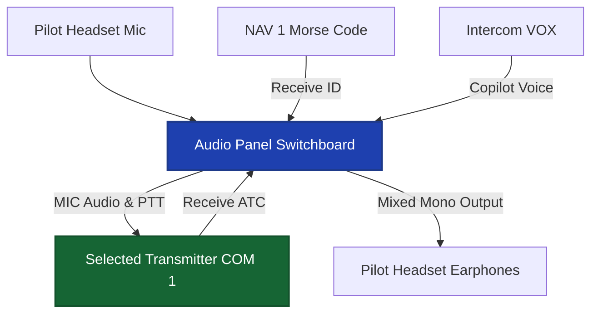
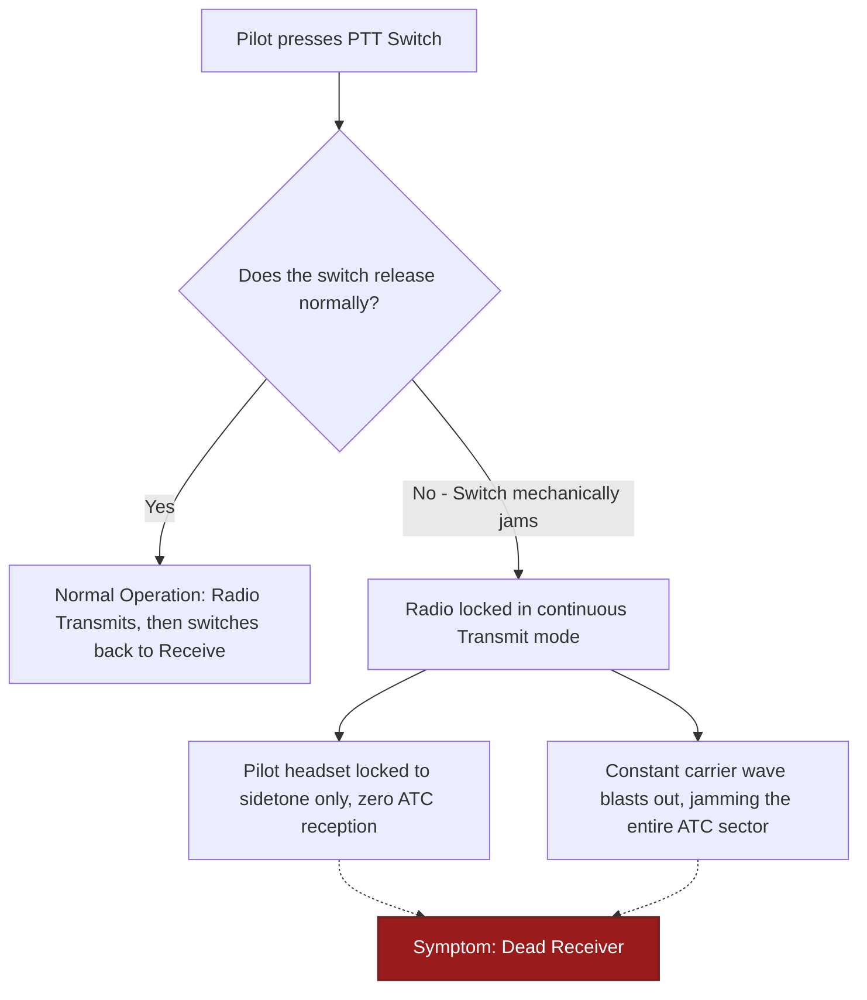
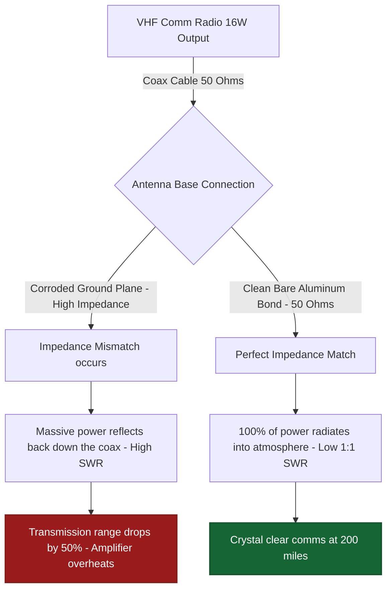
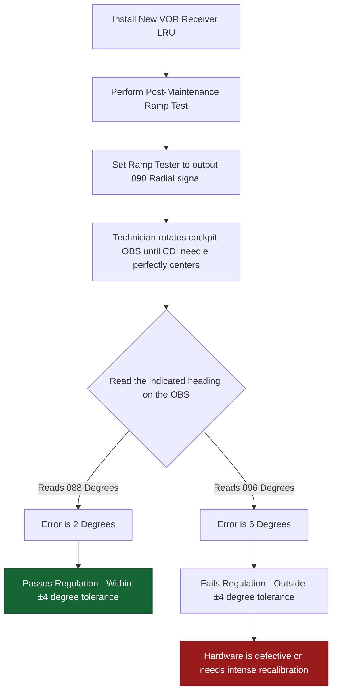
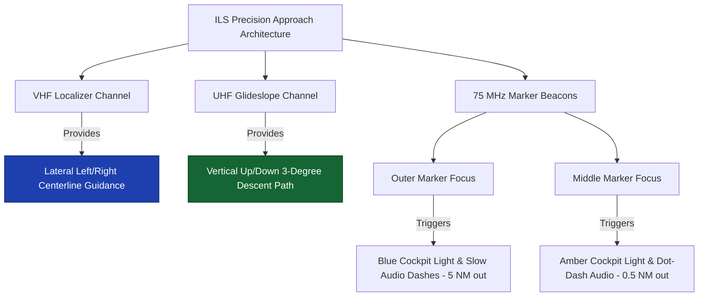
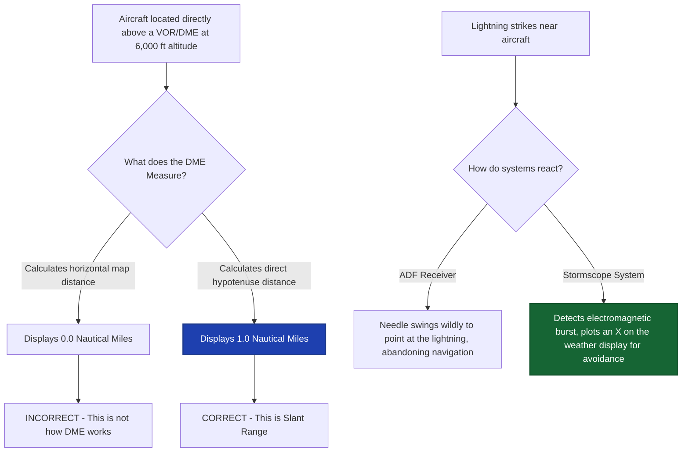
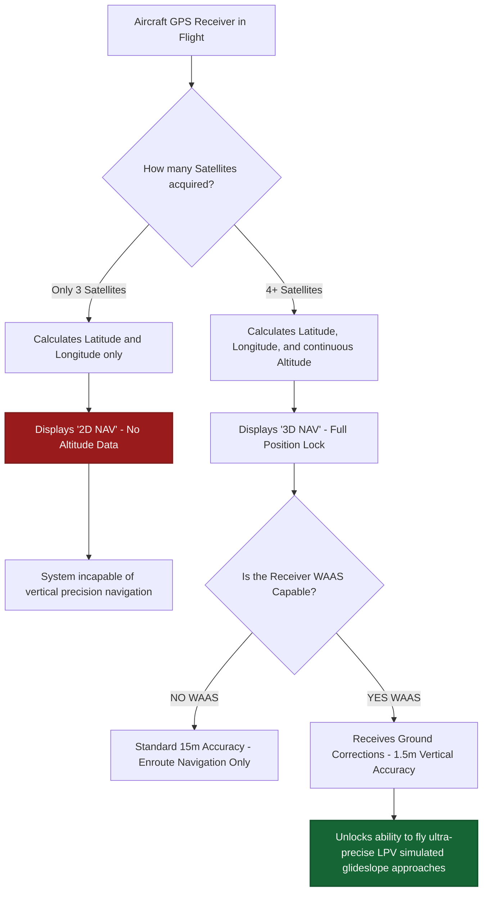
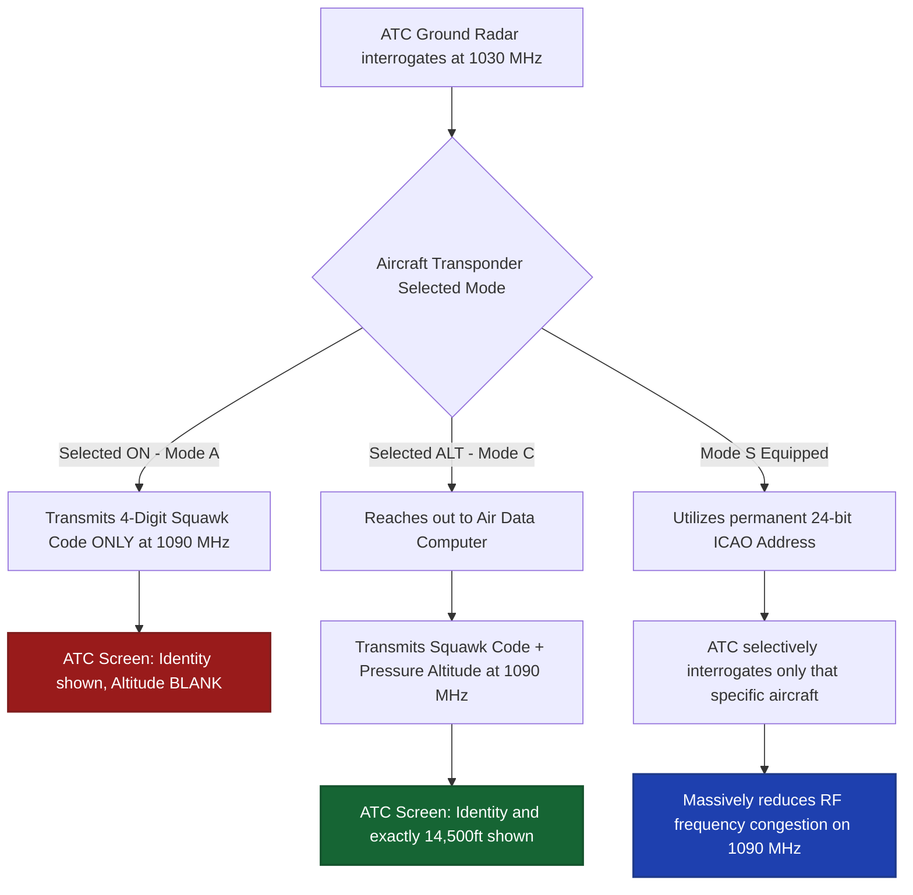
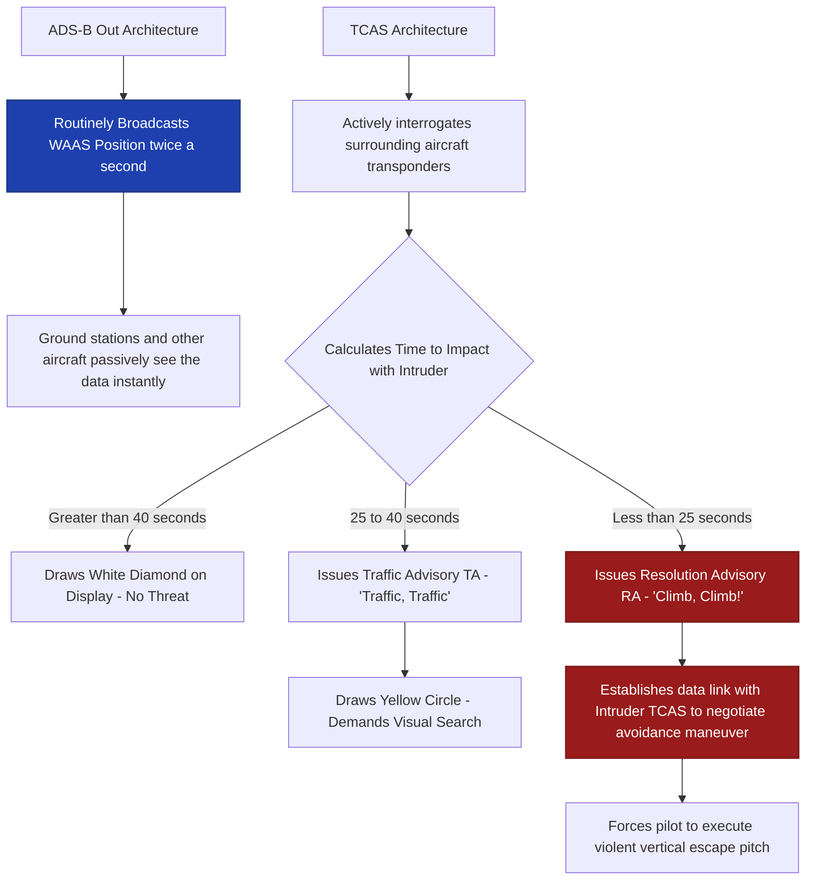

# World 7: CNS Systems — NEETS-Style Training Content
> **9 Nodes | 5 Zones | Estimated Read Time: 55–65 minutes total**

---
---

# Node: Audio Panel & Intercom Basics
**Zone: Audio & Comm Path**

## 📋 OBJECTIVES
- Describe the primary routing functions of an aircraft audio control panel.
- Contrast aircraft mono communication audio with standard consumer stereo audio.
- Explain why impedance matching is structurally critical for clean audio transmission.

## 🎯 WHY THIS MATTERS

A frustrated flight instructor reports that she can perfectly hear Air Traffic Control on COM1, but the moment she tries to monitor ATIS weather on COM2, the headset is utterly dead, even though both radios bench-test flawlessly. The issue isn't the radios, the headsets, or the wiring — the audio panel simply has the COM2 receive button deselected. The audio panel acts as the grand central switchboard for every single electronic sound generated in the aircraft. Completely understanding its routing logic prevents agonizing hours of unnecessary radio removals and phantom troubleshooting.

## 📖 WHAT YOU NEED TO KNOW

### The Core of Cockpit Audio: The Audio Panel
The **audio panel** (or Audio Control Panel - ACP in transport aircraft) is the mandatory central routing hub sitting physically between the pilot's headset and every radio in the avionics stack. It performs four absolute critical functions:
1. **Transmit Selection:** It routes the pilot's microphone audio and the Push-To-Talk (PTT) trigger exclusively to the single COM radio selected for transmission (typically COM1 or COM2), preventing the pilot from accidentally broadcasting on two frequencies simultaneously.
2. **Receiver Monitoring:** It allows the crew to selectively mix and monitor incoming audio from multiple receivers at once (listening to ATC on COM1 while simultaneously listening to a weather broadcast on NAV1).
3. **Intercom Management (ICS):** It manages internal, voice-activated communication between the pilot, copilot, and passengers without broadcasting over the external radios.
4. **Isolate Functions:** It provides the ability to structurally isolate the crew from the passengers so ATC clearances are not drowned out by cabin chatter.

### The Standard: Mono Audio
Unlike consumer car stereos, standard aircraft communication strictly utilizes **mono (single-channel) audio**.
- Both the left and right earcups of an aviation headset receive the exact same audio channel in parallel.
- Directional stereo audio is entirely unnecessary and consumes extra wiring weight when the only goal is vocal clarity for air traffic control. (Note: High-end modern panels do offer 3D spatial stereo to separate radio voices left/right, but mono remains the foundational standard.)

### Impedance Matching (The Electrical Physics)
Audio signals require mathematically **matched impedance** between the audio panel's output amplifiers and the connected headset inputs to efficiently transfer power.
- Standard civilian aviation headsets utilize a generalized impedance of **150Ω to 600Ω**.
- Military headsets use a vastly lower impedance of **5Ω to 8Ω**.
- **The Failure Mode:** If you plug a low-impedance military headset into a high-impedance civilian audio panel, the drastic mismatch causes severe signal reflections, drastically reduced audio volume, horrific distortion, and can physically burn out the audio panel's output amplifier.

## 🖼️ SYSTEM DIAGRAM

## 🔧 ON THE JOB

The #1 rule of audio troubleshooting: Before removing a single LRU from the rack, fundamentally verify the switchology on the audio panel. If the pilot complains of a dead radio, physically push the button on the audio panel to select it. If they complain they can't talk to ATC, verify the transmit selector is pointing to the correct radio. If they complain of constant hissing, adjust the intercom squelch knob. 80% of reported audio failures are operator errors stemming from an incorrectly configured audio panel. 

## 🔑 KEY TERMS
- **Audio Panel** — The central routing device that acts as a switchboard for all incoming radio audio, outgoing microphone audio, and internal intercom communication.
- **Mono Audio** — The aviation standard single-channel audio format where both headset speakers receive identical signals.
- **Impedance Matching** — The electrical requirement ensuring audio output circuitry and headset input resistance are mathematically compatible to prevent severe distortion and volume loss.
- **ICS (Intercom System)** — The internal closed-circuit audio network allowing crew and passengers to converse via headset without transmitting externally.

## ⚡ THE BOTTOM LINE

**The audio panel is the absolute gatekeeper for every sound entering or leaving the aircraft — always verify its routing selections and impedance compatibility before condemning a perfectly healthy radio.**

---
---

# Node: VHF/HF Comm Basics
**Zone: Communications**

## 📋 OBJECTIVES
- State the frequency range and propagation method of civilian VHF communication.
- Explain the precise function of the squelch control circuit.
- Identify the catastrophic system-wide symptoms of a stuck microphone.

## 🎯 WHY THIS MATTERS

A pilot radios approach control, but moments later, she hears a piercing, constant tone in her headset and realizes she is no longer receiving any ATC instructions. Assuming the old receiver has violently failed, she squawks emergency and diverts. On the ground, the avionics technician simply unplugs her headset and the "failure" instantly vanishes. The actual cause was a classic **stuck mic** — the push-to-talk (PTT) switch on the yoke had physically jammed in the pressed position. The radio was perfectly healthy, but it was continuously transmitting, structurally blocking any ability to receive. Understanding VHF architecture prevents replacing thousands of dollars in radios over a broken $10 switch.

## 📖 WHAT YOU NEED TO KNOW

### VHF Communication Profile
VHF (Very High Frequency) is the absolute lifeblood of worldwide civilian air traffic control.
- **Frequency Range:** Operates linearly from **118.000 MHz to 136.975 MHz**.
- **Modulation:** Utilizes Amplitude Modulation (AM), heavily resisting the "capture effect" of FM radios, ensuring two simultaneous transmissions overlap into an audible squeal rather than one totally silencing the other.
- **Channel Spacing:** Traditionally 25 kHz per channel, now densely compressed to 8.33 kHz in Europe to cram more channels into the spectrum.
- **Propagation:** VHF is strictly **line-of-sight**. The radio waves shoot straight through the atmosphere and do not bounce over the horizon. At 35,000 feet, you can reach ATC 200 miles away; on the runway, you might only reach 15 miles.

### The Squelch Control
**Squelch** is an internal noise gate that sets the minimum RF signal strength required to unmute the receiver's audio amplifier.
- Because there is constant atmospheric background RF static (cosmic noise), leaving the receiver always "open" would blast the pilot with deafening white noise.
- **Below the threshold limit:** The squelch violently clamps shut, keeping the headset perfectly silent.
- **Above the threshold (Valid Transmission):** The strong incoming signal bursts through the gate, unmuting the audio to the pilot.
- Adjusting the squelch too tight blocks out weak, distant aircraft. Adjusting it too loose lets constant hiss into the headset.

### The "Stuck Mic" Emergency
A stuck microphone occurs when a mechanical failure in the yoke PTT switch or a short in the microphone jack wiring keeps the transmitter continuously keyed.
- **The Threat:** A radio physically cannot receive while the transmitter section is active. The pilot will hear nothing but their own sidetone (their voice echoing in the headset).
- **The System Impact:** The aircraft continuously blasts an unmodulated carrier wave into the air, effectively jamming that specific ATC frequency for hundreds of miles, blinding controllers and endangering dozens of aircraft.

### HF Communication (High Frequency)
For trans-oceanic flights beyond line-of-sight VHF range, large aircraft utilize **HF Communication (2–30 MHz)**. HF waves bounce massively off the planet's ionosphere (skip propagation), allowing a jet over the mid-Atlantic to confidently talk directly to New York or London. 

## 🖼️ SYSTEM DIAGRAM

## 🔧 ON THE JOB

If a pilot reports that they suddenly cannot hear anyone and the "TX" (Transmit) light on the radio is permanently illuminated, you have a stuck mic. To definitively isolate the fault: physically unplug the pilot's microphone jack. If the TX light immediately goes out, the short is inside the headset. If it stays brightly lit, the short is in the airframe wiring or the yoke PTT switch. Never rip a radio out of the panel until you have systematically Ohmed out the PTT circuit.

## 🔑 KEY TERMS
- **VHF (Very High Frequency) Comm** — The primary civilian aviation communication band operating from 118.000 to 136.975 MHz, limited strictly by line-of-sight propagation.
- **Squelch** — An adjustable RF noise gate that deliberately mutes the receiver amplifier when no valid signal is strong enough to break the threshold.
- **Stuck Mic** — A catastrophic transmission failure where a jammed switch keys the radio continuously, blinding the aircraft's receiver and actively jamming the ATC frequency.
- **Line-of-Sight** — The physical limitation of high-frequency radio waves to travel only in straight lines, blocked completely by the earth's curvature or massive terrain.

## ⚡ THE BOTTOM LINE

**VHF comm operates line-of-sight between 118 and 136.975 MHz, squelch is the noise gate that keeps the headset quiet, and a constant transmitting tone signifies a highly disruptive stuck mic, not a broken receiver.**

---
---

# Node: Antennas & RF Safety Basics
**Zone: Communications**

## 📋 OBJECTIVES
- Identify the five critical inspection points for any VHF communication antenna.
- Explain the physical hazards of RF radiation on the flight line.
- Define SWR and its impact on transmitter efficiency.

## 🎯 WHY THIS MATTERS

A technician is hastily replacing a weather-damaged VHF comm antenna on a regional jet. They bolt the new antenna to the roof, hastily torque the BNC coax connector, and do a quick 30-second radio check to the tower—it sounds crystal clear. They skip the required SWR measurement to save time. Six months later, the aircraft returns squawking intermittent comm dropouts at a distance. The culprit? Hidden corrosion at the antenna base had severely degraded the ground plane connection, driving the SWR through the roof and bleeding off 40% of the transmitter's power as wasted heat. Measuring the SWR post-install would have caught the glaring impedance mismatch instantly.

## 📖 WHAT YOU NEED TO KNOW

### Comprehensive VHF Antenna Inspection
An antenna is the absolute most structurally exposed avionics component on the aircraft, taking relentless abuse from 500-knot winds, hail, and extreme icing. A thorough phase inspection requires five strict checks:
1. **Physical Integrity:** Inspect the fiberglass or composite shell for micro-cracks, deep erosion, or structural delamination.
2. **Mounting Security:** Grab the antenna firmly—there should be absolutely zero wobble. Loose antennas vibrate violently and quickly tear massive holes in the aluminum skin.
3. **Connector Torque:** Verify the coaxial BNC/TNC connector at the base is completely seated and biologically sealed against moisture.
4. **Coaxial Health:** Follow the cable run inside the fuselage to ensure the coax is not violently kinked, crushed by cargo, or weeping internal water.
5. **Corrosion and Ground Plane:** An antenna must violently bond to the bare aluminum airframe to utilize the skin as the "bottom half" of the antenna (the ground plane). Severe corrosion between the antenna base and the skin destroys this electrical mirror, crippling performance.

### RF Radiation Safety
Radio Frequency (RF) energy is invisible, non-ionizing radiation. While it won't cause cellular mutation like X-rays, high-powered RF massively vibrates water molecules in human tissue, causing deep internal heating (exactly like a microwave oven).
- **The Absolute Rule:** Never stand near, touch, or inspect an antenna while the transmitter is energized.
- This applies critically to high-power systems like HF radios, weather radar, transponders, and DME.
- Always physically pull the system circuit breaker and hang a highly visible lockout tag before climbing onto the fuselage near an antenna cluster.

### Impedance and SWR (Standing Wave Ratio)
For a transmitter to push its full rated wattage (e.g., 16 watts) into the atmosphere, the entire electrical pathway—the radio, the coax cable, and the antenna—must mathematically share the exact same impedance (historically **50 Ohms** for aviation VHF).
- **SWR (Standing Wave Ratio):** This is the ultimate metric of antenna health. It measures how much power actually radiates into the sky, versus how much power violently reflects back down the cable into the radio due to an impedance mismatch.
- A perfect system has an SWR of **1:1** (100% power radiated).
- An SWR above **3:1** means severe power loss and the reflected energy is literally cooking the transmitter's final amplifier stage. Always use a calibrated SWR meter to scientifically prove an installation.

## 🖼️ SYSTEM DIAGRAM

## 🔧 ON THE JOB

When replacing an antenna, absolutely ensure you aggressively clean the footprint on the fuselage down to bright, shiny aluminum to guarantee a flawless ground plane connection. Immediately after installation, seal the edges perfectly with aerodynamic sealant to prevent capillary water action from dragging corrosion under the base. Finally, never sign off an antenna installation based solely on a short-range radio check to Ground Control; you must connect an SWR/Wattmeter inline to scientifically prove the impedance match is sound.

## 🔑 KEY TERMS
- **Ground Plane** — The massive conductive surface (the aluminum aircraft skin) beneath a VHF whip antenna that acts as the required electrical second half of the dipole.
- **SWR (Standing Wave Ratio)** — The critical numerical ratio measuring the efficiency of an antenna system; indicating how much power radiates vs. how much violently reflects back.
- **Impedance Mismatch** — A destructive electrical condition where components of unequal resistance (like a corroded connector) cause massive signal reflections and power loss.
- **RF Safety Barrier** — The mandatory clearance zone around active transmitting antennas to prevent severe internal tissue heating from high-power electromagnetic radiation.

## ⚡ THE BOTTOM LINE

**Inspect antennas methodically for structural security and base corrosion, always de-energize the transmitters to prevent RF tissue burns, and definitively utilize an SWR meter to scientifically validate your 50-Ohm impedance match.**

---
---

# Node: VOR Basics
**Zone: Navigation**

## 📋 OBJECTIVES
- Define the specific navigational geometry provided by a VOR ground station.
- Explain the function and relationship of VOR radials and the OBS selector.
- Determine the legal tolerance limits for a post-maintenance VOR ramp test.

## 🎯 WHY THIS MATTERS

Following a routine VOR receiver replacement, the technician wheels an expensive digital ramp tester out to the aircraft, dials in a test signal, perfectly centers the Course Deviation Indicator (CDI) needle, and notes that the OBS card reads 98°. Without knowing the structural regulations of the VOR system, the technician might shrug and sign off the paperwork. In reality, the receiver is off by 8 solid degrees—double the legal limit. Releasing that aircraft to fly an instrument approach in hard IMC weather could result in the aircraft missing the runway centerline by miles. Understanding VOR radials and strict ramp test tolerances guarantees navigational life safety.

## 📖 WHAT YOU NEED TO KNOW

### The Core of VOR
A **VOR (VHF Omnidirectional Range)** ground station is the historical backbone of the global airway system.
- It operates strictly between **108.00 MHz and 117.95 MHz**.
- It provides absolute **magnetic bearing geometric information**—it tells the aircraft exactly what magnetic direction it is physically located on relative to the station.
- VOR provides **direction only**. It knows nothing about distance. (Distance requires the addition of DME).

### VOR Radials
A VOR station radiates exactly 360 distinct magnetic beams, called **radials**, pointing outward from the station like spokes on a bicycle wheel.
- A radial is always defined as a magnetic bearing radiating **FROM** the station.
- If an aircraft is located physically due East of the station, it is flying on the 090° radial. If it is due West, it is on the 270° radial, regardless of which direction the nose of the plane is currently pointing.

### The OBS and the CDI
The pilot interacts with VOR data entirely through the **CDI (Course Deviation Indicator)** or HSI on the panel.
- The **OBS (Omnibearing Selector)** is the physical knob the pilot twists to select their desired navigational course.
- If the pilot sets the OBS to 090, they are commanding the instrument to fly along the 090 line.
- The vertical needle on the CDI swings left or right to graphically display exactly how far off the selected course the aircraft has drifted. When the absolute center of the needle aligns with the center dot, the aircraft is perfectly on course.

### VOR Ramp Test Procedures and Tolerances
Under 14 CFR Part 91, VOR equipment used under Instrument Flight Rules (IFR) must pass rigorous accuracy checks every 30 days, or immediately following any maintenance. A ramp test procedure involves:
1. Placing a calibrated VOR ramp tester unit outside the aircraft, facing the V-shaped receiving antenna on the tail.
2. Dialing the tester to command a specific radial (standardly testing the four cardinal directions: 0°, 90°, 180°, 270°).
3. The technician sits in the cockpit, turns the OBS to match the test radial, and observes the horizontal deflection of the CDI needle.
4. **The Legal Tolerance:** The final reading must be within an absolute **±4°** of the commanded test signal. Any deviation of 5° or higher is a definitive hard failure, requiring immediate receiver calibration or replacement.

## 🖼️ SYSTEM DIAGRAM

## 🔧 ON THE JOB

When executing a VOR ramp test, absolutely ensure the tester antenna is positioned correctly relative to the aircraft's receiving antenna (usually high up on the vertical stabilizer). Large metal hangars, moving fuel trucks, and even your own physical body standing between the tester and the aircraft can introduce heavy signal multipath reflections, causing the CDI needle to bizarrely jitter and fail the ±4° tolerance test. Always verify any failure by moving the aircraft to massive open ramp space away from all reflective metal surfaces before condemning the receiver.

## 🔑 KEY TERMS
- **VOR (VHF Omnidirectional Range)** — A legacy ground-based navigation aid radiating 360 separate magnetic courses, operating strictly in the 108–117.95 MHz band.
- **Radial** — A specific magnetic bearing line projecting outward natively FROM a VOR ground station.
- **OBS (Omnibearing Selector)** — The mechanical dial utilizing a resolver that allows a pilot or technician to physically select their desired VOR course on the cockpit instrument.
- **CDI (Course Deviation Indicator)** — The primary analog or digital flight instrument sporting a swinging vertical needle that graphically displays cross-track error from the selected VOR radial.

## ⚡ THE BOTTOM LINE

**A VOR provides magnetic bearing orientation exclusively (never distance), radials always project FROM the station, the OBS selects the desired path, and post-maintenance system accuracy must definitively fall within a strict ±4° tolerance.**

---
---

# Node: ILS/Marker Basics
**Zone: Navigation**

## 📋 OBJECTIVES
- Differentiate the specific navigational axes provided by the Localizer and the Glideslope.
- Outline the relationship between the ILS system and Marker Beacons.
- Interpret the visual and auditory cues generated by Outer, Middle, and Inner markers.

## 🎯 WHY THIS MATTERS

An ILS receiver is aggressively flagged for maintenance after a rough instrument landing in deep fog. The technician quickly verifies the Localizer channel utilizing a ramp tester, watches the horizontal needle sweep smoothly left and right, and proudly signs off the aircraft as fully operational. The next day, the pilot attempts another fog approach, but the vertical Glideslope needle remains solidly pinned to the top of the gauge—they have zero vertical guidance toward the runway threshold. By fundamentally failing to understand that an ILS is composed of two entirely distinct, separate radio frequencies and receivers working in tandem, the technician endangered the flight.

## 📖 WHAT YOU NEED TO KNOW

### The Two Pillars of the ILS
The **Instrument Landing System (ILS)** is a highly precise radio navigation system designed to thread an aircraft blindly down to the runway threshold through zero-visibility weather. It achieves this by broadcasting two utterly separate guiding beams:

1. **The Localizer (Lateral Guidance):**
   - Broadcasts from an antenna array located at the far departure end of the runway.
   - Provides absolute horizontal (left/right) steering down the direct centerline of the runway.
   - Uses the highly sensitive VHF frequencies 108.10 MHz to 111.95 MHz (utilizing only odd tenths, like 109.3).
   - Displayed as the **vertical needle** swinging left/right on the CDI.

2. **The Glideslope (Vertical Guidance):**
   - Broadcasts from an antenna array located immediately physically next to the touchdown zone.
   - Provides absolute vertical (up/down) steering along a steep ~3° descent slope directly to the tarmac.
   - Operates in the ultra-high UHF band (329.15 MHz to 335.00 MHz).
   - Displayed as a **horizontal needle** (or diamond shape) sliding up/down on the CDI.
   - **Crucial Fact:** The Glideslope channel is automatically electronically paired to the Localizer frequency. When the pilot tunes the VHF Localizer frequency, the receiver secretly tunes the paired UHF Glideslope channel in the background.

### Marker Beacons (The Distance Fixes)
While the ILS provides precise steering, it historically provided zero information about exactly how far away the runway was. **Marker Beacons** fill this massive gap by transmitting deeply focused, vertical fan-shaped 75 MHz beams straight up into the air at structurally fixed distances along the approach path. When the aircraft flies through the invisible fan, it acts as an absolute position fix.

A traditional full ILS incorporates three markers:
- **Outer Marker (Blue Light / Slow Dashes):** Located 4 to 7 miles out. Marks the point where the aircraft should intercept the glideslope beam.
- **Middle Marker (Amber Light / Dots & Dashes):** Located about 0.5 miles out (3,500 feet from threshold). Usually denotes the Category I decision height (where the pilot must see the runway or abort).
- **Inner Marker (White Light / Fast Dots):** Located exactly at the runway threshold. Reserved for intense Category II/III low-visibility operations.

## 🖼️ SYSTEM DIAGRAM

## 🔧 ON THE JOB

When rigorously performing an ILS automated ramp check, you must explicitly remember that you are testing two completely disparate radio receivers operating in entirely different frequency bands (VHF and UHF) that happen to be physically housed in the same aluminum chassis. You must verify the Localizer's left/right deflection at standard micro-amp levels, and then you must separately command the test box to sweep the Glideslope's up/down deflection. A pass on the Localizer guarantees absolutely nothing regarding the health of the Glideslope hardware.

## 🔑 KEY TERMS
- **ILS (Instrument Landing System)** — A highly sophisticated precision approach architecture utilizing overlapping radio beams to provide absolute 3D steering to a runway.
- **Localizer** — The VHF component of an ILS dedicated exclusively to horizontal lateral runway centerline guidance.
- **Glideslope** — The UHF component of an ILS dedicated exclusively to vertical descent path guidance.
- **Marker Beacon** — Fixed-position 75 MHz vertical transmitters that provide positive distance-to-runway verification along the final approach corridor.

## ⚡ THE BOTTOM LINE

**A complete ILS absolutely requires both a distinct Localizer receiver for lateral centerline guidance and a paired Glideslope receiver for vertical descent guidance, supported fundamentally by Market Beacons marking fixed distances to the runway.**

---
---

# Node: Other Nav Basics (DME, ADF, Lightning Detection)
**Zone: Navigation**

## 📋 OBJECTIVES
- Clarify the geometric difference between horizontal ground distance and DME slant range.
- Identify the fundamental accuracy and weather vulnerabilities associated with ADF systems.
- Explain the operational theory behind passive lightning detection avionics.

## 🎯 WHY THIS MATTERS

*Note: Visual illustration omitted; refer to system diagram for structural flow.*

A pilot radios maintenance extremely confused: their panel DME (Distance Measuring Equipment) is actively showing 2.5 Nautical Miles to the station, but they are flying at 15,000 feet directly over the top of the physical VOR/DME antenna. They assume the receiver's computing core is malfunctioning and requires replacement. In reality, the DME is operating flawlessly. By failing to understand that DME exclusively measures the angled "slant range" (the direct hypotenuse from the aircraft to the ground station), a technician might waste days swapping boxes instead of simply explaining Pythagorean geometry to the flight crew. 

## 📖 WHAT YOU NEED TO KNOW

### DME (Distance Measuring Equipment)
DME is an active, pulse-ranging system operating in the UHF band that provides pilots with continuous distance readouts to a ground station.
- **The Physics of the Ping:** The aircraft's DME actively transmits a highly structured interrogation pulse-pair down to the ground station. The ground station receives it, waits exactly 50 microseconds, and fires a reply pulse back. The aircraft receiver measures the total round-trip microsecond travel time of the light-speed radio waves and calculates the exact distance.
- **The Slant Range Factor:** DME absolutely does not measure horizontal ground distance. It measures **slant range**—the diagonal "line of sight" distance through the air from the aircraft directly to the station. If you are 6,000 feet directly above the station (zero horizontal distance), the DME will accurately display 1 Nautical Mile of slant-range distance.

### ADF (Automatic Direction Finder) and NDB
The NDB (Non-Directional Beacon) and ADF system is the oldest form of electronic air navigation, now mostly phased out but still present in legacy airframes and remote global regions.
- **The Ground Station (NDB):** A massively simple AM radio transmitter broadcasting continuously in the Low/Medium Frequency (LF/MF) band.
- **The Receiver (ADF):** The airborne receiver utilizes a combination of a directional loop antenna and a non-directional sense antenna to determine the exact magnetic bearing pointing **TO** the station.
- **The Fatal Flaw:** ADF operates in the AM radio band, making it acutely susceptible to massive electromagnetic interference—most notably thunderstorms. During severe weather, the ADF needle will wildly abandon the NDB station and snap to point directly at the most severe lightning strikes, leading an unaware pilot directly into the core of a lethal convective supercell.

### Lightning Detection Systems (Stormscope / Strike Finder)
Instead of being a flaw, modern passive lightning detectors (like L-3's Stormscope) deliberately exploit thunderstorm electromagnetic interference to save lives.
- They utilize incredibly sensitive passive antennas to sense the massive electromagnetic bursts generated by distant lightning strikes.
- The computer immediately analyzes the signal shape to determine the strike's exact bearing and relative intensity/distance.
- It beautifully displays these strikes as tiny "X" marks on a cockpit screen, allowing crews to visualize and geometrically avoid the violently convective, hail-producing cores of embedded storm cells long before they encounter structural turbulence.

## 🖼️ SYSTEM DIAGRAM

## 🔧 ON THE JOB

When troubleshooting older Nav systems, never ignore the profound impact of environmental interference. If a pilot writes up an ADF as "erratic operation," aggressively check the weather records for their flight path before tearing down the antenna array; it was likely just pointing at localized thunderstorm activity. For DME, utilize a sophisticated ramp test set capable of simulating extremely fast, precise interrogation/reply pulse timing to accurately verify the system's calculating logic across various simulated slant ranges.

## 🔑 KEY TERMS
- **DME (Distance Measuring Equipment)** — An active UHF pulse-ranging system calculating distance by clocking the round-trip travel time of radio signals.
- **Slant Range** — The absolute direct diagonal distance measuring geometrically from the airborne aircraft to the ground station, fundamentally different from flat ground distance.
- **ADF (Automatic Direction Finder)** — A legacy navigation receiver highly susceptible to erratic behavior initiated by atmospheric electromagnetic interference.
- **Lightning Detection** — Advanced passive avionics that map the bearing and intensity of in-flight convective activity by triangulating severe electromagnetic weather bursts.

## ⚡ THE BOTTOM LINE

**DME calculates the diagonal slant range to a station using pulse timing, ADF systems are notoriously vulnerable to pointing at thunderstorms, and passive lightning detectors brilliantly exploit that same interference to plot dangerous weather cells.**

---
---

# Node: GPS/WAAS Basics
**Zone: GPS/WAAS**

## 📋 OBJECTIVES
- Define the absolute minimum number of satellites required for a 3D position fix.
- Explain the architectural mechanism of the Wide Area Augmentation System (WAAS).
- Describe the precision operational capability WAAS brings to instrument approaches.

## 🎯 WHY THIS MATTERS

*Note: Visual illustration omitted; refer to system diagram for structural flow.*

A technician completes a massive glass-cockpit upgrade on a twin-engine aircraft and pushes it out of the hangar for a satellite lock test. The GPS navigator successfully acquires exactly three satellites and proudly displays a "2D NAV" lock. The technician assumes it's fully operational and signs the logbook. The next day, the pilot attempts an IFR departure, but without altitude data from the GPS, the autopilot violently refuses to couple, grounding the flight. The technician failed to realize a fundamental mathematical rule: three satellites provide latitude and longitude, but a fourth satellite is absolutely mandatory to solve for time and unlock 3D altitude computations.

## 📖 WHAT YOU NEED TO KNOW

### The Core Math of GPS Satellites
The Global Positioning System (GPS) determines aircraft position by timing the microscopic delay of radio signals arriving from multiple space-based satellites.
- **3 Satellites (2D Position):** Minimum required to mathematically calculate Latitude and Longitude by overlapping three giant distance spheres. The system must assume the aircraft is at sea level.
- **4 Satellites (3D Position):** The absolute minimum required to achieve a full navigational lock. The crucial fourth satellite provides the timing triangulation necessary to solve for height, granting accurate Latitude, Longitude, and **Altitude**.
- Modern aviation receivers track 12, 15, or even 20+ satellites simultaneously to guarantee incredible redundancy and sub-meter precision.

### The Imperative for WAAS
Base GPS is remarkable, but inherent atmospheric distortion (signals bending as they hit the ionosphere) limits its vertical accuracy to roughly 10–15 meters—far too sloppy to safely guide an aircraft down to a fogged-in runway. The FAA solved this mathematically with **WAAS (Wide Area Augmentation System)**.
1. A vast network of rigidly fixed ground stations across North America continuously monitors GPS satellites and instantly detects their exact atmospheric drift errors.
2. The ground stations generate a massive master correction algorithm and aggressively uplink it to geosynchronous communication satellites over the equator.
3. These WAAS satellites broadcast the final correction data directly down to the aircraft's WAAS-capable GPS receiver.

### The WAAS Result: LPV Approaches
By applying these constant ground-based WAAS corrections, the aircraft's internal GPS accuracy is tightened from 15 meters down to a phenomenal **1.5 meters vertical and 1 meter horizontal**.
- This microscopic precision unlocks the ability to fly **LPV (Localizer Performance with Vertical guidance)** approaches.
- An LPV approach allows the GPS to electronically simulate a perfectly steady, highly precise ILS glideslope down to 200 feet above the runway, without requiring a single piece of actual ILS radio equipment installed at the airport.

## 🖼️ SYSTEM DIAGRAM

## 🔧 ON THE JOB

When terminating the coaxial cable for an advanced WAAS GPS antenna, realize that you are engineering an incredibly fragile RF pathway. Standard legacy RG-58 coax is brutally lossy at GPS frequencies (1575.42 MHz) and is legally prohibited forWAAS installations due to excessive signal attenuation. You must utilize premium, heavily shielded, low-loss cable (like RG-400 or RG-142) and meticulously verify the maximum allowable signal loss limits defined in the installation manual. A poor crimp on a WAAS antenna drops the precision lock entirely, reverting the multi-million dollar panel to a basic VFR map.

## 🔑 KEY TERMS
- **3D Navigation** — A rigorous mathematical receiver state requiring a minimum of four distinct satellite signals to triangulate latitude, longitude, and critical altitude.
- **WAAS (Wide Area Augmentation System)** — A massive FAA ground-network architecture that continuously calculates and broadcasts real-time atmospheric error corrections to drastically tighten GPS accuracy.
- **LPV Approach** — A highly precise, WAAS-enabled instrument approach that completely simulates a traditional ILS localizer and glideslope utilizing only satellite geometry.
- **Ionospheric Delay** — The unpredictable bending and slowing of GPS radio waves as they tear through the Earth's charged upper atmosphere, necessitating WAAS corrections.

## ⚡ THE BOTTOM LINE

**A minimum of four satellites is mathematically mandatory to secure 3D altitude data, and the WAAS network broadcasts ground-based atmospheric corrections to enable ultra-precise, glideslope-quality LPV approaches globally.**

---
---

# Node: Transponder Basics
**Zone: Surveillance**

## 📋 OBJECTIVES
- Contrast the fundamentally distinct data sets transmitted in Mode A, Mode C, and Mode S operations.
- Detail the exact interrogation and reply frequencies composing transponder radar architecture.
- Explain the role of the 24-bit ICAO address in modern Mode S surveillance environments.

## 🎯 WHY THIS MATTERS

*Note: Visual illustration omitted; refer to system diagram for structural flow.*

Following a heavy maintenance check, a regional jet departs the airspace but Air Traffic Control immediately radios the crew, demanding to know why their radar screen is blank regarding the aircraft's altitude. The technician had inadvertently bumped the transponder control panel from the "ALT" position down to the "ON" position during cockpit cleaning. The transponder was happily pinging back identity codes (Mode A), but was completely failing to transmit altitude data (Mode C). Understanding the distinct operational modes of transponders is critical to deciphering radar failure reports and preventing pilot deviations.

## 📖 WHAT YOU NEED TO KNOW

### The Core Radar Physics
A transponder is the avionics foundation of the Air Traffic Control **Secondary Surveillance Radar (SSR)** system. Unlike primary radar, which stupidly bounces massive microwaves off the metal skin of an aircraft, SSR is an intelligent conversation between two computers:
- **The Interrogation (1030 MHz):** The rotating ATC ground radar sweep actively commands: "Who are you?"
- **The Reply (1090 MHz):** The aircraft transponder instantly fires a high-powered digital burst back saying: "I am Flight 123 at 14,000 feet."

### The Three Operational Modes
1. **Mode A (Identity Only):** The most basic legacy mode. The transponder replies exclusively with its 4-digit octal assigned **Squawk Code** (e.g., 1200 for VFR, 7700 for Emergency). ATC sees a dot on the screen with a code name, but has absolutely no idea how high the aircraft is.
2. **Mode C (Identity + Altitude):** The mandatory standard for controlled airspace. The transponder reaches out to an onboard blind altitude encoder or air data computer, grabs the current uncorrected pressure altitude (e.g., Flight Level 240), and transmits it seamlessly alongside the Mode A squawk code.
3. **Mode S (Selective Intelligences):** The modern global standard. Instead of blindly blasting replies to every radar sweep, it incorporates a deeply interwoven data link and a unique microchip identifier.

### The Power of Mode S and the ICAO Address
Every single Mode S aircraft is hard-coded with a mathematically globally unique **24-bit ICAO address** (essentially a permanent MAC address for the airplane).
- **Because of this unique address, ATC can perform Selective Interrogation.** The radar can ask "Only aircraft 10101011, what is your status?" and all other aircraft instantly remain silent, massively cleaning up global radio congestion.
- Mode S transponders can also stream massive amounts of internal flight data (heading, airspeed, roll angle) down to advanced ATC computers.

## 🖼️ SYSTEM DIAGRAM

## 🔧 ON THE JOB

When heavily installing or troubleshooting a Mode S transponder system, the single most critical configuration step is manually programming the 24-bit ICAO address (usually coded in Hexadecimal via the front panel menus) to perfectly match the aircraft's FAA registration matrix. If you mistype a single character in the Hex code during installation, ATC systems will wildly misidentify the aircraft, safety systems like TCAS will fail to resolve conflicts, and the FAA will flag the airframe for immediate grounding due to data corruption.

## 🔑 KEY TERMS
- **Transponder** — A critical surveillance transceiver that actively replies to ground radar interrogations with robust identity and altitude data.
- **Squawk Code** — A specific 4-digit octal identifier explicitly assigned by Air Traffic Control to correlate a radar dot with a specific flight plan.
- **Mode C** — The operational transponder mode that actively intertwines raw pressure altitude data alongside the squawk code reply.
- **Mode S** — Advanced selective-interrogation transponders utilizing a permanent 24-bit global address to drastically reduce radio frequency clutter.
- **SSR (Secondary Surveillance Radar)** — The modern ATC radar system heavily reliant on active aircraft transponder replies rather than passive skin reflections.

## ⚡ THE BOTTOM LINE

**Transponders violently reply to 1030 MHz radar sweeps on 1090 MHz; Mode C layers critical altitude onto the Mode A squawk code, while Mode S cleans up skies via unique 24-bit selective interrogation.**

---
---

# Node: ADS-B/TCAS basics
**Zone: Surveillance**

## 📋 OBJECTIVES
- Distinguish the autonomous, continuous broadcast nature of ADS-B Out from traditional interrogated radar.
- Detail the highly specific data metrics packaged within an ADS-B squitter.
- Describe the active interrogation and command resolution roles of a TCAS architecture.

## 🎯 WHY THIS MATTERS

*Note: Visual illustration omitted; refer to system diagram for structural flow.*

A corporate jet is cruising at FL350 when the cockpit erupts in a deafening, synthetic voice commanding: "CLIMB, CLIMB!" The pilot instantly disconnects the autopilot and violently pitches up. Simultaneously, 1,000 feet above, an oncoming jet's cockpit demands: "DESCEND, DESCEND!" Seconds later, the aircraft safely pass each other, averting a catastrophic mid-air collision by 400 feet. The ATC controller never uttered a word. This miracle of automated physics is TCAS (Traffic Collision Avoidance System) operating totally independent of the ground, leveraging highly complex transponder interrogations. Understanding how TCAS coordinates with modern ADS-B broadcasts represents the absolute pinnacle of airframe safety systems.

## 📖 WHAT YOU NEED TO KNOW

### The Revolution: ADS-B Out
**ADS-B (Automatic Dependent Surveillance - Broadcast)** represents the death of legacy radar. Instead of waiting for a spinning ground dish to interrogate the aircraft, an ADS-B equipped aircraft **actively, continuously broadcasts its own highly precise state to the entire planet** twice every second via a "squitter" burst on 1090 MHz.
- **Automatic:** It requires zero pilot input and zero external ground interrogation to function.
- **Dependent:** The entire system is totally dependent on highly accurate, WAAS-enhanced GPS data to formulate its package.
- **Broadcast:** The packet floods the airspace, sending out: High-precision 3D GPS Position, GPS Velocity/Track, Altitude, and the 24-bit ICAO Address.
- **The Result:** ATC controllers stare at screens showing sub-meter accuracy updates twice a second, compared to the 8-second delay of traditional sweep radar.

### The Shield: TCAS (Traffic Collision Avoidance System)
While ADS-B passively broadcasts, **TCAS** is a violently active, aggressive airborne hunter. It operates completely independently of ATC and ground radar to act as the absolute last line of defense against mid-air collisions.
- **The Hunter:** The heavy TCAS processor in the avionics bay actively transmits 1030 MHz interrogations outward, hunting for other Mode C/S transponders in its airspace perimeter.
- **The Tracker:** By analyzing the reply time and the directional antenna bearing, it constructs a 3D spherical map of every intruder aircraft.
- **Traffic Advisory (TA):** If an intruder breaches the outer safety bubble, TCAS issues a 'TA' — drawing a yellow circle on the glass display and announcing "Traffic, Traffic" to draw crew visual attention.
- **Resolution Advisory (RA):** If the computer calculates a high-probability collision within the next 25 seconds, it issues an 'RA' — drawing a stark red square and verbally commanding decisive vertical action ("Climb", "Descend", or "Maintain Vertical Speed").
- **The Coordination Matrix:** Crucially, if both aircraft have TCAS II, the two computer systems establish an encrypted microwave data link and negotiate geometric escape maneuvers in a fraction of a second. TCAS computer A tells TCAS B: "I am forcing my pilot to climb, you must force your pilot to descend."

## 🖼️ SYSTEM DIAGRAM

## 🔧 ON THE JOB

During a major flight line inspection, realize that ADS-B and TCAS are heavily interconnected ecosystems. If the GPS antenna coax sustains water damage and drops the satellite lock, the transponder no longer has position data to broadcast, meaning ADS-B Out inherently fails and sets off FAA automated alarms. Furthermore, when executing a routine TCAS ramp test on the tarmac using a ground simulator box, you must cover the aircraft's directional TCAS antennas with heavy RF shields. Otherwise, you will inadvertently broadcast a simulated collision resolution advisory, causing every widebody jet at the adjacent gates to trigger massive blaring cockpit alarms.

## 🔑 KEY TERMS
- **ADS-B (Automatic Dependent Surveillance-Broadcast)** — The modern surveillance pillar where aircraft autonomously and continuously broadcast exact GPS state data continuously outward.
- **TCAS (Traffic Collision Avoidance System)** — An aggressive, independent airborne safety computer that actively interrogates surrounding transponders and commands vertical escape maneuvers to prevent collisions.
- **Traffic Advisory (TA)** — A preliminary TCAS alert mathematically warning the flight crew of encroaching traffic, explicitly prioritizing visual acquisition.
- **Resolution Advisory (RA)** — A definitive, severe TCAS command demanding immediate, decisive vertical action (climb/descend) to evade an imminent mid-air collision.

## ⚡ THE BOTTOM LINE

**ADS-B revolutionizes surveillance through continuous autonomous broadcasting of precision GPS coordinates, while TCAS acts as the ultimate safety net by actively interrogating intruders and mathematically negotiating drastic mid-air escape maneuvers.**

---
