# World 1: Safety — NEETS-Style Training Content
> **11 Nodes | 5 Zones | Estimated Read Time: 35–45 minutes total**

---
---

# Node: Hazard Recognition (Stop-Work Mindset)
**Z# Node: Hazard Recognition (Stop-Work Mindset)

## 📋 OBJECTIVES
- Define what constitutes a hazard in a high-stakes Part 145 avionics shop environment.
- Execute the three-step stop-work sequence: Stop, Secure, Report.
- Explain the "Safety Triangle" and why near-miss events are leading indicators of future accidents.
- Overcome psychological barriers to utilizing Stop-Work Authority under schedule pressure.

## 🎯 WHY THIS MATTERS

You are pulling wire behind an avionics rack when you notice the floor is wet from a leaking roof drain. Nobody has slipped yet. The aircraft is scheduled to push back in two hours. Do you keep working to meet the deadline, or do you stop?

In aviation maintenance, the pressure to deliver is immense, but the cost of failure is catastrophic. Your ability to recognize a hazard and **stop work** before someone gets hurt—or before an aircraft is damaged—is the single most important safety skill you will develop. The shop floor is not a place where you "hope for the best."

## 📖 WHAT YOU NEED TO KNOW
A **hazard** is any condition, practice, or situation that has the potential to cause injury, damage, or loss — **even if nothing bad has happened yet.** Unlike an accident, which is a reactionary event, a hazard is a leading indicator.

### The Stop-Work Authority (SWA)
In a Part 145 repair station, every technician has both the right and the absolute obligation to **stop work** when they identify an unsafe condition. This is a foundational element of a Safety Management System (SMS). You do not need a supervisor's permission to stop working if you feel unsafe. 

When a hazard is identified, follow the three-step sequence:
1. **Stop** — Cease the task immediately. Do not try to "finish this one thing first."
2. **Secure** — Make the area or equipment safe. De-energize active circuits, place physical barricades or cones around wet floors, and isolate the hazard from other unaware technicians.
3. **Report** — Notify your supervisor and document what you observed. This removes the hazard from your shoulders and places it into the shop's formal safety system.

### The Psychology of "Pressing On"
Accident investigations frequently reveal that technicians knew a hazard existed but chose not to stop work. The primary reasons include:
- **Schedule Pressure:** "The plane needs to fly at 16:00."
- **Normalization of Deviance:** "The floor is always wet here when it rains, it's fine."
- **Fear of Reprisal:** Worrying that management will be angry about the delay.

A mature safety culture actively fights these barriers. A delayed aircraft is always cheaper and safer than an injured technician or a damaged airframe.

### The Near-Miss and The Safety Triangle
A critical concept you must understand is the **near-miss** (often called a "close call"). A near-miss is an unplanned event that did NOT result in injury or damage, but had the potential to do so.

*Example: A technician slips on the wet floor, momentarily loses balance, but catches themselves on a workbench. No one is hurt.*

**Near-misses must be reported and investigated.** According to Heinrich's Law (The Safety Triangle), for every 1 major injury, there are approximately 29 minor injuries and **300 near-misses**. Reporting a near-miss is treating the symptom before it becomes a disease. It allows the shop to fix the hazard before the statistical probability of a major accident becomes reality.

## 🖼️ SYSTEM DIAGRAM
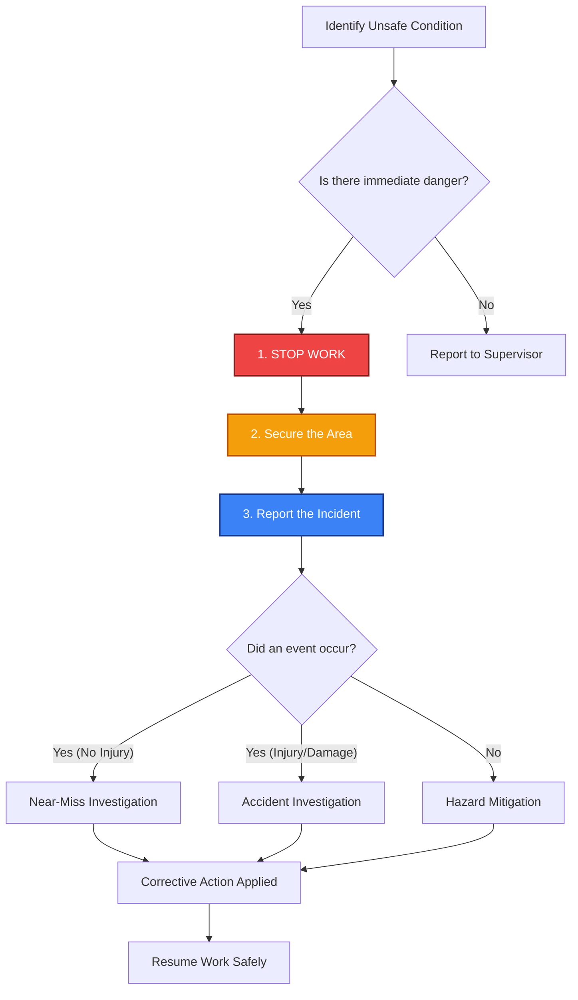

## 🔧 ON THE JOB
When you see something that does not look right — a wet floor, a frayed power cord on a heat gun, an unsecured heavy panel — physically stop your task, secure the danger zone so nobody else interacts with it, and verbally report it to your shift lead. Do not assume "someone else will handle it." Near-misses are free lessons; report them every time.

## 🔑 KEY TERMS
- **Hazard** — Any condition, practice, or situation that has the potential to cause injury, damage, or loss.
- **Stop-Work Authority (SWA)** — The right and obligation of every employee to halt work when perceiving an unsafe condition without fear of reprisal.
- **Near-Miss** — An unplanned event that did not result in injury, illness, or damage, but had the potential to do so.
- **Normalization of Deviance** — The gradual acceptance of unsafe practices as normal because they haven't resulted in a disaster yet.

## ⚡ THE BOTTOM LINE
**If something almost went wrong, it must be reported — a near-miss is a warning you only get once.**

---
---

# Node: Housekeeping & Clean Work Area Discipline
**Zone: Safety Mindset & Reporting**

## 📋 OBJECTIVES
- Define FOD (Foreign Object Debris/Damage) and explain its operational impact.
- Execute the "Clean-As-You-Go" methodology during avionics maintenance tasks.
- Identify and mitigate the three primary hazards associated with poor shop housekeeping.
- Maintain strict tool accountability at the workbench.

## 🎯 WHY THIS MATTERS

You finish a harness modification and leave wire clippings, tie-wrap tails, and a few loose screws on the bench. Tomorrow, an aircraft gets returned to service with a screw lodged behind an avionics tray because no one noticed it migrate during the next job. This is not hypothetical — FOD incidents caused by poor housekeeping are among the most common and most preventable safety failures in Part 145 shops. Every loose item is a potential in-flight emergency.

## 📖 WHAT YOU NEED TO KNOW

Housekeeping in an avionics shop is not about appearance — it is a strict risk mitigation strategy designed to prevent three specific hazards:

### 1. Foreign Object Damage/Debris (FOD)
FOD is any substance, debris, or article alien to an aircraft or system that would potentially cause damage. In an avionics setting, this includes:
- **Wire clippings:** Small copper strands can bridge gaps on circuit boards, causing dead shorts.
- **Hardware:** Loose screws, washers, and nuts that vibrate into flight control mechanisms or electrical contacts.
- **Consumables:** Tie-wrap ends, safety wire clippings, and abrasive debris from grinding or sanding.

### 2. Physical Hazards
Trip and fall hazards are amplified in an avionics shop. Cables, test equipment boxes, and pneumatic lines left in walkways create fall risks. In a shop environment with live circuits, sharp metal edges, and heavy equipment, a fall is significantly more dangerous than in a typical office. Organized cord management is mandatory.

### 3. Tool Loss
A cluttered work area makes it easy to lose track of hand tools. If a specialized extraction tool or a wrench ends up inside an aircraft and is not accounted for, it transforms instantly into severe FOD. A clean bench provides an immediate visual indicator of missing items.

### The Standard: Clean-As-You-Go
The standard procedure is simple: **clean as you go.** This means:
- Do not wait until the end of your shift to clean up.
- Clear your bench immediately after completing a specific phase of a task.
- Ensure all waste (wire scraps, packaging, used consumables) goes directly into designated disposal bins.
- Return tools to their shadow boards immediately after use.

## 🖼️ SYSTEM DIAGRAM
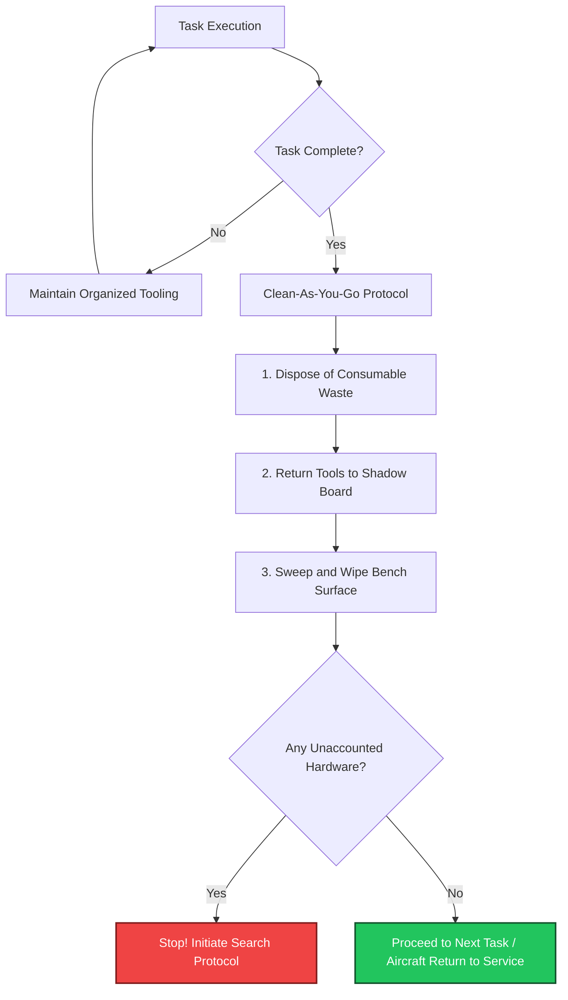

## 🔧 ON THE JOB

When you finish a wiring task, sweep your bench and immediately dispose of all scrap material. Before you close any aircraft panel, visually inspect the entire work area and the internal cavities for loose hardware or clippings. Treat your avionics bench like a surgical tray — every item has a designated place, and nothing is left behind when the operation is complete.

## 🔑 KEY TERMS
- **FOD (Foreign Object Damage/Debris)** — Any material or object that is not part of the aircraft but ends up where it can cause damage. Includes loose hardware, wire clippings, personal items, and tools.
- **Clean-As-You-Go** — The practice of continuously clearing your work area during and after each task, rather than waiting until the end of the shift.
- **Shadow Board** — A tool storage system where each tool has a precisely cut outline, allowing immediate visual detection of missing inventory.

## ⚡ THE BOTTOM LINE

**A cluttered bench is a FOD source, a trip hazard, and a tool accountability failure waiting to happen — clean as you go, every time.**

---
---

# Node: Eye, Hearing, and Chemical Glove Basics
**Zone: Basic PPE**

## 📋 OBJECTIVES
- Select the appropriate Personal Protective Equipment (PPE) for specific avionics tasks based on Safety Data Sheets (SDS).
- Explain the cumulative nature of noise-induced hearing loss.
- Differentiate between impact-rated safety glasses and chemical splash goggles.
- Properly inspect and wear chemical-resistant gloves.

## 🎯 WHY THIS MATTERS

A technician grabs a solvent can to clean flux residue off a circuit board. They pour it into a dish, start wiping, and within minutes their skin is burning. They did not read the label. They did not check the SDS. They grabbed the wrong gloves. This mistake — skipping the first step of PPE verification — is the most common safety failure in avionics shops. Your protective gear is only effective if it matches the specific hazard.

## 📖 WHAT YOU NEED TO KNOW

**Personal Protective Equipment (PPE)** is your last line of defense against workplace hazards. It does not eliminate the hazard; it creates a barrier between you and the injury. In a Part 145 avionics shop, the three most critical types of PPE are:

### 1. Eye Protection
Safety glasses with side shields are the minimum standard whenever you are:
- Soldering or desoldering (flux splatter risk)
- Cutting wire, safety wire, or metal (projectile risk)
- Using compressed air (particulate risk)

**Impact vs. Splash:** Impact-rated safety glasses (marked ANSI Z87.1) protect against flying debris but will not stop liquids. **Chemical splash goggles** (which fully seal around the eyes) are required when pouring, mixing, or applying liquid chemicals that present an eye contact hazard.

### 2. Chemical Gloves
Not all gloves are created equal. Latex gloves that protect you from biohazards will dissolve in contact with harsh aviation solvents like MEK or specialized flux removers. 
**Before handling any chemical, you must read the Safety Data Sheet (SDS).** The SDS explicitly states the required glove material (e.g., nitrile, neoprene, butyl rubber).
- Inspect gloves for pinhole tears before use.
- Remove them safely by turning them inside out.
- Wash your hands immediately after removal.

### 3. Hearing Protection
Noise-induced hearing loss is **cumulative and completely permanent**. Each unprotected exposure adds to the total damage, even when individual events seem brief or tolerable.
In an avionics shop and hangar environment, hazardous noise sources include:
- Helicopter or fixed-wing engine run-ups on the ramp or inside the hangar
- Pneumatic tools (rivet guns, drills) from adjacent sheet metal shops
- APU (Auxiliary Power Unit) operation

You do not feel the physical damage happening inside your ear. By the time you notice hearing loss or chronic tinnitus (ringing), it is irreversible. Wear earmuffs or tightly fitted earplugs whenever noise levels exceed 85 decibels, or whenever communication requires shouting at a distance of three feet.

## 🖼️ SYSTEM DIAGRAM
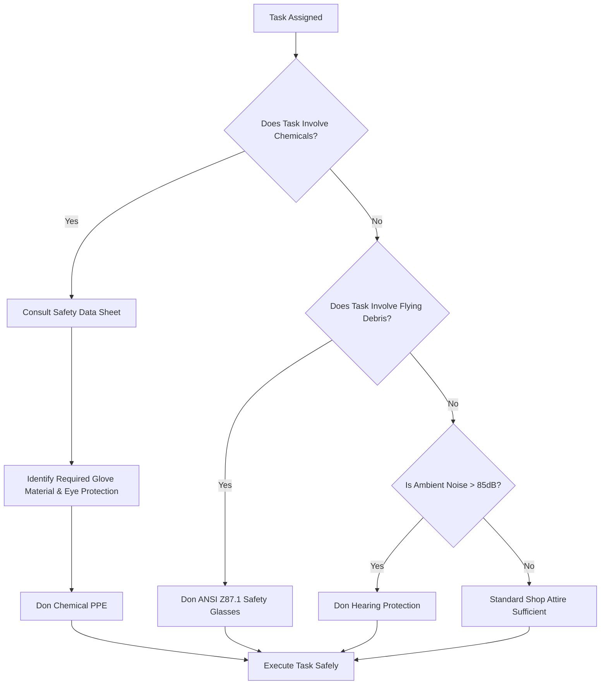

## 🔧 ON THE JOB

When you reach for a chemical you have not used before, STOP. Find the SDS first. Read the PPE section. Then select the correct gloves, eye protection, and ensure proper ventilation before opening the container. If you hear a rivet gun start up in the next bay, immediately put in your earplugs. Do not wait for someone to tell you.

## 🔑 KEY TERMS
- **PPE (Personal Protective Equipment)** — Equipment worn to minimize exposure to hazards that cause serious workplace injuries and illnesses.
- **ANSI Z87.1** — The American National Standard for Occupational and Educational Personal Eye and Face Protection Devices.
- **Cumulative Hearing Loss** — Permanent, irreversible hearing damage that increases incrementally with each unprotected noise exposure over time.
- **SDS (Safety Data Sheet)** — The standardized document specifying hazards, PPE requirements, and emergency procedures for each chemical.

## ⚡ THE BOTTOM LINE

**Before you touch any chemical or start a high-risk task, verify your PPE — it is your final barrier against permanent injury.**

---
---

# Node: Electrical Shock First Action
**Zone: Basic PPE**

## 📋 OBJECTIVES
- Identify the physiological effects of electrical shock, including tetanic contraction.
- Execute the correct sequence of emergency actions when a colleague is actively being shocked.
- Demonstrate the principle of safe separation from energized victim.
- Explain why low-voltage DC avionics systems still present severe shock hazards.

## 🎯 WHY THIS MATTERS

A coworker is troubleshooting a power supply on the bench when their hand contacts an energized 115VAC circuit. Their muscles lock up and they cannot let go. Your instinct screams "grab them and pull them away." If you follow that instinct, you instantly become the second victim. The correct first action in an electrical shock emergency is wildly counter-intuitive under pressure.

## 📖 WHAT YOU NEED TO KNOW

An **Electrical Shock** occurs when the human body becomes part of an electrical circuit. Even low-voltage direct current (DC) systems in avionics (like 28VDC) can deliver enough current to cause severe burns, cardiac arrest, or muscle lock under the right conditions (such as sweaty hands or wet floors reducing skin resistance).

### Tetanic Contraction (The "Let-Go" Threshold)
When alternating current (AC) passes through muscles, it can cause them to violently contract and lock up. This is called a **tetanic contraction**. The victim is physically unable to release their grip on the energized wire or component. They are paralyzed by the current.

### The Emergency Response Sequence
When someone is receiving an electrical shock and is still in contact with the circuit, **never touch the victim directly.** If they are energized, the current will flow through them and into you the moment you make contact, because your body offers a path to ground. One victim becomes two.

You must follow this exact sequence:

1. **Ensure the area is safe**
   - Assess the scene rapidly. Do not rush in blindly. Identify the power source.
2. **Disconnect the Power Source (De-energize)**
   - Flip the associated circuit breaker, kill the bench power switch, pull the main disconnect lever, or unplug the equipment from the wall.
   - **If you cannot immediately find the disconnect:** Use a dry, non-conductive object (like a heavy wooden broom handle or a fiberglass rod) to physically push or pull the victim's body away from the live circuit. Never use metal tools or damp materials.
3. **Call for Emergency Assistance**
   - Shout for help to activate the shop's emergency action plan and call emergency services (911). Ensure someone knows exactly where the incident occurred.
4. **Provide First Aid / CPR**
   - **Only after** the power is definitively disconnected and it is verified safe to touch the victim. Begin CPR if the victim is unresponsive and not breathing.

## 🖼️ SYSTEM DIAGRAM
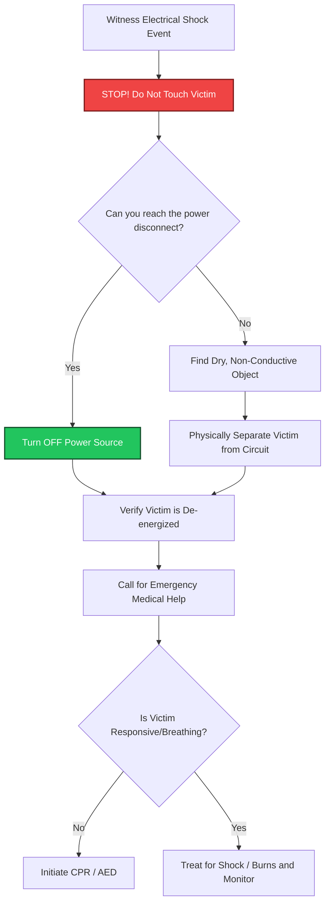

## 🔧 ON THE JOB

When working with live equipment, always know exactly where the main breaker or bench kill switch is located before you begin your task. In an emergency, if you witness a shock, fight the instinct to grab the person. Power OFF first. If you must use force to separate them, use the nearest dry wooden or plastic object. 

## 🔑 KEY TERMS
- **Electrical Shock** — The physiological reaction or injury caused by electrical current flowing through the human body.
- **Tetanic Contraction** — Involuntary, sustained muscle lock caused by electrical current, making the victim unable to voluntarily release their grip.
- **De-energize** — To disconnect or completely remove all sources of electrical power from a circuit or system.
- **Path of Least Resistance** — The principle that electrical current will flow through the most conductive route to ground, which readily includes the human body.

## ⚡ THE BOTTOM LINE

**Never touch a shock victim who is still energized — disconnect the power source first, or you become the second casualty.**

---
---

# Node: Ramp/Rotor Awareness (Optional)
**Zone: Basic PPE**

## 📋 OBJECTIVES
- Identify the lethal zones around running helicopters and fixed-wing aircraft.
- Demonstrate the correct approach path and protocol for engaging a running helicopter.
- Explain the necessity of visual contact when working on an active ramp.

## 🎯 WHY THIS MATTERS

A technician finishes a cockpit avionics check on a helicopter and steps out while the rotors are still turning. They walk toward the tail to inspect an antenna. The tail rotor is spinning at 2,000+ RPM and is nearly invisible. This is one of the most lethal hazards in aviation ground operations. Walking into a "live" zone without awareness takes only two seconds of distraction.

## 📖 WHAT YOU NEED TO KNOW

When working around aircraft with running engines or rotors, three rules govern your survival:

### Helicopter Ground Safety
1. **Stay clear of the tail rotor at all times.** The tail rotor is the most dangerous part of a helicopter on the ground. It spins at extremely high speed and is nearly invisible. Contact is almost always fatal.
2. **Approach only from the front**, within the pilot's field of view. The pilot must be able to see you at all times.
3. **Wait for the pilot's signal** before approaching. Never approach a running helicopter until the pilot explicitly signals that it is safe to do so.

### Fixed-Wing Ramp Safety
- Stay clear of propeller arcs and jet intake (suction) / exhaust (blast) zones.
- Never walk behind a running jet engine.
- Use designated walkways and marshaling paths.
- Wear high-visibility PPE on the active outdoor ramp (Note: High-vis is generally not required inside Part 145 avionics hangars unless specified by local policy).

The general principle is this: **never assume a flight crew knows you are there.** If they cannot see you, they cannot avoid you.

## 🖼️ SYSTEM DIAGRAM
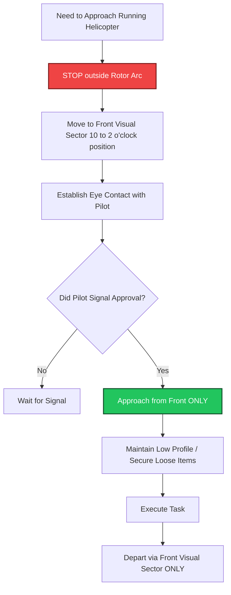

## 🔧 ON THE JOB

When you need to approach a running helicopter, walk to the front where the pilot can see you. Make eye contact. Wait for their hand signal (often a thumbs-up or a wave). Never walk around the tail, even if it seems like a shorter path to the avionics bay you need. If you cannot see the pilot's eyes, the pilot cannot see you.

## 🔑 KEY TERMS
- **Tail Rotor** — The small, high-speed lateral rotor at the rear of a helicopter, virtually invisible when spinning. Lethal on contact.
- **Visual Sector** — The area directly in front of an aircraft where the pilot has an unobstructed view.
- **Ramp Awareness** — The continuous practice of maintaining situational awareness around aircraft, vehicles, and equipment on the active apron/ramp.

## ⚡ THE BOTTOM LINE

**Stay clear of the tail rotor, approach from the front, and never move toward a running aircraft until the pilot signals it is safe.**

---
---

# Node: SDS / HazCom Basics
**Zone: SDS / Chemicals**

## 📋 OBJECTIVES
- Define the purpose and regulatory requirement of a Safety Data Sheet (SDS).
- Navigate the 16-section SDS format to extract critical hazard and PPE data.
- Explain the physical availability requirement of SDS documents under OSHA HazCom.

## 🎯 WHY THIS MATTERS

A technician gets a chemical splash on their forearm from a conformal coating remover. They need to know immediately: Is this an acid? Do they flush with water? Is there a specific chemical neutralizer required? All of this information exists in one place — the Safety Data Sheet. If they cannot find the specific SDS in the next 30 seconds, a minor burn could become a severe medical emergency.

## 📖 WHAT YOU NEED TO KNOW

A **Safety Data Sheet (SDS)** is the master reference document for every hazardous chemical used in your shop. Under OSHA's **Hazard Communication (HazCom) Standard** (often called the "Right-to-Know" law), an SDS must be available for every hazardous material in the workplace. 

### What an SDS Contains
An SDS is a globally standardized 16-section document. The most critical sections for a technician are:
- **Section 2 (Hazard Identification):** What specific dangers the chemical presents (flammable, corrosive, toxic, carcinogenic, etc.)
- **Section 4 (First-Aid Measures):** What exact medical steps to take for skin contact, eye contact, inhalation, or ingestion.
- **Section 8 (Exposure Controls/Personal Protection):** What exact gloves (e.g., nitrile vs. butyl), eye protection, and respiratory protection are required.
- **Section 7 (Handling and Storage):** How to safely use and store the chemical to prevent reactions.

### Where the SDS Must Be Kept
This is a critical, highly audited compliance point:
- SDS documents (either physical binders or digital kiosks) **must be kept in an actively accessible location in the shop** — not locked in a supervisor's office, not in a building across the facility.
- They must be **readily available to ALL personnel** on all shifts.
- "Readily available" means within immediate physical or digital reach — no barriers, no passwords required, no delays.

### When to Check the SDS
Check the SDS **before** you use any chemical — especially one you have not used before. The SDS is your first stop for preparation, not your last resort during an emergency.

## 🖼️ SYSTEM DIAGRAM
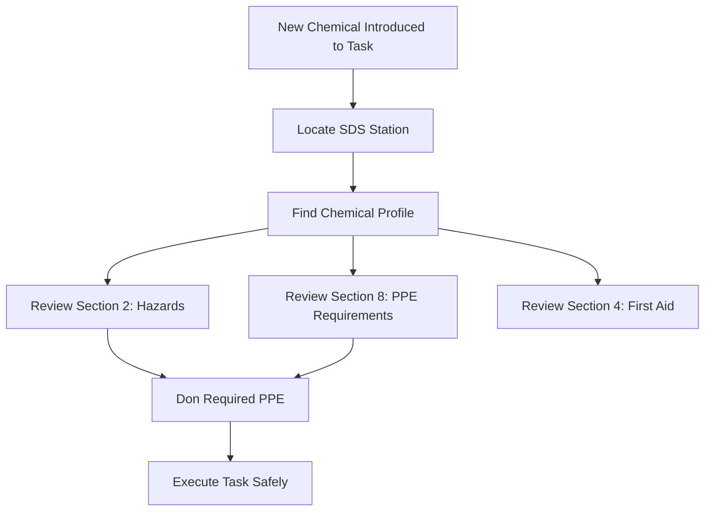

## 🔧 ON THE JOB

On your first day in any new shop, locate the SDS station. Know exactly where the binders or digital kiosks are. Before you open any chemical container for the first time, pull the SDS and read Sections 2, 4, and 8. This takes two minutes and can literally prevent a chemical injury or regulatory violation.

## 🔑 KEY TERMS
- **SDS (Safety Data Sheet)** — A 16-section document detailing the hazards, handling, PPE, first aid, and disposal procedures for a specific chemical.
- **HazCom (Hazard Communication Standard)** — The OSHA regulation requiring employers to provide SDS, container labels, and training for all hazardous chemicals.
- **Readily Available** — Accessible without delay to all personnel who may be exposed — no barriers, no locked storage.

## ⚡ THE BOTTOM LINE

**The SDS must be kept in the shop, accessible to everyone, and consulted before you handle any chemical — no exceptions.**

---
---

# Node: Chemical Handling, Storage & Disposal Awareness
**Zone: SDS / Chemicals**

## 📋 OBJECTIVES
- Execute proper disposal procedures for avionics shop chemicals and hazardous waste.
- Identify the storage requirements for flammable and reactive chemicals.
- Outline the initial containment response to a chemical spill near avionics equipment.

## 🎯 WHY THIS MATTERS

A technician finishes cleaning a multi-pin connector with IPA (isopropyl alcohol) and pours the leftover solvent down the shop sink drain. A month later, the company receives an EPA violation notice and a five-figure fine. Hazardous materials — even common ones like IPA — have strict disposal rules. Diluting them or pouring chemicals down the drain is never acceptable and legally catastrophic for a Part 145 station.

## 📖 WHAT YOU NEED TO KNOW

In a Part 145 avionics shop, you will regularly work with solvents, flux removers, potting compounds, conformal coatings, and battery acids classified as **hazardous materials**. You must understand three fundamental rules: how to handle them, how to store them, and how to dispose of them.

### Handling
- Always wear the PPE specified by Section 8 of the SDS.
- Use chemicals only in well-ventilated areas or under localized fume extraction systems (solder fume extractors).
- Never mix chemicals unless specifically required by the technical data (e.g., mixing two-part epoxy).

### Storage
- Store chemicals in their **original, labeled containers**. If transferring to a smaller dispenser, that dispenser must have a secondary HazCom label.
- Flammable liquids must be kept in **approved flammable storage cabinets**, away from heat, soldering stations, and ignition sources.
- Incompatible chemicals (such as acids and bases, or oxidizers and flammables) must be stored separately to prevent outgassing reactions.

### Disposal
This is where shops most commonly violate regulations:
- **Never pour chemicals down drains** — even "small amounts."
- **Never place chemical waste in regular trash.**
- All hazardous waste must be disposed of through **licensed hazardous waste disposal vendors**, following EPA and local regulations.
- **NiCd (Nickel-Cadmium) batteries** contain cadmium, a toxic heavy metal. They must be disposed of through regulated hazmat channels — never in regular trash, regardless of their state of charge.

### Spill Response
If hydraulic fluid, solvent, or any hazardous material spills near avionics equipment:
1. **Contain** — Use absorbent materials (pads, booms, or granular absorbent) immediately to stop the spread.
2. **De-energize** — Remove power from nearby equipment to eliminate ignition risk if the chemical is flammable.
3. **Clean up** — Follow your shop's hazmat spill procedures and dispose of the saturated absorbent pads as hazardous waste.

## 🖼️ SYSTEM DIAGRAM
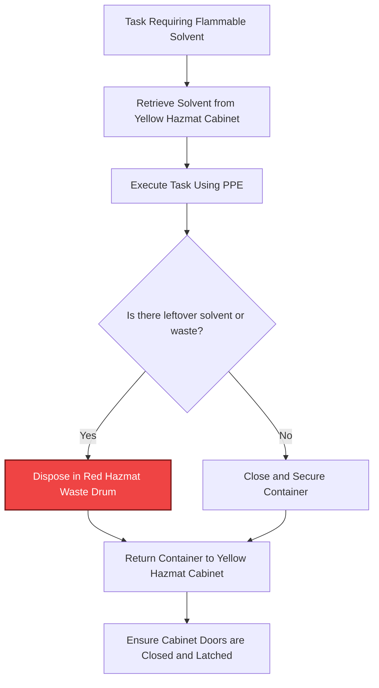

## 🔧 ON THE JOB

When you finish using a chemical, immediately put it back in the proper flammable storage cabinet. Do not leave it on your bench "for later." When you have waste — used solvent, empty cans, spent batteries, or saturated wipes — place it in the designated hazmat waste collection drum. Never improvise disposal. If you are unsure where something goes, ask your supervisor before discarding it.

## 🔑 KEY TERMS
- **Hazardous Waste** — Chemical waste that is toxic, flammable, corrosive, or reactive and must be disposed of through licensed vendors.
- **Licensed Disposal Vendor** — An EPA-approved company authorized to transport and dispose of hazardous waste.
- **Secondary Container Label** — A mandated HazCom label required on any bottle or dispenser holding a chemical transferred from its original bulk container.
- **Spill Containment** — Immediate action to prevent a chemical spill from spreading using absorbent materials.

## ⚡ THE BOTTOM LINE

**Chemicals go in approved storage, waste goes through licensed disposal vendors, and nothing ever goes down the drain — ever.**

---
---

# Node: Solvent Fumes / Exposure Awareness
**Zone: SDS / Chemicals**

## 📋 OBJECTIVES
- Identify the symptoms of acute volatile organic compound (VOC) overexposure.
- Execute the immediate response protocol for personal solvent overexposure.
- Differentiate between compliant and non-compliant flammable liquid storage.

## 🎯 WHY THIS MATTERS

A technician is using a heavy flux remover to clean a complex circuit board at their bench. The localized fume extractor is turned off. After 20 minutes, they start feeling dizzy and lightheaded. They assume it will pass and keep working to meet a deadline. Thirty minutes later, they are disoriented, nauseous, and drop a $5,000 component. They should have left the area at the first sign of dizziness — every additional minute of exposure compounded the physiological effect.

## 📖 WHAT YOU NEED TO KNOW

Many solvents, encapsulants, and cleaning chemicals used in avionics work release **volatile organic compound (VOC) fumes** that are hazardous when inhaled. Even in a large, well-ventilated hangar, localized overexposure can easily occur at the bench level where you are working intimately close to evaporating chemicals.

### Flammable Vapor Storage
The fumes from these solvents are often not just toxic to breathe, but highly flammable. Flammable liquids must be stored in containers and cabinets that meet three strict requirements:
1. **Approved, self-closing safety containers** — These specialized cans automatically seal when the handle is released, limiting vapor escape and preventing spills if knocked over.
2. **Dedicated flammable storage cabinets** — Heavy-gauge steel cabinets built to temporarily contain interior fires and isolate flammable materials from exterior shop fires.
3. **Separation from ignition sources** — Never store solvents near electrical panels, energized soldering stations, hot air rework equipment, or grinders.

All three elements must be present. An approved safety can sitting in a non-approved wood cabinet is non-compliant.

### Overexposure Response Protocol
If you begin to feel dizzy, lightheaded, nauseous, or develop an acute headache while working with solvents or adhesives, your body is signaling toxicity. The correct action is:

1. **Leave the area immediately** — Stop the task. Secure the chemical quickly if safe to do so. Do not wait for the feeling to pass.
2. **Move to fresh air** — Go outside the hangar or to a known clean-air environment away from all chemical exposure.
3. **Notify your supervisor** — Management must know about the potential ventilation failure or inadequate PPE selection.
4. **Report the incident** — Document the exposure per your shop's safety reporting procedures (SMS).

You must complete all four steps **before returning to work.** "Toughing it out" at the bench is the single worst decision you can make — it worsens the exposure, impairs your judgment, and delays medical response.

## 🖼️ SYSTEM DIAGRAM
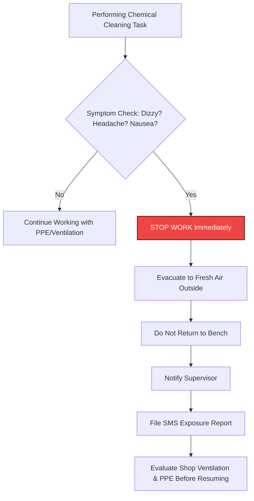

## 🔧 ON THE JOB

If you are using a solvent and start feeling "off" — dizzy, headache, lightheaded — that is your central nervous system telling you the VOC concentration is too high. Do not ignore it. Get up, get outside, report it. It is infinitely better to lose ten minutes of schedule time than to suffer central nervous system effects from continued exposure.

## 🔑 KEY TERMS
- **VOC (Volatile Organic Compound)** — Chemical compounds that evaporate easily at room temperature and can be inhaled, causing health effects from dizziness to organ damage.
- **Self-Closing Safety Container** — An approved container for flammable liquids that automatically spring-seals when released, limiting hazardous vapor escape.
- **Overexposure** — Inhalation or physical contact exceeding the safe exposure limit (PEL), indicated by physiological symptoms like dizziness, headache, or nausea.

## ⚡ THE BOTTOM LINE

**If you feel dizzy or lightheaded while using solvents, leave the area immediately, get fresh air, notify your supervisor, and report it — never try to "work through it."**

---
---

# Node: Fire Safety Basics
**Zone: Fire Safety Basics**

## 📋 OBJECTIVES
- Verify the serviceable status of a portable fire extinguisher.
- Explain the four criteria that dictate a fire extinguisher is ready for emergency use.
- Identify common fire prevention practices specific to avionics benches.

## 🎯 WHY THIS MATTERS

A small fire starts on an avionics bench when a powered-on soldering iron tip is accidentally laid across a solvent-soaked rag. You grab the nearest wall-mounted fire extinguisher. You pull the handle, but nothing happens. The gauge reads zero. The safety pin is missing. The inspection tag expired eight months ago. You are now fighting a rapidly growing chemical fire with an empty metal cylinder. This scenario is completely preventable if technicians verify extinguisher readiness before an emergency occurs.

## 📖 WHAT YOU NEED TO KNOW

In a Part 145 avionics shop, fire prevention is primarily about housekeeping, controlling ignition sources, and situational awareness. However, if prevention fails, you must be absolutely certain the fire extinguishing equipment is ready.

### Fire Extinguisher Readiness Verification
A fire extinguisher is not "ready" just because it is hanging on the wall. To confirm a fire extinguisher is **serviceable and ready for emergency use**, you must visually verify four items:

1. **Pressure gauge in the green zone** — The gauge needle must be firmly in the green operating band. If it points to red (empty) or is overcharged, the extinguisher is unreliable and must be pulled from service.
2. **Safety pin intact with tamper seal** — The metal pin prevents accidental discharge. The plastic breakable tamper seal proves the pin hasn't been pulled. If the seal is broken, assume the extinguisher has been partially discharged and lost pressure.
3. **No visible physical damage** — Inspect the metal cylinder, rubber hose, and plastic nozzle for heavy dents, severe corrosion, cracks, or mud-wasp obstructions in the nozzle.
4. **Annual inspection tag is current** — A certified fire inspector must physically verify and punch the tag annually. If the punched date is older than one year, the extinguisher is legally out of compliance, even if the gauge is green.

All four checks must pass. If any single item fails, the extinguisher is not serviceable. Notify your facility manager immediately.

### Fire Prevention Basics on the Bench
- Never leave soldering irons unattended while powered on. Always return them to their heat-resistant resting stands.
- Clean up solvent-soaked rags and dispose of them in approved, self-closing metal waste containers (they are a spontaneous combustion risk).
- Do not daisy-chain power strips (plugging one power strip into another) to run bench test equipment.

## 🖼️ SYSTEM DIAGRAM
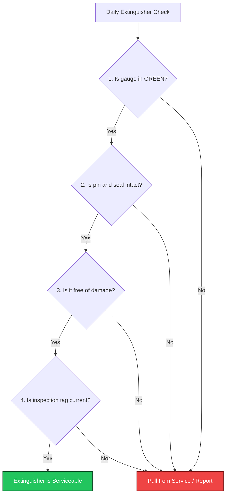

## 🔧 ON THE JOB

When you walk into your primary work area at the start of your shift, glance at the nearest fire extinguisher. Is the gauge green? Is the pin in? Does the tag have a current date? This visual sweep takes five seconds. If anything is wrong, report it immediately. Do not assume "the safety manager handles that." It is your bench and your safety.

## 🔑 KEY TERMS
- **Serviceable Extinguisher** — A fire extinguisher that passes all four readiness checks and is fully capable of deploying its rated chemical agent.
- **Tamper Seal** — A breakable plastic tie securing the extinguisher pin, indicating that the unit has not been previously fired or compromised.
- **Annual Inspection Tag** — The physical tag attached to the extinguisher documenting the month and year of the last certified professional inspection.

## ⚡ THE BOTTOM LINE

**A fire extinguisher is only ready if it has four things: gauge in green, pin intact, no physical damage, and a current inspection tag — verify it before you need it.**

---
---

# Node: ESD-Safe Handling Basics
**Zone: ESD/FOD Discipline**

## 📋 OBJECTIVES
- Define Electrostatic Discharge (ESD) and explain why it is uniquely dangerous to modern avionics.
- Differentiate between a catastrophic failure and a latent failure caused by ESD.
- Don and verify the two mandatory components of an ESD-protected workstation.

## 🎯 WHY THIS MATTERS

A technician removes a GPS receiver printed circuit board (PCB) from a Line Replaceable Unit (LRU) to inspect a solder joint. They are not wearing a wrist strap, and the bench has no ESD rubber mat. They feel absolutely nothing unusual. But the static discharge from their fingertip — an invisible arc far too small to feel — just cratered a microscopic CMOS gate on the processor. The board passes a quick bench operational check, but fails in flight six weeks later at 35,000 feet, plunging the cockpit into a navigation downgrade. ESD damage is invisible, cumulative, and often delayed. That is what makes it catastrophic.

## 📖 WHAT YOU NEED TO KNOW

**Electrostatic Discharge (ESD)** is the sudden, uncontrolled transfer of static electricity between two objects at different electrical potentials. In avionics, ESD is one of the leading root causes of unexplainable, intermittent component failures.

### The Invisible Threat
- A human body walking across a floor can accumulate up to **25,000 volts** of static charge.
- Most humans cannot feel a static shock until the discharge reaches approximately **3,500 volts**.
- Many modern CMOS and semiconductor components used in avionics processors can be permanently destroyed by **as little as 100 volts**.

This means you can easily destroy a $20,000 avionics board without ever seeing, hearing, or feeling a spark. 

### Latent vs. Catastrophic Failures
- **Catastrophic Failure:** The ESD event completely destroys the component. The unit fails immediately on the bench and is caught before installation.
- **Latent Failure:** The dangerous outcome. The ESD event partially damages the internal silicon structure. The component still "works" and passes bench tests, but it will prematurely fail weeks or months later under thermal or vibrational stress in the aircraft.

### Mandatory ESD Protection
To prevent ESD damage, voltage potentials between you, the bench, and the component must be equalized. Two protective measures are **always required together**:

1. **A properly grounded anti-static wrist strap** — Worn directly against bare skin (no gloves), this continuously drains accumulating static charge from your body to electrical ground.
2. **An ESD-protected workstation** — A bench equipped with a grounded dissipative rubber mat, dedicated ground bonding points, and the use of ESD-safe anti-static shielding bags for component transport.

A wrist strap without an ESD mat is insufficient. An ESD mat without a wrist strap is insufficient. They must be utilized as a complete system.

## 🖼️ SYSTEM DIAGRAM
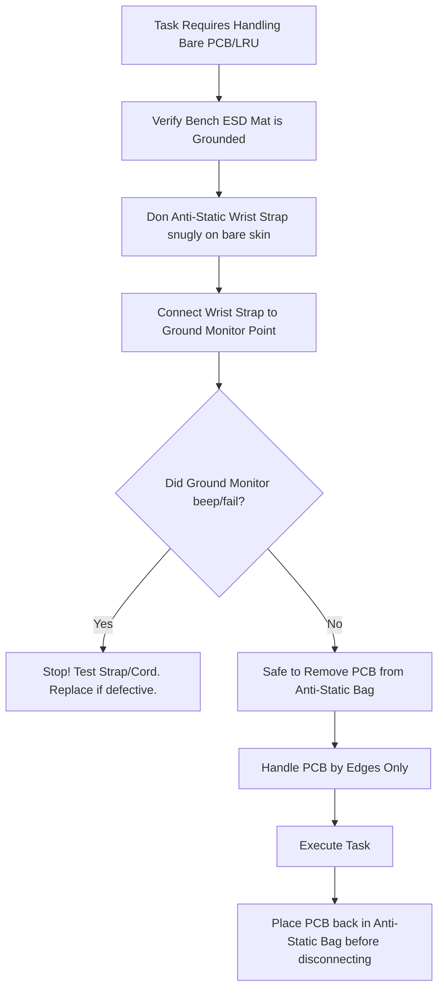

## 🔧 ON THE JOB

Before you crack open any LRU case or touch any exposed circuit board, verify two things: your wrist strap is tightly connected to your bare skin and plugged into ground, and your dissipative bench mat is connected to ground. Test your wrist strap with a continuity checker every morning. These 10 seconds of preparation protect tens of thousands of dollars in avionics and prevent inflight emergencies.

## 🔑 KEY TERMS
- **ESD (Electrostatic Discharge)** — A sudden flow of static electricity between two objects, capable of instantly destroying semiconductor components.
- **Latent Failure** — ESD damage that does not cause immediate malfunction but degrades the internal silicon, leading to failure later under operational stress.
- **Anti-Static Wrist Strap** — A conductive strap worn snugly around the wrist that continuously drains static charge from the technician's body to ground.
- **ESD-Protected Workstation** — A work area equipped with grounded dissipative mats and bonding points to equalize electrical potential and prevent static damage.

## ⚡ THE BOTTOM LINE

**Always use a grounded wrist strap AND an grounded ESD-protected mat — both are required, every single time, no exceptions.**

---
---

# Node: FOD and Tool Accountability
**Zone: ESD/FOD Discipline**

## 🎯 WHY THIS MATTERS

A technician drops a small screw behind an avionics panel during installation. They look for it briefly, cannot see it, and decide to close the panel and use a spare screw. Three months later, that loose screw shorts across a wire bundle during flight, causing an intermittent navigation system failure on approach. **Every loose item left inside an aircraft is a potential in-flight emergency.**

## 📖 WHAT YOU NEED TO KNOW

**Foreign Object Damage/Debris (FOD)** is any material or object that is not part of the aircraft but has ended up where it can cause damage. In avionics work, the most common FOD items are:
- Dropped screws, nuts, and washers
- Wire clippings and tie-wrap tails
- Solder splatter and flux residue
- Tools and personal items (pens, badges, phone)

### The Most Effective FOD Prevention Practice

Industry-wide, the single most effective practice for preventing FOD is **strict tool control**:

1. **Count all tools BEFORE starting a job.** Use a shadow board, foam cutout, or checklist to verify every item.
2. **Count all tools AFTER completing the job.** Every tool must be accounted for before any panel is closed.
3. **Immediately retrieve any dropped hardware or debris.** Do not continue working — stop and recover the item first.

If a tool or piece of hardware is missing at the end of a job, **no panel may be closed** until it is found. This is not optional. This is a hard stop.

### Dropped Hardware Response
If a screw, nut, washer, or any hardware drops behind a panel or into an aircraft structure:

1. **STOP work** — Do not continue the installation.
2. **Retrieve the item** — Use mirrors, borescopes, or magnetic tools as needed.
3. **Log the event** — Document the dropped hardware and its recovery per your shop's FOD prevention procedures.
4. **Only then close the panel.**

The "replace it with a spare and move on" approach is never acceptable. The original item must be physically recovered.

## 🔑 KEY TERMS
- **FOD (Foreign Object Damage/Debris)** — Any object or material not part of the aircraft that could cause mechanical, electrical, or structural damage.
- **Tool Control** — The practice of counting and tracking all tools before and after every job to ensure none are left inside the aircraft.
- **Shadow Board** — A tool storage panel with outlined shapes for each tool, allowing instant visual detection of a missing item.

## 🔧 ON THE JOB

Before you start any job, lay out your tools and count them. When you finish, count them again. If a screw drops and you cannot immediately find it, stop working — do not close anything until it is recovered. When your tool count does not match, escalate immediately. A missing item is never "probably fine."

## ⚡ BOTTOM LINE

**Count your tools before and after every job, retrieve every dropped item before closing any panel, and never assume a missing piece is "probably fine."**

---

# Node: Chemical handling/storage/disposal awareness (generic)
**Zone: Hazmat**

## 📋 OBJECTIVES
- Identify proper storage methods for flammable aviation chemicals.

## 🎯 WHY THIS MATTERS
Improper storage of MEK or aviation fuel in non-ventilated cabinets has caused catastrophic hangar fires.

## 📖 WHAT YOU NEED TO KNOW
All flammable chemicals must be stored in grounded, flame-resistant yellow Hazmat cabinets. Never store oxidizers and flammables together.

## 🖼️ SYSTEM DIAGRAM
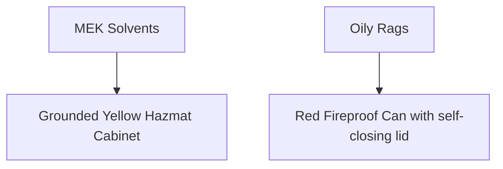

## 🔧 ON THE JOB
Always check the Safety Data Sheet (SDS) before mixing or disposing of any unknown aerospace solvent.

## 🔑 KEY TERMS
- **SDS** — Safety Data Sheet.

## ⚡ THE BOTTOM LINE
**Aviation chemicals require engineered storage cabinets to prevent spontaneous combustion and vapor explosions.**

---
