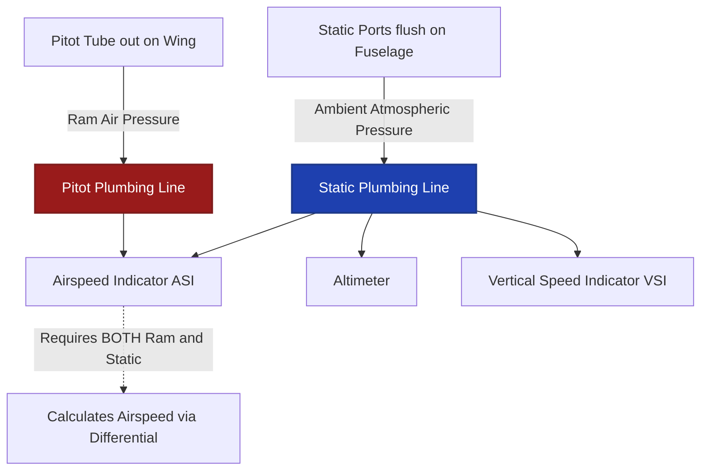
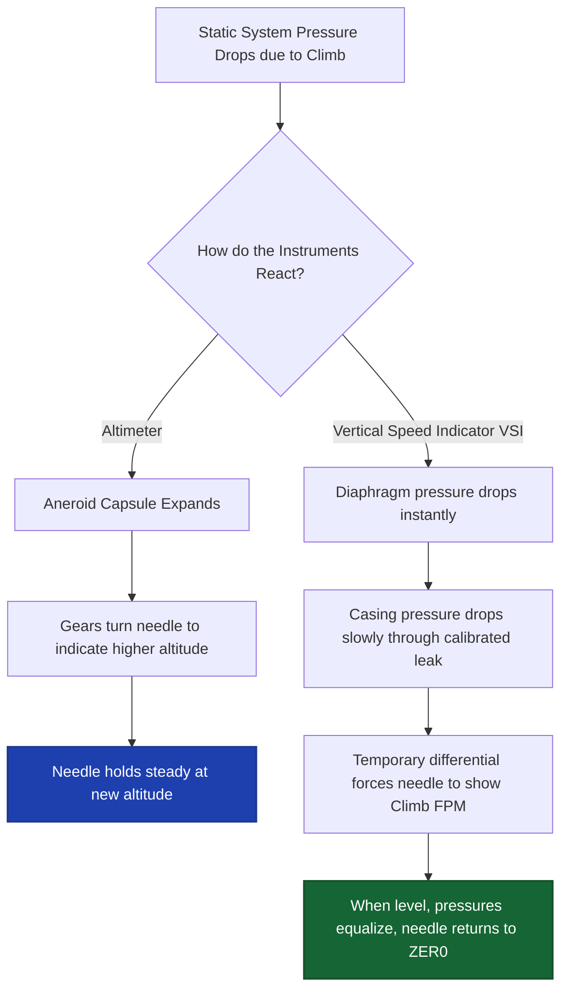
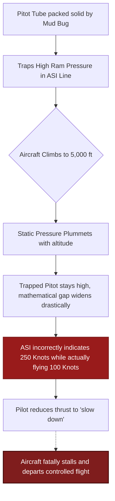
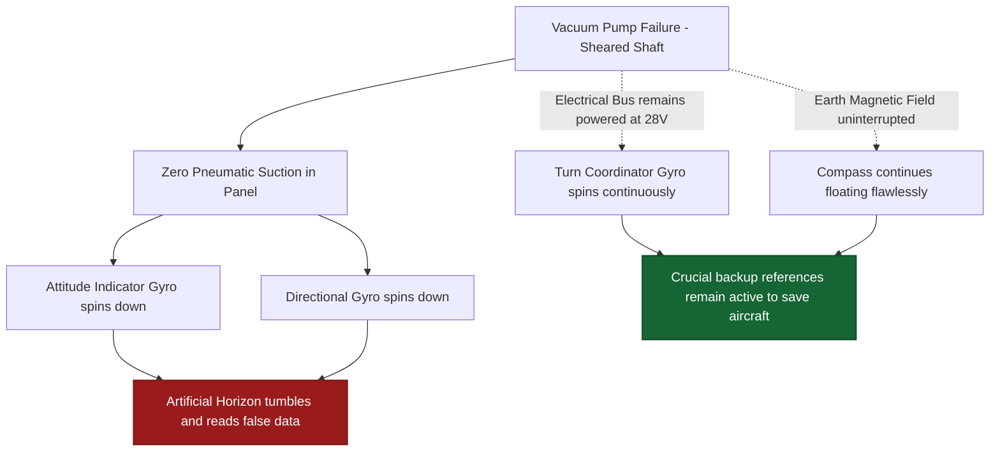
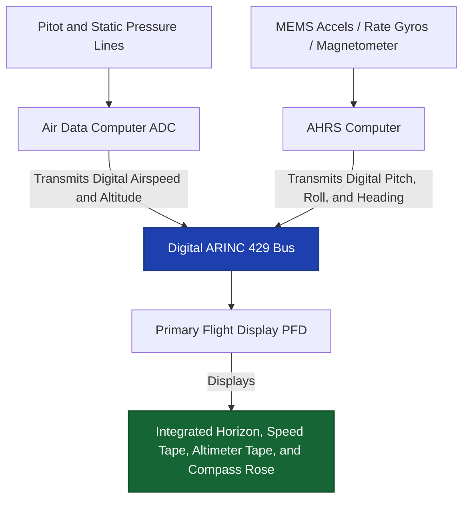
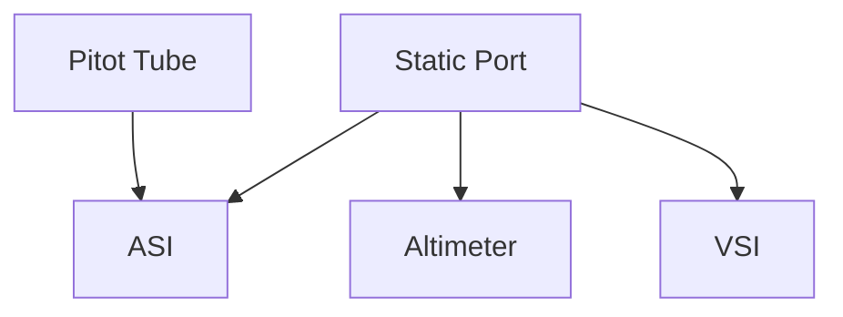
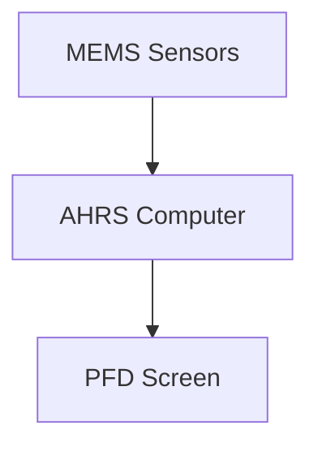

# World 8: Flight Instruments & Pitot-Static (with Gyro/AHRS)
> **5 Nodes | 5 Zones | Estimated Read Time: 35–45 minutes total**

---
---

# Node: Pitot-Static Components Basics
**Zone: Pitot-Static Fundamentals**

## 📋 OBJECTIVES
- Define standard sea level atmospheric pressure in both inches of mercury and millibars.
- Contrast the physical forces measured by the pitot tube versus the static ports.
- Identify the exact combination of instruments fed by each specific pressure source.

## 🎯 WHY THIS MATTERS

During a routine 24-month pitot-static certification, a technician connects the test box and applies a simulated vacuum pressure equivalent to 5,000 feet. Instead of holding steady, the altimeter slowly sinks back to zero. The technician discovers a microscopic leak in a B-nut fitting directly behind the altimeter. In flight, as cabin pressure dynamically changes with altitude, this 'tiny' leak would cause the altimeter to read hundreds of feet in error. In heavy instrument meteorological conditions (IMC), a 300-foot altimeter error is the absolute difference between clearing a mountain ridge and Controlled Flight Into Terrain (CFIT). Mastering the plumbing of the pitot-static system is a matter of life safety.

## 📖 WHAT YOU NEED TO KNOW

### The Standard Atmospheric Baseline
To accurately measure pressure, avionics must calibrate against a universal baseline. The **International Standard Atmosphere (ISA)** mathematically defines sea-level pressure on a 'standard' day as:
- **29.92 inches of mercury (inHg)** (The standard used in North America)
- **1013.25 millibars (mb) or hectopascals (hPa)** (The standard used globally)
- Aircraft flying above the transition altitude (FL180 in the US) universally set their altimeters to 29.92 to ensure every aircraft mathematically flies the same pressure levels, regardless of actual local weather.

### The Pitot Tube (Ram Pressure)
The **pitot tube** is an open-faced, forward-pointing metal probe structurally mounted in undisturbed air (usually under the wing or on the nose).
- It measures **ram air pressure** (impact pressure).
- The faster the aircraft violently hits the air molecules, the higher the ram pressure aggressively builds inside the tube.
- **The Only Consumer:** This isolated pitot pressure line is physically plumbed to exactly **one instrument only**: The Airspeed Indicator (ASI) (or the Air Data Computer).

### The Static System (Ambient Pressure)
The **static ports** are highly precise, flush-mounted openings built into the side of the fuselage, specifically designed to sense undisturbed **ambient atmospheric pressure** while completely avoiding ram air effects.
- As the aircraft climbs higher into the thinning atmosphere, the static pressure naturally drops.
- **The Consumers:** The static pressure line is split and structurally plumbed to **three distinct instruments**:
  1. **Altimeter:** Measures pure static pressure to compute altitude.
  2. **Vertical Speed Indicator (VSI):** Measures the *rate of change* of static pressure.
  3. **Airspeed Indicator (ASI):** Utilizes static pressure as the baseline reference against the massive pitot pressure.

## 🖼️ SYSTEM DIAGRAM

## 🔧 ON THE JOB

When actively performing a 14 CFR 91.411 static system certification test, you are aggressively hunting for leaks in the blue (static) plumbing lines shown in the diagram above. If you discover a massive leak, physically pinch off the flexible hoses isolating the instruments one at a time. If you pinch off the line feeding the pilot's VSI and the system instantly holds pressure, you have rapidly isolated the leak to the VSI casing itself, completely exonerating the airframe tubing. Furthermore, never blow high-pressure shop air into a pitot tube to clear a bug—you will instantly blow the delicate diaphragms out of the ASI.

## 🔑 KEY TERMS
- **Pitot Tube** — A forward-facing probe sensing impact air pressure, exclusively driving the airspeed indicator.
- **Static Port** — A flush fuselage vent sensing ambient atmospheric pressure, fundamentally driving all three pitot-static instruments.
- **29.92 inHg** — The absolute standard sea-level atmospheric pressure utilized as the universal baseline for high-altitude flight levels.
- **Differential Pressure** — The mathematical calculation comparing raw pitot ram pressure against ambient static pressure to determine true indicated airspeed.

## ⚡ THE BOTTOM LINE

**The pitot tube provides ram pressure exclusively to the Airspeed Indicator, while the static ports provide ambient pressure to the Altimeter, VSI, and ASI; a static leak compromises three critical instruments simultaneously.**

---
---

# Node: Altimeter, VSI & ASI Basics
**Zone: Instrument Behavior**

## 📋 OBJECTIVES
- Explain the mechanical operation of an aneroid capsule within an altimeter.
- Calculate the altitude error resulting from an incorrectly set Kollsman window.
- Differentiate how the VSI measures pressure change versus how the altimeter measures absolute pressure.

## 🎯 WHY THIS MATTERS

A pilot departs a high-elevation airport. The actual local barometric pressure is a very high 30.42 inHg. However, the pilot carelessly leaves the altimeter set to standard 29.92. Because the altimeter receives no electrical data and relies purely on pressure physics, this 0.50 inHg error mathematically forces the altimeter to read approximately **500 feet lower** than the aircraft's true physical altitude. During a night departure over mountainous terrain, that uncorrected 500-foot offset is completely fatal. For a technician, validating the strict accuracy of the Kollsman window gearing is a life-critical procedure.

## 📖 WHAT YOU NEED TO KNOW

### Altimeter Mechanics
A conventional mechanical altimeter measures **barometric altitude** by actively sensing changes in static pipeline pressure through a sealed **aneroid capsule** (a flexible corrugated metal pancake).
- As the aircraft climbs, the ambient cabin and static pressure decreases.
- The sealed capsule physically expands because the pressure outside it is now lower.
- This microscopic expansion pushes a complex system of magnifying gears, ultimately turning the altitude pointer on the dial.
- **The Kollsman Window:** The small sub-dial where the pilot inputs the local barometric pressure. Turning the knob physically rotates the entire gear mechanism, shifting the baseline altitude reference.
- **The Math:** Every **1.0 inHg of tuning error equates to exactly 1,000 feet** of altitude indication error. (e.g., 29.92 vs 30.92 = 1,000 ft difference).

### Vertical Speed Indicator (VSI)
While the altimeter measures absolute pressure, the VSI strictly measures the **rate of change** of static pressure, displaying feet per minute (fpm).
- The static line feeds directly into a flexible diaphragm inside the VSI.
- The static line also feeds into the rigid casing *surrounding* the diaphragm, but it must pass through a highly precision **calibrated leak** (a microscopic capillary tube).
- When climbing, pressure inside the diaphragm drops instantly. Pressure inside the casing drops slowly (delayed by the leak).
- The temporary pressure difference forces the diaphragm to contract, registering a climb on the dial. When level, the pressures equalize to zero completely.

### Airspeed Indicator (ASI)
The ASI measures **indicated airspeed** exclusively by manipulating the vast differential between raw pitot (ram) pressure and ambient static pressure.
- High airspeed rams massive pressure into the instrument diaphragm.
- Static pressure is piped into the casing surrounding the diaphragm to act as the baseline reference.
- The expanding diaphragm physically drives the speed needle. The higher the ram pressure relative to the static pressure, the higher the registered knot readout.

## 🖼️ SYSTEM DIAGRAM

## 🔧 ON THE JOB

When investigating a pilot complaint of a "sluggish" or "lagging" VSI, immediately inspect the tiny capillary tube or restriction fitting mounted on the back of the instrument casing. Microscopic dust, lint, or moisture freezing across that calibrated leak will vastly alter the bleed-off rate, rendering the instrument wildly inaccurate or completely seizing it at a false climb reading. Furthermore, altitude errors must be tested across the entire operational range (e.g., from -1,000 feet to +20,000 feet) to prove the complex aneroid gears haven't worn down non-linearly over decades of service.

## 🔑 KEY TERMS
- **Aneroid Capsule** — A sealed, highly flexible metallic chamber that physically expands or contracts in direct response to surrounding static pressure changes.
- **Kollsman Window** — The small barometric sub-dial on an altimeter allowing the pilot to manually calibrate the instrument to localized atmospheric pressure fields.
- **Calibrated Leak** — An ultra-precise capillary restriction on a VSI casing that deliberately delays pressure equalization, generating the required differential to calculate climb rates.
- **Indicated Airspeed** — The raw, uncorrected speed registered on the ASI dial driven purely by the differential force between pitot ram pressure and static ambient pressure.

## ⚡ THE BOTTOM LINE

**The altimeter utilizes expanding aneroid capsules to measure absolute pressure; the VSI utilizes a calibrated leak to measure the rate of pressure change; an unchecked Kollsman window error of 1 inHg induces a massive 1,000-foot altitude discrepancy.**

---
---

# Node: Pitot/Static Blockage Symptoms
**Zone: Blockage Scenarios**

## 📋 OBJECTIVES
- Analyze the dangerous ASI indication behavior during a climb with a completely blocked pitot tube.
- Describe the simultaneous instrument reactions of a frozen static port.
- Explain the physiological concept behind an alternate static source valve.

## 🎯 WHY THIS MATTERS

An aircraft departs into heavy clouds with a pitot tube seamlessly packed solid by a mud dauber wasp nest while it sat on the ramp. As the aircraft physically climbs, the trapped ram pressure remains totally constant inside the tubing. However, the outside static pressure is drastically dropping due to altitude. The Airspeed Indicator (ASI) calculates speed by subtracting static from pitot. Because the static is shrinking, the mathematical gap between the two pressures widens massively. The ASI registers a massive increase in airspeed. The pilot, trusting the instrument, aggressively pulls the throttle back to slow the plane. The actual airspeed collapses, and the aircraft violently stalls and spins. Recognizing blockage symptoms is a survival imperative.

## 📖 WHAT YOU NEED TO KNOW

### Scenario 1: Blocked Pitot Tube (Ram Air Trapped)
If a pitot tube is entirely blocked (by ice, mud, or a forgotten synthetic cover), the ASI is the **only** instrument affected. The altimeter and VSI remain perfectly healthy.
- **During a Climb:** The trapped pitot pressure stays high. Static pressure mathematically drops. The differential artificially grows. The ASI wildly reads a **falsely high and continuously increasing airspeed**.
- **During a Descent:** The trapped pitot pressure stays constant. Static pressure violently rises. The differential violently shrinks. The ASI wildly reads a **falsely low and decreasing airspeed**, eventually hitting zero.
- **The Analogy:** A blocked pitot tube fundamentally transforms the ASI into a crude altimeter — the airspeed needle will go up when you climb, and go down when you descend, making it lethally deceptive.

### Scenario 2: Blocked Static Port (Ambient Pressure Trapped)
If the static ports ice over or get painted shut, the trapped ambient pressure locks the baseline for all three instruments.
- **Altimeter:** Completely freezes in place at the exact altitude where the blockage occurred.
- **VSI:** Returns to zero and refuses to move, regardless of actual climb or descent rates.
- **ASI:** Registers incorrectly because its reference line is locked. If you climb above the blockage altitude, the ASI will read falsely low (because the trapped static pressure acts like you are still low and dense).

### The Solution: Alternate Static Source
If the primary external static ports ice over in heavy weather, the pilot can physically actuate the **Alternate Static Source** valve.
- This mechanically vents the static plumbing lines directly into the unpressurized aircraft cabin.
- Because the fast-moving air outside the aircraft slightly sucks air out of the cabin vents (Venturi effect), the cabin pressure is marginally lower than actual true ambient pressure.
- **The Result:** The altimeter will falsely pop up slightly (showing you higher than you are), and the ASI will show a slightly faster airspeed. This minor, predictable error is infinitely preferable to locked, frozen instruments.

## 🖼️ SYSTEM DIAGRAM

## 🔧 ON THE JOB

Before touching any static plumbing after a reported instrument anomaly, meticulously perform a heavy visual inspection of the tiny static port holes on the fuselage sides. Often, an overzealous wash crew gets wax inside the microscopic holes, or a mechanic physically tapes over the ports during painting and forgets to peel the tape off. If an aircraft exhibits all three symptoms simultaneously (frozen altimeter, dead VSI, reversed ASI behavior), absolutely do not start removing gyros or displays—the fault is a 100% pneumatic static obstruction. 

## 🔑 KEY TERMS
- **Pitot Blockage** — A lethal obstruction geometry where trapped ram pressure mathematically forces the airspeed indicator to act like an altimeter, wildly registering speed increases during climbs.
- **Static Blockage** — An obstruction of ambient pressure delivery that immediately freezes the altimeter, zeros the VSI, and skews the baseline reference of the ASI.
- **Alternate Static Source** — A critical flight deck pneumatic valve allowing pilots to instantly bypass iced-over external static ports by venting the instruments into the ambient cabin air pressure.
- **Differential Widening** — The core mechanism causing false airspeed climbs; achieved when the static subtrahend drops while the pitot minuend remains artificially trapped.

## ⚡ THE BOTTOM LINE

**A blocked pitot tube lethally commands the ASI to read falsely high in climbs and falsely low in descents; a blocked static port entirely freezes the altimeter and zeros the VSI — always cross-check instruments.**

---
---

# Node: Gyro Instruments Basics
**Zone: Gyro Fundamentals**

## 📋 OBJECTIVES
- Define the physical principle of gyroscopic rigidity in space.
- Distinguish the power sources feeding the Attitude Indicator versus the Turn Coordinator.
- Explain the utter physical independence of the magnetic compass.

## 🎯 WHY THIS MATTERS

Mid-flight in heavy clouds, the primary engine-driven vacuum pump catastrophically shears its drive shaft. Without suction, the heavy brass gyroscopes inside the Attitude Indicator (AI) and Directional Gyro (DG) slowly spin down. The AI Horizon slowly rolls 30 degrees sideways, and the DG begins wandering uncontrollably. If the pilot strictly trusts these dying instruments, they will roll the plane upside down into an unrecoverable dive. However, because avionics engineers designed a structurally diverse power architecture, the electric Turn Coordinator and the fluid-filled magnetic compass remain flawlessly functional. Knowing exactly which instrument is powered by which source allows complete triage during a cascading failure.

## 📖 WHAT YOU NEED TO KNOW

### The Core Principle: Rigidity in Space
At the conceptual heart of legacy mechanical flight instruments lies a heavy, perfectly balanced brass rotor spinning at massive speeds (upwards of 20,000 RPM).
- A spinning mass vehemently resists any external force trying to change its planar orientation. This is known as **rigidity in space**.
- The spinning gyro rotor stays perfectly locked level with the physical horizon. As the aircraft banks and pitches in the sky, it physically moves and rotates *around* the gyro casing.
- The instrument face merely displays the mechanical difference between the rigid horizontal gyro and the tilting aircraft case.

### Architecture 1: Vacuum-Driven Gyros
Historically, the two most critical instruments are powered purely by massive pneumatic suction from an engine-driven **vacuum pump**:
1. **Attitude Indicator (AI):** The artificial horizon; provides instant, direct readout of both pitch and roll.
2. **Directional Gyro (DG):** Provides stable heading reference that does not bounce around like a magnetic compass.

**How it works:** The pump sucks air out of the instrument casing. Filtered cabin air rushes in through a tiny internal jet nozzle, physically blasting against scalloped "buckets" machined into the heavy gyro rotor, keeping it spinning at a blinding 18,000 RPM.

### Architecture 2: Electrically Driven Gyros
To guarantee flight safety, the FAA mandates that instrument panels cannot rely entirely on a single power source (like a sheared vacuum pump).
- Therefore, the secondary backup instrument, the **Turn Coordinator (or Turn-and-Bank)**, is almost exclusively driven by a 28V DC electric motor.
- If the entire vacuum system explodes, the electrically-spun Turn Coordinator continues calculating the aircraft's roll and yaw turning rates, allowing a skilled pilot to navigate blindly down on backup instruments.

### The Independent Anomaly: The Magnetic Compass
The **magnetic compass** sitting on top of the dashboard is the ultimate fail-safe. It is the **only** primary flight instrument that contains zero gyroscopes, requires zero vacuum suction, and requires absolutely zero electrical power. It is a magnetized card floating in a damping fluid (kerosene), physically dragged into alignment by the massive invisible flux lines of Earth's magnetic core. It will function flawlessly even if the airplane is entirely dead.

## 🖼️ SYSTEM DIAGRAM

## 🔧 ON THE JOB

When tracking down erratic mechanical gyros, immediately check the panel vacuum gauge. The gyro buckets require a precise suction flow (typically 4.8 to 5.2 inHg) to achieve 20,000 RPM. A restricted, heavily soiled central air filter will drop the system to 3.0 inHg, resulting in gyros that sluggishly lag behind the aircraft's movements or constantly precess and wander off course. You must routinely clean gyro filters and vigorously slap mechanical DG instruments on the bench to test bearing friction before they are certified for instrument flight.

## 🔑 KEY TERMS
- **Rigidity in Space** — The fundamental physics principle where a high-mass spinning rotor aggressively resists any force attempting to tilt its axis of rotation.
- **Vacuum Pump** — A mechanical, engine-driven pneumatic pump creating immense suction deliberately used to physically spin the Attitude Indicator and Directional Gyros.
- **Turn Coordinator** — An electrically powered backup gyro instrument structurally canted at 30 degrees to effectively sense combinations of both roll rate and yaw rate.
- **Precession** — The inherent mechanical error where bearing friction and Earth rotation slowly cause a spinning gyroscope to drift away from its calibrated heading.

## ⚡ THE BOTTOM LINE

**The primary Attitude and Heading indicators rely on massive engine-driven vacuum pumps spinning brass rotors; the Turn Coordinator leverages electrical motors for backup redundancy, and the compass requires zero power whatsoever.**

---
---

# Node: AHRS & PFD Basics
**Zone: AHRS / Glass Cockpit**

## 📋 OBJECTIVES
- Contrast the physical mechanics of a traditional gyro with a solid-state MEMS sensor.
- Detail the specific data distribution role of the Air Data Computer (ADC).
- Explain the consolidation architecture of a modern Primary Flight Display (PFD).

## 🎯 WHY THIS MATTERS

A modern glass-cockpit Cirrus SR22 powers up on the ramp, but the pilot's massive 10-inch Primary Flight Display (PFD) brutally shows a giant red "X" blazing across the entire attitude horizon and the heading compass rose simultaneously. In legacy aircraft, losing pitch, roll, and heading all at exactly the same time would basically mean the entire vacuum system and electrical bus exploded simultaneously. In the glass cockpit, this immense failure footprint points to exactly one specific box malfunctioning: the **AHRS (Attitude and Heading Reference System)**. Knowing how modern solid-state computing consolidates a dozen scattered instruments into two master data processors (AHRS and ADC) shifts troubleshooting from chasing pneumatic hoses to querying digital databuses.

## 📖 WHAT YOU NEED TO KNOW

### The Transition to the Glass Cockpit
Historically, an instrument panel was cluttered with heavy brass gyros, fragile vacuum pumps, and scattered pneumatic dial gauges—a configuration affectionately called the "Six-Pack." Modern avionics completely stripped out all mechanical moving parts and consolidated the physics into two highly advanced solid-state computers that digitally beam data onto high-definition screens.

### Computer 1: Air Data Computer (ADC)
The ADC entirely replaces the mechanical plumbing of the altimeter, VSI, and airspeed indicator.
- The external pitot tube and static ports physically plumb directly into the back of the small ADC chassis.
- Internal digital pressure transducers violently sample the air pressures hundreds of times a second.
- The computer's processor mathematically crunches the raw barometric pressure data, compensating for intense temperature variables, to output brutally precise **Digital Airspeed, Digital Altitude, and Vertical Speed Trend Vectors**.
- It then blasts this data out onto an ARINC 429 databus directed to the displays.

### Computer 2: The AHRS (Attitude & Heading)
The **AHRS (Attitude and Heading Reference System)** completely obliterates the heavy, spinning brass vacuum gyroscopes, replacing them with motionless microchips.
It utilizes three core layers of solid-state **MEMS (Micro-Electro-Mechanical Systems)** sensors:
1. **Solid-State Rate Gyroscopes:** Microscopic tuning forks etched into silicon chips that measure exact angular rate of rotation (Pitch, Roll, Yaw) through Coriolis acceleration physics.
2. **MEMS Accelerometers:** Microchips that measure raw linear acceleration forces and gravity vectors to constantly re-establish the mathematical center "downward" vector.
3. **Flux-Gate Magnetometers:** Remote electronic sensors mounted way out in the wingtips (away from engine interference) that constantly measure Earth's 3D magnetic flux lines to provide incredibly stable, drift-free digital heading data.

### The Aggregator: Primary Flight Display (PFD)
The **PFD** is merely a high-definition computer monitor. It does not calculate physics; it only draws pictures.
- It constantly listens to the data streams fired from the ADC and the AHRS simultaneously.
- It seamlessly stitches the digital altitude, airspeed, attitude horizon, and magnetic heading into one consolidated, hyper-fluid graphical interface directly in the pilot's line of sight.

## 🖼️ SYSTEM DIAGRAM

## 🔧 ON THE JOB

When troubleshooting a glass PFD boasting multiple red X's, analyze the pattern utilizing architectural logic. If only the Altitude and Airspeed tapes are violently red X'd, but the Attitude Horizon is moving perfectly level, the screen is fine—your ADC box has crashed, isolating the fault. Conversely, if the Horizon is a sprawling red X but the altimeter is working, the AHRS box has crashed. Never arbitrarily rip the $15,000 PFD screen out of the dash assuming the display is broken; the blank screen is just accurately reporting that the remote computing sensors in the avionics bay have violently stopped talking to it.

## 🔑 KEY TERMS
- **AHRS (Attitude and Heading Reference System)** — A heavily sophisticated solid-state computer utilizing motionless microchips to calculate highly accurate pitch, roll, and magnetic heading vectors.
- **ADC (Air Data Computer)** — An advanced digital LRU that converts raw analog pitot-static pneumatic pressures into hyper-precise digital airspeed, vertical speed, and altitude databus streams.
- **MEMS (Micro-Electro-Mechanical Systems)** — The revolutionary solid-state sensing technology embedding microscopic mechanical accelerometers and tuning forks directly into rigid semiconductor silicon chips.
- **PFD (Primary Flight Display)** — The master cockpit glass display synthesizing AHRS and ADC databus feeds into a singular, highly integrated visual instrument cluster.

## ⚡ THE BOTTOM LINE

**The ADC mathematically converts raw air pressures into digital altitude and speed; the AHRS leverages motionless MEMS microchips to perfectly map aircraft orientation; and the PFD aggressively stitches these databuses together into a single master display.**

---

# Node: Altimeter/VSI/ASI basics
**Zone: Pitot-Static**

## 📋 OBJECTIVES
- Identify which instruments use pitot pressure vs static pressure.

## 🎯 WHY THIS MATTERS
Cross-referencing instruments isolates blockages.

## 📖 WHAT YOU NEED TO KNOW
Airspeed (ASI) uses both Pitot (ram) and Static pressure. Altimeter and Vertical Speed (VSI) use ONLY Static pressure.

## 🖼️ SYSTEM DIAGRAM

## 🔧 ON THE JOB
If ASI drops but Altimeter is fine, the Pitot tube is blocked.

## 🔑 KEY TERMS
- **Ram Air** — Pitot pressure.

## ⚡ THE BOTTOM LINE
**Only the Airspeed Indicator uses Ram Air.**

---
---

# Node: AHRS/PFD basics
**Zone: Advanced Instruments**

## 📋 OBJECTIVES
- Explain how AHRS replaces mechanical gyros.

## 🎯 WHY THIS MATTERS
AHRS is the heart of the glass cockpit.

## 📖 WHAT YOU NEED TO KNOW
Attitude and Heading Reference Systems (AHRS) use solid-state MEMS sensors to calculate pitch, roll, and yaw, sending digital data to the Primary Flight Display (PFD).

## 🖼️ SYSTEM DIAGRAM

## 🔧 ON THE JOB
AHRS units must be perfectly leveled and calibrated to the aircraft centerline during installation.

## 🔑 KEY TERMS
- **MEMS** — Micro-Electro-Mechanical Systems.

## ⚡ THE BOTTOM LINE
**AHRS turned spinning mechanical gyros into solid-state digital sensors.**

---
